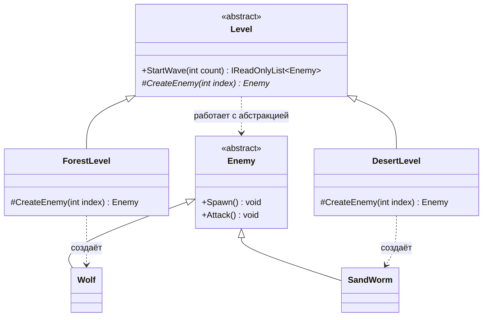
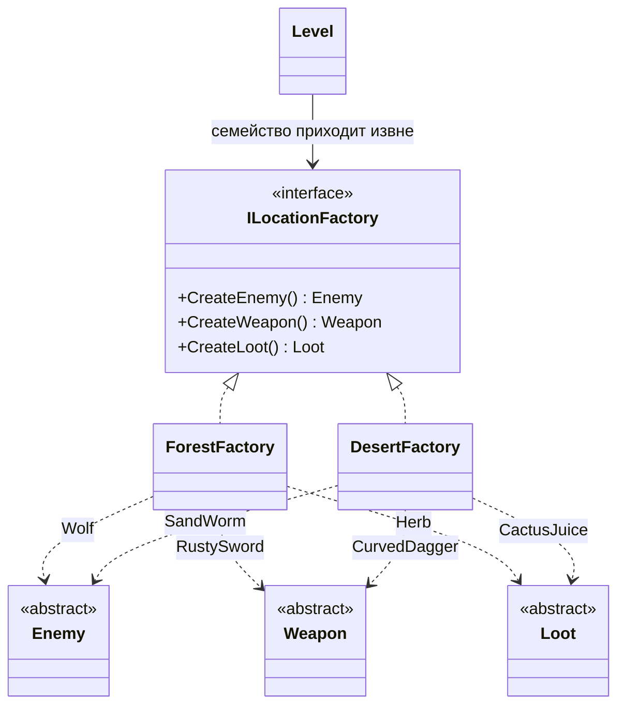

# Лабораторная работа 1. Фабрики: простая, фабричный метод, абстрактная

!!! info "Об этом материале"

    Тема: порождающие паттерны — простая фабрика, фабричный метод, абстрактная фабрика.
    Объём: 6–8 часов; сдаётся репозиторием с историей коммитов по этапам и отчётом.
    Оценка: 100 баллов плюс до 4 за задания со звёздочкой; штрафы указаны в тексте.


> Тема: порождающие паттерны на примере игрового мира. Лекция 5 — теория, здесь — руки.
> Работа выполняется на **C#** (или на Python, если согласовали заранее); диаграммы —
> в **Mermaid**. Ориентировочно 6–8 часов, сдаётся репозиторием и отчётом.

## Цель работы

Научиться убирать из кода зависимости от конкретных классов и осознанно выбирать между
тремя способами это сделать: простой фабрикой, фабричным методом и абстрактной фабрикой.
К концу работы вы должны уметь не только написать каждый из них, но и объяснить, **что
варьируется** в вашей системе и **чем вы платите** за выбранное решение.

## Легенда

Вы пишете ядро небольшой игры. В игре есть **волны врагов**: перед началом волны генератор
создаёт врагов, выдаёт им оружие и раскладывает лут. Игра поддерживает несколько
**локаций**, у каждой свой набор врагов, оружия и добычи. Наборы смешивать нельзя:
в ледяных пещерах не водятся песчаные черви, а снежный голем не роняет кактусовый сок.

Задача — сделать ядро таким, чтобы добавление новой локации не требовало правок
в существующем коде.

---

## Этап 0. Разминка: посчитать зависимости

Заготовка проекта лежит в материалах курса:
[`OOP/examples/GameFactories`](../examples/GameFactories/README.md) — решение
`GameFactories.sln`, консольное приложение, доменные классы и проект тестов на xUnit.
Как её забрать, написано там же в README. Скопируйте папку к себе, проверьте, что
`dotnet run` и `dotnet test` отрабатывают, — и это ваш первый коммит, до единой
собственной правки. Если хотите собрать проект сами, обойдётесь `dotnet new console`
плюс `dotnet new xunit` и листингом ниже.

Начинаем с файла `src/GameFactories/WaveSpawner.cs`:

```csharp
public class WaveSpawner
{
    public IReadOnlyList<Enemy> Spawn(string location, int count)
    {
        var enemies = new List<Enemy>();

        for (var i = 0; i < count; i++)
        {
            Enemy enemy;

            if (location == "forest")
            {
                enemy = i % 3 == 0 ? new Wolf() : new Bandit();
                enemy.Weapon = new RustySword();
                enemy.Loot = new Herb();
            }
            else if (location == "desert")
            {
                enemy = i % 3 == 0 ? new SandWorm() : new Nomad();
                enemy.Weapon = new CurvedDagger();
                enemy.Loot = new CactusJuice();
            }
            else
            {
                throw new ArgumentOutOfRangeException(nameof(location), location,
                    "Неизвестная локация");
            }

            enemy.Spawn();
            enemies.Add(enemy);
        }

        return enemies;
    }
}
```

**Что сделать:**

1. Посчитать, от скольких конкретных классов зависит `WaveSpawner` сейчас.
2. Посчитать, сколько их станет после добавления локации «ледяные пещеры»
   (враг, оружие, лут — по два-три класса).
3. Написать в отчёте одним абзацем: какие части этого метода **меняются** при добавлении
   локации, а какие остаются неизменными всегда.

Ответы на первые два пункта — числа, их я буду сверять.

---

## Этап 1. Простая фабрика (1 час)

Вынесите создание врагов в отдельный объект, единственная задача которого — создавать.

```csharp
public class SimpleEnemyFactory
{
    public Enemy Create(string kind) => kind switch
    {
        "wolf"   => new Wolf(),
        "bandit" => new Bandit(),
        _ => throw new ArgumentOutOfRangeException(nameof(kind))
    };
}
```

**Требования:**

- `WaveSpawner` больше не содержит ни одного `new` для врагов;
- фабрика — единственное место в проекте, где упоминаются конкретные классы врагов;
- есть тест: спавнер работает с подменённой фабрикой (заглушкой), которая возвращает
  тестового врага.

**В отчёт:** почему простая фабрика — не паттерн, а идиома, и что изменилось в зависимостях
`WaveSpawner` по сравнению с этапом 0.

---

## Этап 2. Фабричный метод (2 часа)

Локации должны отличаться составом волны, но **процедура запуска волны должна остаться
одна на всех**: создать врагов, расставить, проиграть музыку, запустить таймер.



??? note "Исходник диаграммы"

    ```
    classDiagram
        direction TB
        class Level {
            <<abstract>>
            +StartWave(int count) IReadOnlyList~Enemy~
            #CreateEnemy(int index)* Enemy
        }
        class ForestLevel {
            #CreateEnemy(int index) Enemy
        }
        class DesertLevel {
            #CreateEnemy(int index) Enemy
        }
        class Enemy {
            <<abstract>>
            +Spawn() void
            +Attack() void
        }
        class Wolf
        class SandWorm
        Level <|-- ForestLevel
        Level <|-- DesertLevel
        Enemy <|-- Wolf
        Enemy <|-- SandWorm
        Level ..> Enemy : работает с абстракцией
        ForestLevel ..> Wolf : создаёт
        DesertLevel ..> SandWorm : создаёт
    ```


Каркас:

```csharp
public abstract class Level
{
    public IReadOnlyList<Enemy> StartWave(int count)      // одна процедура на все локации
    {
        var wave = new List<Enemy>();
        for (var i = 0; i < count; i++)
        {
            var enemy = CreateEnemy(i);                   // ← решает подкласс
            enemy.Spawn();
            wave.Add(enemy);
        }
        OnWaveStarted(wave);
        return wave;
    }

    protected abstract Enemy CreateEnemy(int index);      // фабричный метод
    protected virtual void OnWaveStarted(IReadOnlyList<Enemy> wave) { }   // зацепка
}
```

**Требования:**

- минимум **три** локации-наследника;
- `StartWave` не переопределяется ни в одном наследнике — если захотелось, значит,
  процедура спроектирована неверно;
- хотя бы одна локация использует зацепку `OnWaveStarted` (например, объявление босса);
- тест: для каждой локации волна состоит из врагов нужных типов.

**В отчёт:** кто здесь принимает решение о типе врага — подкласс или тот, кто выбирает
локацию? Ответьте письменно, это любимый вопрос на защите.

---

## Этап 3. Абстрактная фабрика (3 часа)

Теперь локация определяет **согласованное семейство**: враг, оружие и лут должны быть
из одного мира.



??? note "Исходник диаграммы"

    ```
    classDiagram
        direction TB
        class ILocationFactory {
            <<interface>>
            +CreateEnemy() Enemy
            +CreateWeapon() Weapon
            +CreateLoot() Loot
        }
        class ForestFactory
        class DesertFactory
        class Enemy {
            <<abstract>>
        }
        class Weapon {
            <<abstract>>
        }
        class Loot {
            <<abstract>>
        }
        ILocationFactory <|.. ForestFactory
        ILocationFactory <|.. DesertFactory
        ForestFactory ..> Enemy : Wolf
        ForestFactory ..> Weapon : RustySword
        ForestFactory ..> Loot : Herb
        DesertFactory ..> Enemy : SandWorm
        DesertFactory ..> Weapon : CurvedDagger
        DesertFactory ..> Loot : CactusJuice
        Level --> ILocationFactory : семейство приходит извне
    ```


**Требования:**

- интерфейс фабрики создаёт **минимум три** вида продуктов;
- минимум **две** конкретные фабрики (по числу локаций из вашего варианта);
- фабрика попадает в уровень **через конструктор**, а не создаётся внутри;
- тест, доказывающий **согласованность семейства**: враг из лесной фабрики не может
  получить пустынное оружие. Подумайте, как это проверить — на этом тесте видно,
  понят ли смысл паттерна;
- в коде не должно остаться ни одного `new` конкретного продукта за пределами фабрик.

**В отчёт:** что придётся изменить, если завтра в игре появится новый **вид продукта** —
например, «звуковое сопровождение локации»? Перечислите все файлы, которые придётся
тронуть. Это и есть главный минус паттерна, и вы должны его прочувствовать руками,
а не прочитать в конспекте.

---

## Этап 4. Сравнение и выводы (1 час)

Соберите итоговую таблицу по своему коду:

| | Простая фабрика | Фабричный метод | Абстрактная фабрика |
|---|---|---|---|
| Что варьируется | | | |
| Механизм (наследование / композиция) | | | |
| Что менять при новом **варианте** (локация) | | | |
| Что менять при новом **виде продукта** | | | |
| Число классов в вашем решении | | | |

И ответьте на главный вопрос работы: **какой из трёх вариантов вы оставили бы в реальном
проекте и почему?** Ответ «абстрактную фабрику, она самая продвинутая» не принимается —
нужен аргумент про то, что именно у вас меняется чаще.

---

## Этап 5 (со звёздочкой, по желанию)

Любой пункт на выбор, +2 балла за каждый, максимум +4:

1. **Данные вместо кода.** Состав локаций описан в JSON, фабрика читает его при старте.
   Подумайте, что теперь ловится компилятором, а что — только в рантайме.
2. **Реестр прототипов.** Вместо `new` фабрика клонирует заготовку (`Prototype`).
   Сравните с исходным вариантом в отчёте.
3. **DI-контейнер.** Фабрика выбирается регистрацией
   (`AddKeyedSingleton<ILocationFactory>("forest", …)`), а не `switch`.
4. **Python-версия** одного из этапов с использованием того, что классы — объекты первого
   класса (словарь «имя → класс» вместо ветвлений). Сравните объём кода.

---

## Варианты заданий

Вариант по номеру в списке группы. Локации/фракции — ваши две-три, продукты — минимум три
вида.

| № | Вселенная | Локации / фракции | Виды продуктов |
|---|---|---|---|
| 1 | Тёмное фэнтези | лес, пустыня, склеп | враг, оружие, лут |
| 2 | Космическая опера | астероиды, станция, планета | корабль-противник, вооружение, ресурс |
| 3 | Киберпанк | трущобы, корпорация, сеть | противник, имплант, добыча |
| 4 | Пираты | порт, открытое море, остров | судно, пушка, трофей |
| 5 | Постапокалипсис | метро, руины, пустошь | мутант, самодельное оружие, припасы |
| 6 | Стимпанк | фабрика, дирижабль, подземка | автоматон, механизм, деталь |
| 7 | Средневековая осада | стены, ров, подкоп | юнит, осадное орудие, припас |
| 8 | Подводный мир | риф, впадина, затонувший город | существо, снаряжение, находка |
| 9 | Зимняя экспедиция | ледник, пещеры, база | угроза, экипировка, запас |
| 10 | Мифология | Олимп, Аид, Океан | существо, артефакт, дар |
| 11 | Зомби-выживание | больница, школа, торговый центр | заражённый, оружие ближнего боя, аптечка |
| 12 | Тир Хаоса (своя тема) | согласовать со мной | три вида на выбор |

Требование ко всем вариантам одинаковое: **семейства не должны смешиваться**, и это должно
быть доказано тестом.

---

## Что сдаётся

1. **Репозиторий** на основе заготовки `GameFactories`, с историей коммитов по этапам:
   первый коммит — развёрнутая заготовка, дальше этап 1 — отдельный коммит, этап 2 —
   отдельный, и так далее. Один коммит «сделал лабу» — минус балл.
2. **Код**, который собирается и запускается: консольное приложение, демонстрирующее
   запуск волны на двух-трёх локациях.
3. **Тесты** — минимум четыре: подмена фабрики заглушкой, состав волны для каждой локации,
   согласованность семейства, поведение при неизвестной локации.
4. **Отчёт** `README.md` в репозитории:
   - ответы на вопросы этапов 0–4;
   - **три диаграммы классов в Mermaid**: «как было» (этап 0), фабричный метод, абстрактная
     фабрика. Диаграммы обязаны рендериться;
   - итоговая таблица сравнения;
   - раздел «чем платим» по каждому паттерну.

---

## Критерии оценки

| Что | Баллов |
|---|---|
| Этап 0: подсчёт зависимостей и разбор изменяемых частей | 5 |
| Этап 1: простая фабрика, спавнер без `new` | 10 |
| Этап 2: фабричный метод, три локации, неизменная процедура волны | 20 |
| Этап 3: абстрактная фабрика, семейства, фабрика через конструктор | 25 |
| Тесты (4 обязательных) | 15 |
| Диаграммы в Mermaid, корректные и соответствующие коду | 10 |
| Отчёт: ответы на вопросы, таблица, раздел «чем платим» | 15 |
| **Итого** | **100** |
| Этап 5 со звёздочкой | +2 за пункт, максимум +4 |

**Штрафы:** `new` конкретного продукта вне фабрики — минус 10; переопределённый `StartWave` —
минус 10; диаграмма не рендерится — минус 5; один коммит на всю работу — минус 5.

---

## Типичные ошибки прошлых лет

1. **Фабрика, которая ничего не скрывает** — метод `Create` с телом `new Wolf()` и ничем
   больше. Фабрика оправдана, когда скрывает **выбор** класса.
2. **Фабрика создаётся внутри уровня** (`new ForestFactory()` в конструкторе `Level`) —
   зависимость от конкретного класса вернулась, только спряталась на уровень глубже.
3. **Смешанные семейства** — уровень берёт врага у одной фабрики, оружие у другой.
   Обычно это следствие пункта 2.
4. **`StartWave` переопределён в наследнике** — процедура перестала быть общей, паттерн
   выродился.
5. **Строковые ключи повсюду** — `Create("wolf")` вместо перечисления или отдельных методов.
   Опечатка ловится в рантайме, а могла бы ловиться компилятором.
6. **Диаграмма не соответствует коду** — нарисовано одно, написано другое. Проверяется
   на защите в первую очередь.

---

## Контрольные вопросы к защите

1. Чем простая фабрика отличается от фабричного метода? Почему первая — не паттерн?
2. Кто принимает решение о типе создаваемого объекта в фабричном методе?
3. Почему в абстрактной фабрике тяжело добавить новый **вид** продукта, но легко — новое
   **семейство**?
4. Где в вашем коде прячется фабричный метод внутри абстрактной фабрики?
5. Какой принцип SOLID вы соблюли, убрав `new` из `WaveSpawner`? Покажите на диаграмме,
   что именно инвертировалось.
6. Что произойдёт с вашей архитектурой, если локаций станет тридцать? А если видов
   продуктов — десять?

## Литература

- Конспект лекции 5 «Классификация паттернов. Порождающие паттерны».
- **Э. Фримен, Э. Фримен. Паттерны проектирования**, глава 4 — та же логика от `new`
  к фабрикам, на примере пиццерии.
- **Э. Гамма и др. Приёмы объектно-ориентированного проектирования**, глава 3 — разделы
  «Фабричный метод» и «Абстрактная фабрика»: применимость, результаты, родственные паттерны.
