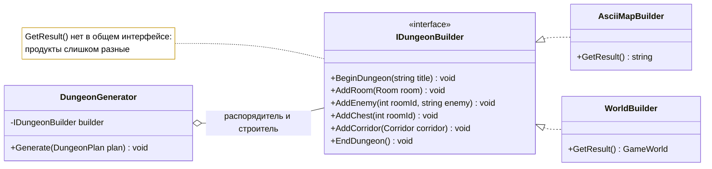
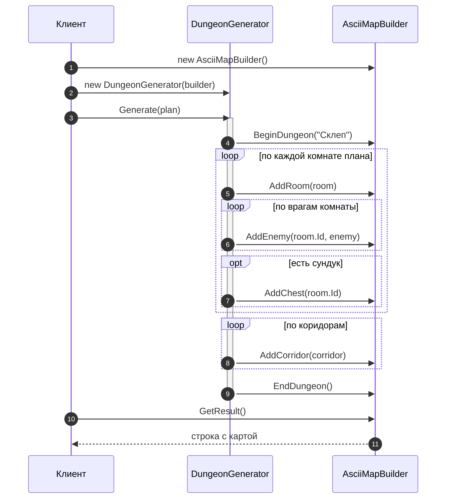

# Лабораторная работа 2. Строитель: один процесс — много представлений

!!! info "Об этом материале"

    Тема: паттерн Строитель в трактовке GoF и текучий строитель — две разные задачи.
    Объём: 6–8 часов; сдаётся репозиторием с коммитами по этапам и отчётом.
    Оценка: 100 баллов плюс до 4 за задания со звёздочкой; штрафы указаны в тексте.


> Тема: порождающий паттерн Builder в трактовке GoF и его современный родственник —
> текучий строитель. Язык — **C#** (Python по согласованию), диаграммы — **Mermaid**.
> Ориентировочно 6–8 часов, сдаётся репозиторием и отчётом.

## Цель работы

Развести **процесс конструирования** и **представление результата**: один и тот же
алгоритм сборки должен создавать разные продукты. Плюс научиться отличать строителя GoF
от текучего строителя (`.WithX().WithY().Build()`) и понимать, какую задачу решает каждый.

После лабораторной 1 у вас уже есть опыт: фабрика отвечает на вопрос **какой объект
создать**. Строитель отвечает на другой вопрос — **как собрать сложный объект по шагам**,
и этот вопрос возникает, когда объект состоит из частей, а частей много.

## Легенда

Продолжаем ту же игру. Теперь нужен **генератор подземелья**: он проходит по заданному
плану — комнаты, коридоры между ними, двери, сундуки, спавн-точки врагов — и что-то из
этого собирает. «Что-то» зависит от того, кому результат нужен:

- игровому движку — настоящие объекты мира, готовые к запуску;
- отладке — текстовая ASCII-карта в консоль;
- сохранению — JSON-описание уровня;
- балансировке — только статистика: сколько комнат, врагов, сундуков, какова длина пути.

Обход плана при этом **один и тот же**. Меняется только то, во что он превращается.

---

## Этап 0. Разминка: найти смешение ответственностей

Заготовка проекта лежит в материалах курса:
<https://github.com/radilov-spsu/materials/tree/main/OOP/examples/DungeonBuilder> —
решение `DungeonBuilder.sln`, консольное приложение, доменные классы и проект тестов
на xUnit. Как её забрать, написано там же в README. Скопируйте папку к себе, проверьте,
что `dotnet run` и `dotnet test` отрабатывают, — и это ваш первый коммит, до единой
собственной правки.

В заготовке лежит генератор, который одновременно обходит план и рисует ASCII-карту:

```csharp
public class DungeonGenerator
{
    public string Generate(DungeonPlan plan)
    {
        var map = new StringBuilder();

        map.AppendLine($"# Подземелье «{plan.Title}»");
        map.AppendLine();

        foreach (var room in plan.Rooms)
        {
            map.AppendLine($"[{room.Id}] комната {room.Width}x{room.Height}");

            foreach (var enemy in room.Enemies)
                map.AppendLine($"    враг: {enemy}");

            if (room.HasChest)
                map.AppendLine("    сундук");
        }

        map.AppendLine();

        foreach (var corridor in plan.Corridors)
            map.AppendLine($"[{corridor.From}] --{corridor.Length}-- [{corridor.To}]");

        return map.ToString();
    }
}
```

**Что сделать:**

1. Выписать, какие шаги обхода здесь есть (комната, враг, сундук, коридор…) — это будущий
   интерфейс строителя.
2. Отметить, какие строки кода относятся к **процессу** (порядок обхода плана), а какие —
   к **представлению** (форматирование текста).
3. Ответить письменно: что придётся сделать, если завтра понадобится тот же обход,
   но с выводом в JSON? А если понадобятся оба одновременно?

---

## Этап 1. Строитель GoF (2 часа)

Разделите класс надвое: **распорядитель** знает порядок шагов, **строитель** знает,
что делать на каждом шаге и как накапливать результат.



??? note "Исходник диаграммы"

    ```
    classDiagram
        direction LR
        class DungeonGenerator {
            -IDungeonBuilder builder
            +Generate(DungeonPlan plan) void
        }
        class IDungeonBuilder {
            <<interface>>
            +BeginDungeon(string title) void
            +AddRoom(Room room) void
            +AddEnemy(int roomId, string enemy) void
            +AddChest(int roomId) void
            +AddCorridor(Corridor corridor) void
            +EndDungeon() void
        }
        class AsciiMapBuilder {
            +GetResult() string
        }
        class WorldBuilder {
            +GetResult() GameWorld
        }
        IDungeonBuilder <|.. AsciiMapBuilder
        IDungeonBuilder <|.. WorldBuilder
        DungeonGenerator o-- IDungeonBuilder : распорядитель и строитель
        note for IDungeonBuilder "GetResult() нет в общем интерфейсе:<br/>продукты слишком разные"
    ```




??? note "Исходник диаграммы"

    ```
    sequenceDiagram
        autonumber
        participant C as Клиент
        participant D as DungeonGenerator
        participant B as AsciiMapBuilder

        C->>B: new AsciiMapBuilder()
        C->>D: new DungeonGenerator(builder)
        C->>D: Generate(plan)
        activate D
        D->>B: BeginDungeon("Склеп")
        loop по каждой комнате плана
            D->>B: AddRoom(room)
            loop по врагам комнаты
                D->>B: AddEnemy(room.Id, enemy)
            end
            opt есть сундук
                D->>B: AddChest(room.Id)
            end
        end
        loop по коридорам
            D->>B: AddCorridor(corridor)
        end
        D->>B: EndDungeon()
        deactivate D
        C->>B: GetResult()
        B-->>C: строка с картой
    ```


**Требования:**

- `DungeonGenerator` не содержит ни одной строки форматирования и ничего не знает
  о типе результата;
- **минимум два строителя**: ASCII-карта и объекты игрового мира;
- `GetResult()` объявлен **в конкретных строителях**, а не в общем интерфейсе, — продукты
  разных типов, общего у них нет. В отчёте объясните, почему это не недоработка, а решение;
- тест: два строителя, прогнанные через один и тот же `Generate(plan)`, дают согласованные
  результаты (в карте столько же комнат, сколько объектов в мире).

---

## Этап 2. Третий строитель без единой правки распорядителя (1 час)

Добавьте **третьего** строителя из списка: JSON-описание уровня или сборщик статистики
(число комнат, врагов, сундуков, суммарная длина коридоров).

**Требование, которое и есть смысл этапа:** коммит с третьим строителем не должен трогать
`DungeonGenerator`. В отчёте приложите `git diff --stat` этого коммита — в нём должны быть
только новые файлы и точка сборки.

Это Open/Closed в чистом виде: расширили поведение добавлением класса, не изменив
работающий код.

---

## Этап 3. Текучий строитель — другая задача (2 часа)

Теперь противоположный случай. Есть игровой предмет с кучей **необязательных** параметров:
название, редкость, урон, вес, набор эффектов, требования к уровню, цена, описание.
Конструктор на восемь параметров нечитаем, а половина из них обычно не нужна.

```csharp
// ПЛОХО: попробуйте с ходу сказать, что означает каждый аргумент
var sword = new Item("Клинок зари", 3, 42, 5.5, true, 7, 1200, null);
```

```csharp
// ХОРОШО: текучий строитель
var sword = new ItemBuilder("Клинок зари")
    .Rarity(Rarity.Epic)
    .Damage(42)
    .Weight(5.5)
    .RequiresLevel(7)
    .WithEffect(Effect.Burning)
    .WithEffect(Effect.Lifesteal)
    .Build();                       // ← здесь же проверяются инварианты
```

**Требования:**

- продукт **неизменяемый**: все свойства только для чтения, собрать его можно лишь
  через строителя (конструктор продукта закрыт);
- `Build()` проверяет инварианты и бросает исключение при нарушении (например, у эпического
  предмета обязателен хотя бы один эффект, урон неотрицателен);
- один и тот же строитель нельзя случайно использовать дважды — либо запретите повторный
  `Build()`, либо возвращайте новый экземпляр строителя на каждом шаге. Выбор обоснуйте;
- минимум три теста: успешная сборка, нарушенный инвариант, повторный вызов `Build()`.

**Главный вопрос этапа в отчёт:** чем этот строитель отличается от строителя из этапа 1?
Подсказка: у GoF ключевое — **один процесс, много представлений**; здесь — **много
необязательных параметров, один продукт**. Названия совпали, задачи разные.

---

## Этап 4. Сравнение и выводы (1 час)

Заполните таблицу по своему коду:

| | Фабрика (лаб. 1) | Строитель GoF (этап 1) | Текучий строитель (этап 3) |
|---|---|---|---|
| Какой вопрос решает | | | |
| Сколько продуктов на выходе | | | |
| Кто знает порядок шагов | | | |
| Что меняется без правки существующего кода | | | |
| Когда избыточен | | | |

И ответьте: **в каких местах вашей игры строитель не нужен и почему.** Работа, где строитель
применён ко всему подряд, оценивается ниже, чем работа с двумя обоснованными применениями.

---

## Этап 5 (со звёздочкой, по желанию)

+2 балла за пункт, максимум +4:

1. **Два сценария у распорядителя** — `GenerateSmall()` и `GenerateBoss()` с разным порядком
   шагов, работающие с теми же строителями.
2. **Вложенный строитель** — комната собирается собственным строителем, который возвращает
   управление внешнему.
3. **C# без строителя** — соберите тот же неизменяемый предмет через `record` с
   `required`-свойствами, объектный инициализатор и `with`. Сравните в отчёте: что потеряли,
   что выиграли, где проверяются инварианты.
4. **Python-версия** этапа 1: строители как обычные классы либо как функции обратного вызова.
   Сравните объём кода и читаемость.

---

## Варианты заданий

Вариант — тот же номер и та же вселенная, что в лабораторной 1: подземелье собирается
в вашем сеттинге. Различается **третий строитель** (этап 2) и **предмет** (этап 3):

| № | Третий строитель | Предмет для текучего строителя |
|---|---|---|
| 1 | JSON-сохранение | оружие ближнего боя |
| 2 | статистика баланса | корабль |
| 3 | JSON-сохранение | имплант |
| 4 | карта в Markdown | судно |
| 5 | статистика баланса | самодельное оружие |
| 6 | граф в формате Mermaid | механизм |
| 7 | JSON-сохранение | осадное орудие |
| 8 | статистика баланса | снаряжение ныряльщика |
| 9 | карта в Markdown | комплект экипировки |
| 10 | граф в формате Mermaid | артефакт |
| 11 | JSON-сохранение | набор выживальщика |
| 12 | согласовать со мной | согласовать со мной |

Строитель «граф в формате Mermaid» — отдельное удовольствие: его результат можно вставить
в отчёт и увидеть своё подземелье картинкой.

---

## Что сдаётся

1. **Репозиторий** на основе
   [заготовки](https://github.com/radilov-spsu/materials/tree/main/OOP/examples/DungeonBuilder),
   коммиты по этапам.
2. **Код**: консольное приложение печатает ASCII-карту, затем сводку от третьего строителя,
   затем собранный текучим строителем предмет.
3. **Тесты** — минимум шесть: согласованность двух строителей, содержимое ASCII-карты,
   работа третьего строителя, успешная сборка предмета, нарушенный инвариант, повторный
   `Build()`.
4. **Отчёт** `README.md`:
   - ответы на вопросы этапов 0–4;
   - **диаграмма классов** (распорядитель, интерфейс строителя, все строители) и
     **диаграмма последовательности** одного вызова `Generate` — обе в Mermaid;
   - `git diff --stat` коммита из этапа 2;
   - итоговая таблица сравнения;
   - раздел «чем платим» по каждому из двух строителей.

---

## Критерии оценки

| Что | Баллов |
|---|---|
| Этап 0: разбор процесса и представления | 5 |
| Этап 1: распорядитель и два строителя, чистое разделение | 25 |
| Этап 2: третий строитель без правки распорядителя (подтверждено diff) | 15 |
| Этап 3: текучий строитель, неизменяемый продукт, инварианты в `Build()` | 20 |
| Тесты (6 обязательных) | 15 |
| Диаграммы: классов и последовательности | 10 |
| Отчёт: ответы, таблица, «чем платим» | 10 |
| **Итого** | **100** |
| Этап 5 со звёздочкой | +2 за пункт, максимум +4 |

**Штрафы:** форматирование внутри распорядителя — минус 10; `GetResult()` в общем
интерфейсе строителей — минус 5; изменённый `DungeonGenerator` в коммите этапа 2 — минус 10;
изменяемый продукт в этапе 3 — минус 5; диаграмма не рендерится — минус 5.

---

## Типичные ошибки

1. **Распорядитель знает про формат.** В `Generate` появляется `if (builder is AsciiMapBuilder)`
   или строка с разделителем — разделение сломано.
2. **`GetResult()` в общем интерфейсе.** Приходится возвращать `object` и делать приведение
   типа у клиента; у GoF результат намеренно вынесен в конкретные строители.
3. **Строитель накапливает состояние и используется повторно.** Второй `Generate` дописывает
   к первому результату. Отсюда требование про повторный `Build()`.
4. **Продукт собирается наполовину.** `Build()` возвращает объект с незаполненными полями,
   потому что инварианты никто не проверил.
5. **Строитель вместо фабрики.** Если продукт один и собирать нечего — нужен конструктор
   или фабричный метод, а не шесть методов `WithX`.
6. **Текучий строитель назван строителем GoF.** На защите это первый вопрос.

---

## Контрольные вопросы к защите

1. Что в паттерне GoF меняется, а что остаётся неизменным: процесс или представление?
2. Почему `GetResult()` не входит в общий интерфейс строителя?
3. Кто задаёт порядок шагов — распорядитель или строитель? Что будет, если порядок
   потребуется менять?
4. Чем строитель отличается от абстрактной фабрики? Оба ведь создают составные вещи.
5. В каком случае текучий строитель избыточен и достаточно `record` с объектным
   инициализатором?
6. Где в вашем коде проверяются инварианты продукта и почему именно там?

## Литература

- Конспект лекции 5, блок 6 «Builder — строитель».
- **Э. Гамма и др. Приёмы объектно-ориентированного проектирования**, глава 3, раздел
  «Строитель»: там же пример с лабиринтом (`MazeBuilder`) — тот же приём, что у вас
  с подземельем, и пример конвертера RTF, где один разбор даёт разные представления.
- **Дж. Блох. Effective Java**, статья о строителе при большом числе параметров —
  первоисточник текучего варианта; идея переносится на C# без изменений.
