# ООАП. Лекция 3 — Язык UML. Диаграммы классов

> Конспект лектора. Нотация — UML 2.x по Мартину Фаулеру («UML. Основы»); примеры диаграмм —
> на **Mermaid**, потому что это текст, который живёт в репозитории рядом с кодом и
> рендерится где угодно. Код — на **C#**. С этой лекции все диаграммы в отчётах и курсовых
> сдаются в Mermaid.

---

## Блок 1. Зачем UML и как им пользоваться

### Три режима применения UML (по Фаулеру)

Фаулер и Стив Меллор независимо друг от друга пришли к одному и тому же делению —
в «UML. Основы» оно названо тремя режимами использования языка:

- **Режим эскиза.** Набросок для обмена информацией: рисуем избранное, остальное опускаем.
  Живёт минуты или дни, инструмент — доска. При прямой разработке эскиз предшествует коду,
  при обратной — объясняет уже написанное. **Фаулер прямо называет этот режим главным,
  и именно ему мы учимся.**
- **Режим проектирования (чертёж).** Подробная модель, из которой пишут код или которую
  восстанавливают из кода. Требует полноты, дисциплины и инструментов.
- **Режим языка программирования.** Из моделей генерируется исполняемая система; это
  подход MDA, где не зависящая от платформы модель превращается в платформенную,
  а из неё — в код. В мейнстриме не прижился.

Практический вывод для курса: диаграмма — **средство коммуникации**, а не отчётный артефакт.
Если она не помогает понять систему быстрее, чем чтение кода, её не надо было рисовать.

### Точки зрения

Одна и та же диаграмма классов читается с трёх точек зрения (термин Фаулера):

- **концептуальная** — понятия предметной области; здесь мы создаём словарь для разговора
  о предметной области, а не описываем программу;
- **спецификации** — интерфейсы и типы, контракт, но ещё не реализация;
- **реализации** — классы такими, какие они есть в коде.

Фаулер отдельно отмечает, что строгих правил выбора точки зрения нет, и большинство
разработчиков используют UML в программном ракурсе. Но смешивать точки зрения в одной
картинке — самая частая ошибка. Перед тем как рисовать, отвечаем: для кого это и с какой
точки зрения.

### Что вообще есть в UML

UML 2 описывает **13 официальных типов диаграмм** (так их считает Фаулер по UML 2.0;
в редакции UML 2.5 их четырнадцать — добавилась диаграмма профилей). Все они делятся
на **структурные** (что система из себя представляет) и **поведенческие** (что она делает).
На практике 90% пользы дают четыре:
классов, последовательности, состояний и вариантов использования. Ими и займёмся: классами
сегодня, поведением — в лекции 4. Полная карта диаграмм — в материале для самостоятельной
работы по разделу 2.

---

## Блок 2. Mermaid как рабочий формат

### Почему текст, а не картинка

Диаграмма-картинка в Word стареет в тот же день, когда меняется код: её нельзя
отдиффить, нельзя отревьюить, нельзя поправить одну стрелку. Mermaid — это текстовое
описание диаграммы, которое:

- лежит в репозитории рядом с кодом и версионируется;
- рендерится в GitHub, GitLab, Obsidian, Notion, VS Code и в этом конспекте;
- правится в две секунды и показывает осмысленный diff в pull request;
- пишется быстрее, чем рисуется мышкой.

Рисовать и проверять — на [mermaid.live](https://mermaid.live): слева текст, справа картинка.

### Минимальный синтаксис

Диаграмма классов начинается с ключевого слова, дальше идут классы и связи:

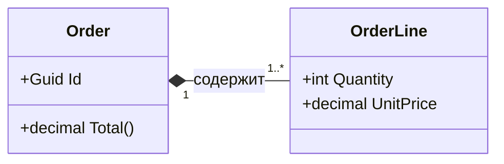

??? note "Исходник диаграммы"

    ```
    classDiagram
        direction LR
        class Order {
            +Guid Id
            +decimal Total()
        }
        class OrderLine {
            +int Quantity
            +decimal UnitPrice
        }
        Order "1" *-- "1..*" OrderLine : содержит
    ```


У каждой диаграммы в этом конспекте есть переключатель **«Диаграмма / Код»**: смотрим
картинку, при необходимости открываем исходный текст и копируем его к себе.

### Правила курса

1. Имена классов, атрибутов и операций — **латиницей, как в коде**. Подписи связей и
   заметки — по-русски.
2. Диаграмма в отчёте — блоком ```` ```mermaid ````, а не скриншотом.
3. Одна диаграмма — одна мысль. Не бывает «диаграммы всей системы»: бывает нечитаемая стена.

---

## Блок 3. Класс на диаграмме

### Три секции

Прямоугольник класса делится на имя, атрибуты и операции. Показывать нужно не всё,
а существенное для данной диаграммы — пустые секции допустимы и нормальны.

**Видимость** обозначается префиксом:

| Символ | UML | C# |
|---|---|---|
| `+` | public | `public` |
| `-` | private | `private` |
| `#` | protected | `protected` |
| `~` | package | `internal` |

Дополнительно: `$` — статический член, `*` — абстрактная операция,
`<<interface>>` / `<<abstract>>` / `<<enumeration>>` — стереотип над именем.

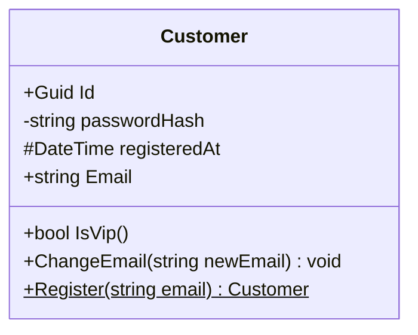

??? note "Исходник диаграммы"

    ```
    classDiagram
        class Customer {
            +Guid Id
            -string passwordHash
            #DateTime registeredAt
            +string Email
            +bool IsVip()
            +ChangeEmail(string newEmail) void
            +Register(string email)$ Customer
        }
    ```


Читаем вслух: `Id` — публичное, `passwordHash` — приватное, `registeredAt` — защищённое,
`Register` — статическая операция (подчёркнута).

Тот же класс в C#:

```csharp
public class Customer
{
    public Guid Id { get; }
    private string passwordHash;
    protected DateTime registeredAt;

    public string Email { get; private set; }

    public bool IsVip() => /* ... */ false;
    public void ChangeEmail(string newEmail) => Email = newEmail;
    public static Customer Register(string email) => new Customer();
}
```

### Атрибут или ассоциация

Важный момент, который путают: `Order` содержит `Customer` — это можно нарисовать
и как атрибут внутри прямоугольника (`+Customer Customer`), и как стрелку между классами.
**Смысл одинаковый, различается акцент.** Правило: если тип — из вашей модели и он
существенен, рисуйте связь стрелкой; если это примитив или деталь (`string`, `DateTime`,
`decimal`) — оставляйте атрибутом.

### Абстрактные классы, интерфейсы, перечисления

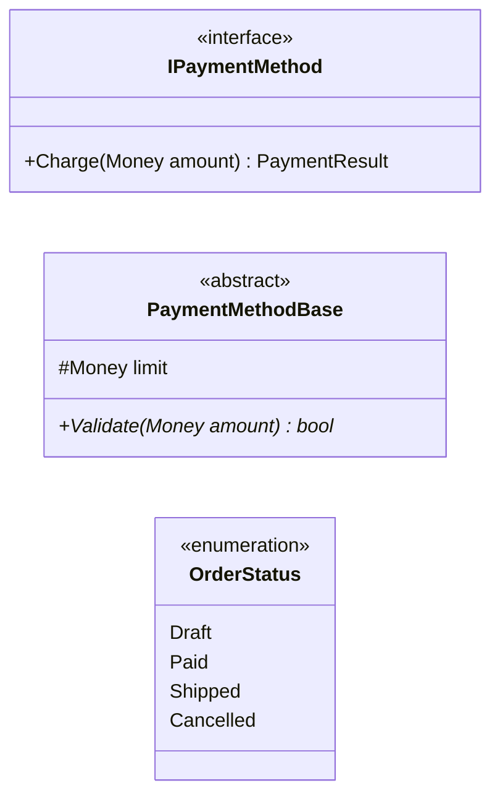

??? note "Исходник диаграммы"

    ```
    classDiagram
        direction LR
        class IPaymentMethod {
            <<interface>>
            +Charge(Money amount) PaymentResult
        }
        class PaymentMethodBase {
            <<abstract>>
            #Money limit
            +Validate(Money amount)* bool
        }
        class OrderStatus {
            <<enumeration>>
            Draft
            Paid
            Shipped
            Cancelled
        }
    ```


Курсив в UML означает «абстрактное»: курсивное имя класса — абстрактный класс, курсивная
операция — абстрактная. В Mermaid для этого используются стереотипы и `*`.

---

## Блок 4. Ассоциации, кратности, роли

**Ассоциация** — структурная связь: объекты одного класса знают об объектах другого.
На диаграмме это линия; стрелка показывает **направление навигации** — кто на кого может
сослаться в коде.

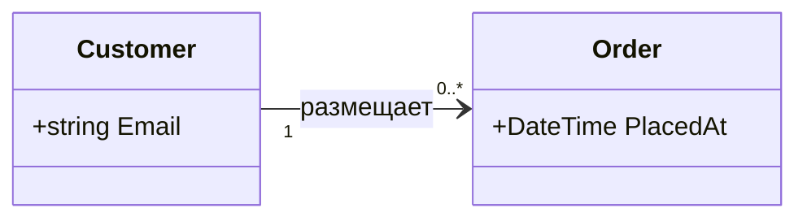

??? note "Исходник диаграммы"

    ```
    classDiagram
        direction LR
        class Customer {
            +string Email
        }
        class Order {
            +DateTime PlacedAt
        }
        Customer "1" --> "0..*" Order : размещает
    ```


Читается: у одного покупателя ноль или больше заказов; из покупателя можно добраться
до заказов, обратно — нет.

### Кратность

| Запись | Смысл |
|---|---|
| `1` | ровно один |
| `0..1` | ноль или один (необязательная связь) |
| `*` или `0..*` | сколько угодно |
| `1..*` | хотя бы один |
| `2..4` | от двух до четырёх |

Кратность — не украшение, а **бизнес-правило**, которое потом превращается в проверку
в коде. «У заказа хотя бы одна позиция» на диаграмме `1..*`, а в коде — исключение
в конструкторе.

### Направление и его цена

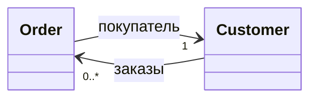

??? note "Исходник диаграммы"

    ```
    classDiagram
        direction LR
        class Order
        class Customer
        Order --> Customer : покупатель
        Customer "1" --> "0..*" Order : заказы
    ```


Двунаправленная навигация (стрелки в обе стороны) — это удобство ценой связанности:
две ссылки надо синхронно поддерживать, объекты нельзя загрузить по отдельности,
в ORM появляются циклы при сериализации. Правило: **начинайте с однонаправленной связи**
и добавляйте вторую сторону, только когда без неё сценарий не пишется.

### Роли

Когда одного имени связи мало (особенно при связи класса с самим собой), подписывают
концы — это **роли**:

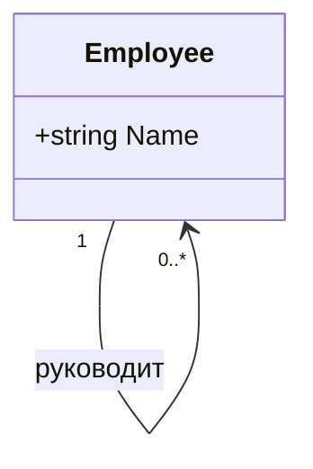

??? note "Исходник диаграммы"

    ```
    classDiagram
        class Employee {
            +string Name
        }
        Employee "1" --> "0..*" Employee : руководит
    ```


В коде роли становятся именами свойств: `Manager` и `Subordinates`.

---

## Блок 5. Агрегация и композиция

Обе — частные случаи ассоциации «часть-целое», из лекции 1.

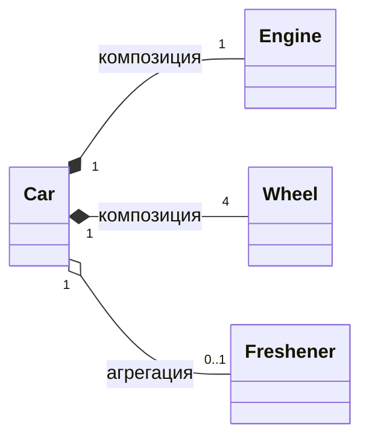

??? note "Исходник диаграммы"

    ```
    classDiagram
        direction LR
        class Car
        class Engine
        class Wheel
        class Freshener
        Car "1" *-- "1" Engine : композиция
        Car "1" *-- "4" Wheel : композиция
        Car "1" o-- "0..1" Freshener : агрегация
    ```


- **Композиция** — закрашенный ромб у целого (`*--`). Ключевое правило Фаулера —
  **нет совместного владения**: класс-часть может фигурировать частью нескольких классов,
  но каждый *экземпляр* принадлежит ровно одному владельцу. Второе допущение: при удалении
  владельца удаляются и все его части. Обратную кратность у части обычно не показывают —
  она равна `0..1`, и только если владелец единственно возможный, ставят `1`.
- **Агрегация** — пустой ромб (`o--`). Часть передаётся извне, живёт своей жизнью,
  может принадлежать нескольким целым.

Честная оговорка, которую стоит сказать студентам: Фаулер пишет, что семантика агрегации
в UML очень расплывчата, и приводит слова Джима Рамбо — агрегация есть «плацебо для
моделирования». Практическое правило: **сомневаетесь — рисуйте обычную ассоциацию.**
Значимо и однозначно только одно: композиция означает владение и совпадающий жизненный
цикл.

В коде это ровно то различие, которое мы обсуждали на примере `Dispose`: композит закрывает
свои части, агрегат — не закрывает чужое.

---

## Блок 6. Обобщение и реализация интерфейса

**Обобщение** (наследование) — сплошная линия с пустым треугольником, направленным
к родителю. **Реализация** интерфейса — пунктирная линия с пустым треугольником.

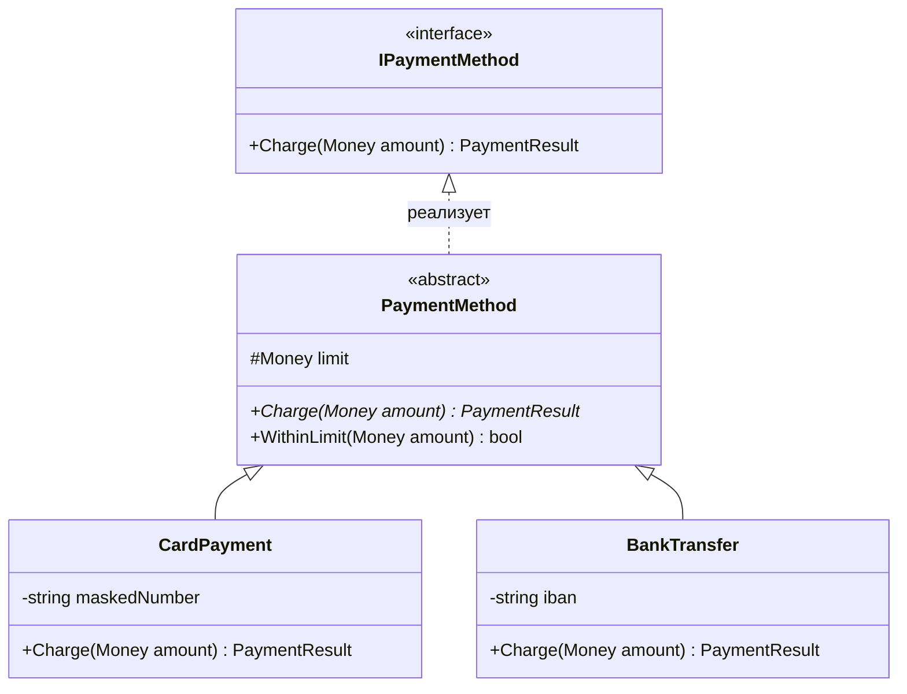

??? note "Исходник диаграммы"

    ```
    classDiagram
        direction TB
        class IPaymentMethod {
            <<interface>>
            +Charge(Money amount) PaymentResult
        }
        class PaymentMethod {
            <<abstract>>
            #Money limit
            +Charge(Money amount)* PaymentResult
            +WithinLimit(Money amount) bool
        }
        class CardPayment {
            -string maskedNumber
            +Charge(Money amount) PaymentResult
        }
        class BankTransfer {
            -string iban
            +Charge(Money amount) PaymentResult
        }
        IPaymentMethod <|.. PaymentMethod : реализует
        PaymentMethod <|-- CardPayment
        PaymentMethod <|-- BankTransfer
    ```


Стрелка всегда указывает **от потомка к предку** — от частного к общему. Это направление
зависимости: наследник знает о базовом типе, базовый о наследниках — нет.

```csharp
public interface IPaymentMethod { PaymentResult Charge(Money amount); }

public abstract class PaymentMethod : IPaymentMethod
{
    protected Money limit;
    public abstract PaymentResult Charge(Money amount);
    public bool WithinLimit(Money amount) => amount <= limit;
}

public sealed class CardPayment : PaymentMethod
{
    private string maskedNumber = "";
    public override PaymentResult Charge(Money amount) => PaymentResult.Ok;
}
```

Сверяемся с лекцией 1: три класса-наследника на диаграмме — это подтиповый полиморфизм;
клиент, работающий с `IPaymentMethod`, не знает ни об одном из них. Если у наследника
на диаграмме появляется операция-заглушка — это нарисованное нарушение LSP, и видно его
на картинке раньше, чем в коде.

---

## Блок 7. Зависимости, обобщённые типы, стереотипы, заметки

### Зависимость

Пунктирная стрелка (`..>`) — самая слабая связь: класс использует другой, но не хранит
ссылку. Типичные поводы: тип параметра метода, локальная переменная, возвращаемое значение,
статический вызов.

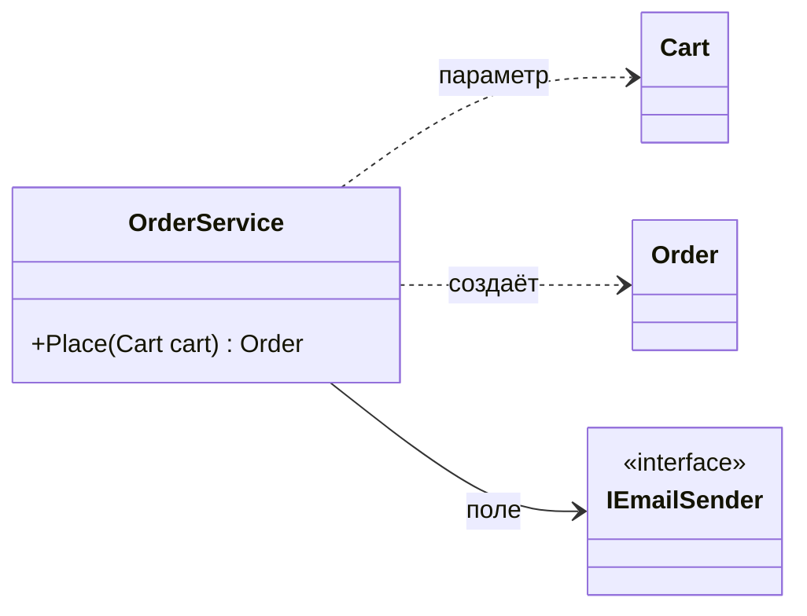

??? note "Исходник диаграммы"

    ```
    classDiagram
        direction LR
        class OrderService {
            +Place(Cart cart) Order
        }
        class Cart
        class Order
        class IEmailSender {
            <<interface>>
        }
        OrderService ..> Cart : параметр
        OrderService ..> Order : создаёт
        OrderService --> IEmailSender : поле
    ```


Разница на практике: ассоциацию (сплошная стрелка) вы увидите в полях класса,
зависимость (пунктир) — только в сигнатурах и теле методов. Когда считаете зацепление
модуля, считать надо и то и другое.

### Обобщённые типы

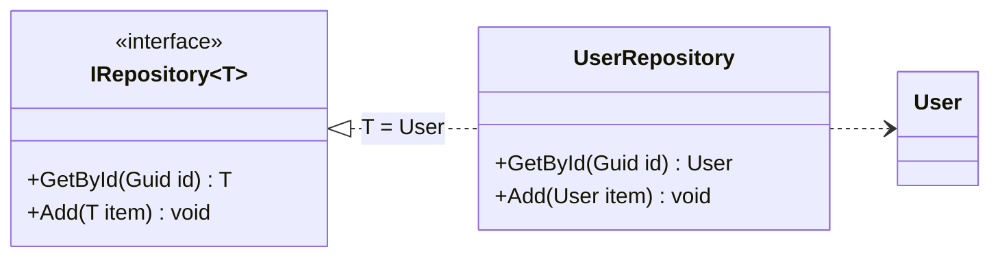

??? note "Исходник диаграммы"

    ```
    classDiagram
        direction LR
        class IRepository~T~ {
            <<interface>>
            +GetById(Guid id) T
            +Add(T item) void
        }
        class UserRepository {
            +GetById(Guid id) User
            +Add(User item) void
        }
        class User
        IRepository~T~ <|.. UserRepository : T = User
        UserRepository ..> User
    ```


Тильды в Mermaid заменяют угловые скобки: `IRepository~T~` — это `IRepository<T>`.

### Стереотипы

Стереотип в двойных угловых скобках уточняет роль элемента: `<<interface>>`, `<<abstract>>`,
`<<enumeration>>`, `<<service>>`, `<<entity>>`, `<<value object>>`, `<<repository>>`,
`<<aggregate root>>`. Последние четыре пригодятся, когда дойдём до моделирования предметной
области.

### Заметки

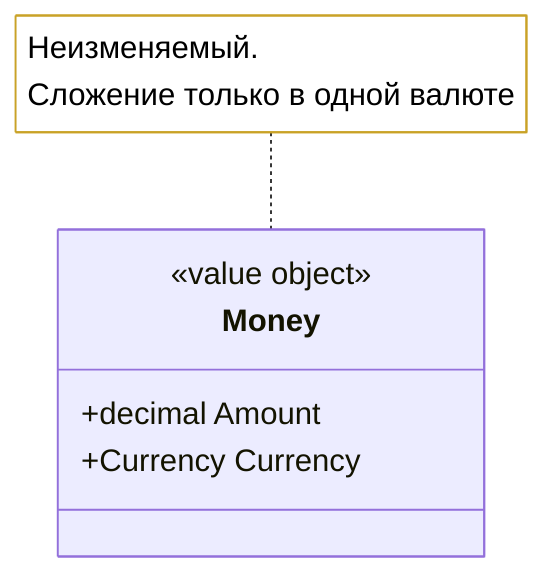

??? note "Исходник диаграммы"

    ```
    classDiagram
        class Money {
            <<value object>>
            +decimal Amount
            +Currency Currency
        }
        note for Money "Неизменяемый.<br/>Сложение только в одной валюте"
    ```


Заметка — место для инварианта, ограничения или вопроса. В настоящем UML для формальных
ограничений есть язык OCL, но на практике пишут человеческим языком в фигурных скобках:
`{Total > 0}`, `{упорядочено по дате}`.

---

## Блок 8. Сквозной пример: от диаграммы к коду

Задача: интернет-магазин. Покупатель кладёт товары в корзину, оформляет заказ, оплачивает
одним из способов, заказ доставляется. Рисуем **логическую** модель.

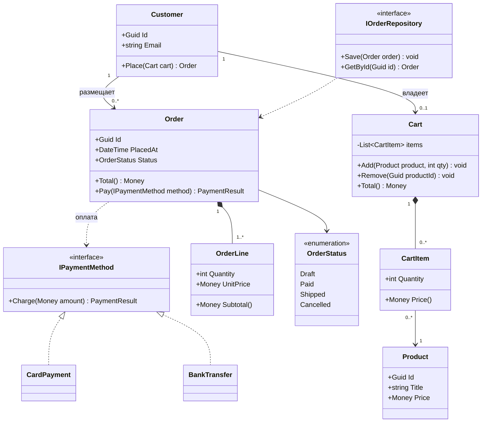

??? note "Исходник диаграммы"

    ```
    classDiagram
        direction TB

        class Customer {
            +Guid Id
            +string Email
            +Place(Cart cart) Order
        }

        class Cart {
            -List~CartItem~ items
            +Add(Product product, int qty) void
            +Remove(Guid productId) void
            +Total() Money
        }

        class CartItem {
            +int Quantity
            +Money Price()
        }

        class Product {
            +Guid Id
            +string Title
            +Money Price
        }

        class Order {
            +Guid Id
            +DateTime PlacedAt
            +OrderStatus Status
            +Total() Money
            +Pay(IPaymentMethod method) PaymentResult
        }

        class OrderLine {
            +int Quantity
            +Money UnitPrice
            +Money Subtotal()
        }

        class OrderStatus {
            <<enumeration>>
            Draft
            Paid
            Shipped
            Cancelled
        }

        class IPaymentMethod {
            <<interface>>
            +Charge(Money amount) PaymentResult
        }

        class CardPayment
        class BankTransfer

        class IOrderRepository {
            <<interface>>
            +Save(Order order) void
            +GetById(Guid id) Order
        }

        Customer "1" --> "0..*" Order : размещает
        Customer "1" --> "0..1" Cart : владеет
        Cart "1" *-- "0..*" CartItem
        CartItem "0..*" --> "1" Product
        Order "1" *-- "1..*" OrderLine
        Order --> OrderStatus
        Order ..> IPaymentMethod : оплата
        IPaymentMethod <|.. CardPayment
        IPaymentMethod <|.. BankTransfer
        IOrderRepository ..> Order
    ```


Что читаем с картинки, не открывая код:

- `CartItem` и `OrderLine` — разные классы, хотя похожи: позиция корзины ссылается
  на товар и меняется, позиция заказа фиксирует цену на момент покупки. Композиция
  обеих к своему целому — жить отдельно они не могут.
- У заказа хотя бы одна позиция (`1..*`) — это правило, а не пожелание.
- `Order` **зависит** от `IPaymentMethod` (пунктир): метод оплаты приходит в операцию
  параметром, заказ его не хранит.
- Репозиторий зависит от `Order`, а `Order` о репозитории не знает — направление
  зависимости соответствует DIP.

Перевод в C# — построчно с диаграммы:

```csharp
public sealed class Order
{
    private readonly List<OrderLine> _lines = new();          // 1..* композиция

    public Guid Id { get; } = Guid.NewGuid();
    public DateTime PlacedAt { get; }
    public OrderStatus Status { get; private set; } = OrderStatus.Draft;
    public IReadOnlyList<OrderLine> Lines => _lines;

    public Order(IEnumerable<OrderLine> lines, DateTime placedAt)
    {
        _lines.AddRange(lines);
        if (_lines.Count == 0)                                 // кратность 1..* как проверка
            throw new DomainException("Заказ без позиций невозможен");
        PlacedAt = placedAt;
    }

    public Money Total() => _lines.Aggregate(Money.Zero, (sum, l) => sum + l.Subtotal());

    public PaymentResult Pay(IPaymentMethod method)            // зависимость, не поле
    {
        if (Status != OrderStatus.Draft)
            throw new DomainException("Заказ уже оплачен или отменён");

        var result = method.Charge(Total());
        if (result == PaymentResult.Ok) Status = OrderStatus.Paid;
        return result;
    }
}

public sealed class OrderLine                                  // часть композита
{
    public int Quantity { get; }
    public Money UnitPrice { get; }                            // цена зафиксирована
    public Money Subtotal() => UnitPrice * Quantity;
}
```

### Обратная задача: диаграмма из кода

Полезное упражнение, которое я буду давать на контрольных: по фрагменту кода восстановить
диаграмму. Правила перевода:

| В коде | На диаграмме |
|---|---|
| поле типа из модели | ассоциация (сплошная стрелка) |
| коллекция в поле + создаётся внутри | композиция `*--` с кратностью `0..*` |
| объект приходит в конструктор и хранится | агрегация `o--` |
| параметр метода / локальная переменная | зависимость `..>` |
| `: BaseClass` | обобщение `<|--` |
| `: IInterface` | реализация `<|..` |
| `sealed` / `abstract` / `static` | стереотип, курсив, подчёркивание |

---

## Блок 9. Ошибки, правила оформления, требования к сдаче

### Типичные ошибки студентов

1. **Диаграмма всей системы.** Тридцать классов и сто линий — это не модель, а обои.
   Одна диаграмма отвечает на один вопрос.
2. **Смешение уровней.** На одной картинке `Customer` из предметной области и
   `CustomerDtoMapper` из инфраструктуры.
3. **Геттеры и сеттеры в списке операций.** Показывайте поведение, а не аксессоры.
4. **Стрелки без смысла.** Линия, у которой нельзя назвать ни кратность, ни направление,
   ни глагол — не нужна.
5. **Композиция вместо ассоциации.** Ромб ставят «для красоты», не задумываясь
   о жизненном цикле.
6. **Отсутствие кратностей.** Именно они несут бизнес-правила; без них диаграмма
   вдвое беднее.
7. **Обратные стрелки наследования.** Треугольник всегда у родителя.
8. **Диаграмма, устаревшая относительно кода.** Поэтому и Mermaid: правится за секунды
   и лежит в том же коммите.

### Требования к диаграммам в отчётах

- Только Mermaid, блоком в markdown, диаграмма должна рендериться (проверяется
  на mermaid.live).
- Указано, какая это перспектива: концептуальная, логическая или реализация.
- Имена — как в коде; подписи связей — глаголом («размещает», «содержит»).
- Кратности проставлены везде, где связь не «один к одному» очевидно.
- Максимум 7–9 классов на диаграмму. Больше — разбивайте по подсистемам.
- Под диаграммой — 3–5 строк текста: что на ней видно и какое решение она обосновывает.

### Литература

- **М. Фаулер. UML. Основы** — главы про диаграммы классов; тонкая книга, читается
  за вечер, дальше используется как справочник.
- **Э. Гамма и др. Приёмы объектно-ориентированного проектирования** — схемы классов
  в описаниях паттернов. Нотация там **не UML, а OMT** (книга старше стандарта), и это
  полезно знать заранее: наследование — треугольник от подкласса к родителю (как в UML),
  агрегирование — линия со стрелкой и ромбиком, отношение осведомлённости — стрелка без
  ромбика, отношение «создаёт» — пунктирная стрелка (в OMT его нет, авторы добавили сами),
  а закрашенный кружок у стрелки означает «более одного». Курсив, как и в UML, — признак
  абстрактного класса или операции. Плюс к схемам классов там используются схемы объектов
  и схемы взаимодействий.
- [mermaid.js.org/syntax/classDiagram.html](https://mermaid.js.org/syntax/classDiagram.html)
  — полный синтаксис.

### Домашнее задание

1. Взять свой проект из ДЗ по разделу 1 (библиотека или магазин) и построить **три**
   диаграммы классов: концептуальную (только понятия предметной области), логическую
   (интерфейсы и контракты) и реализацию (как в коде).
2. Для каждой связи явно проставить кратность и подпись; для каждой композиции — обосновать
   в тексте, почему это владение, а не агрегация.
3. Приложить фрагменты кода и показать соответствие «строка кода → элемент диаграммы»
   по таблице из блока 8.
4. Найти на своей диаграмме реализации хотя бы одно место, где видно архитектурную проблему
   из лекции 2 (цикл, God Object, лишняя двунаправленная связь), и описать, как исправите.
