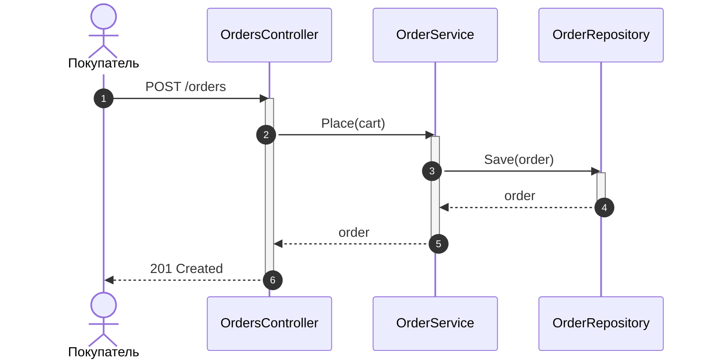
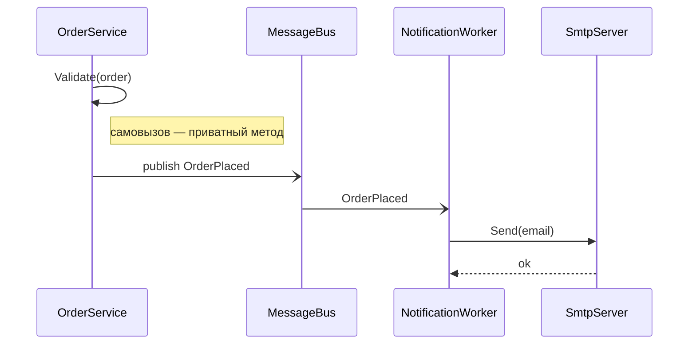
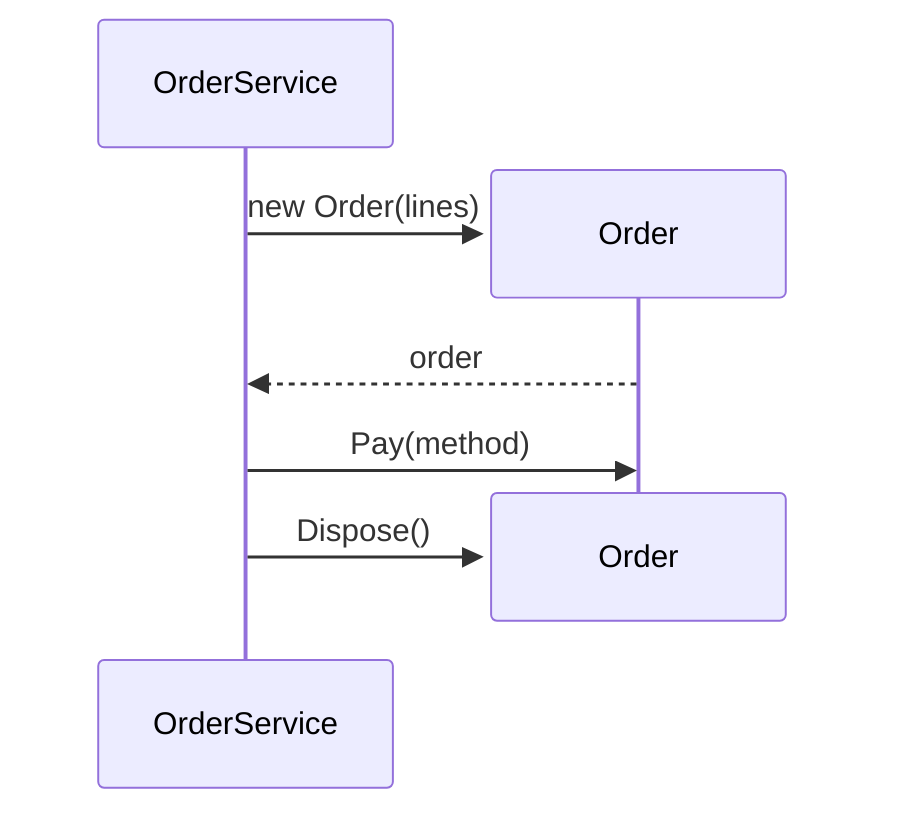
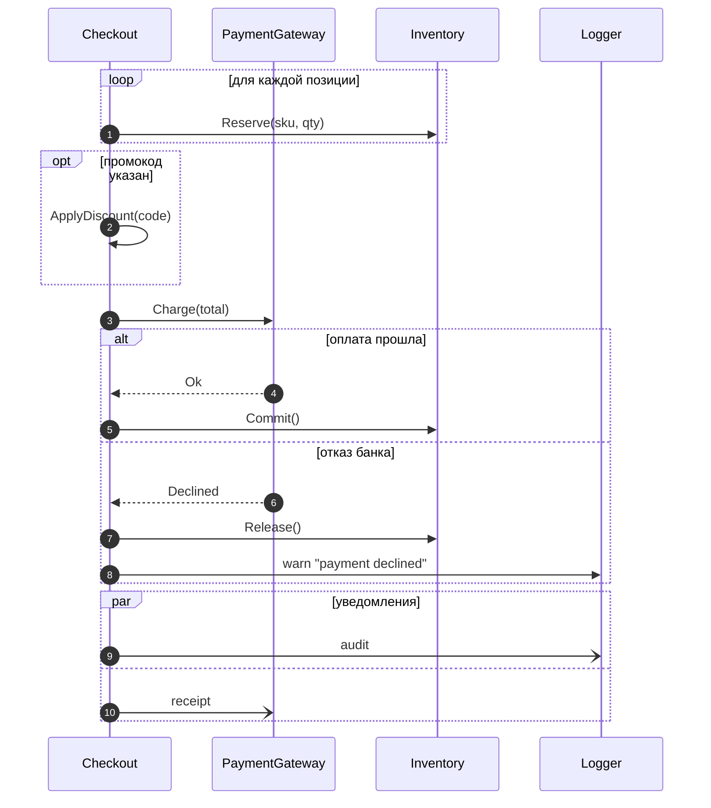
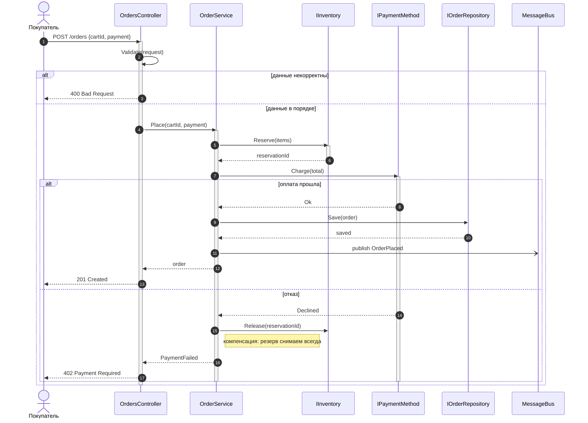
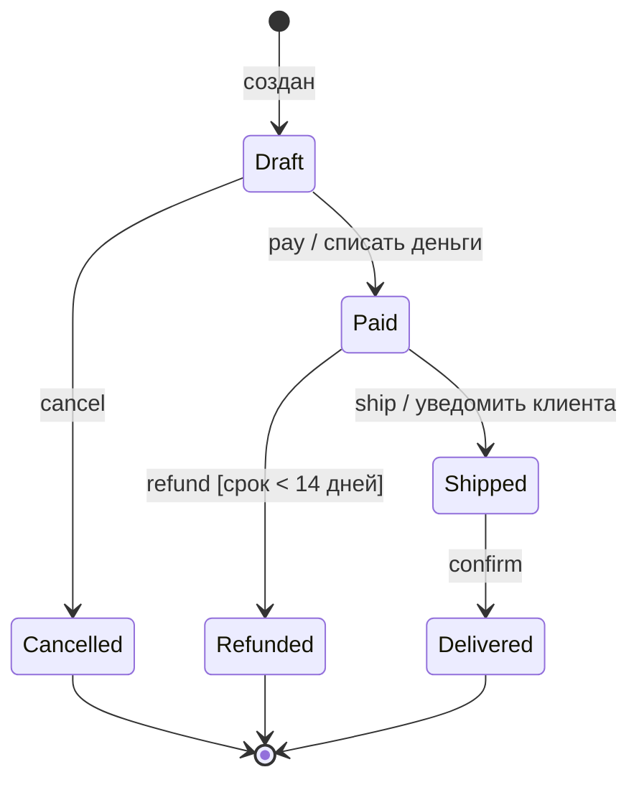
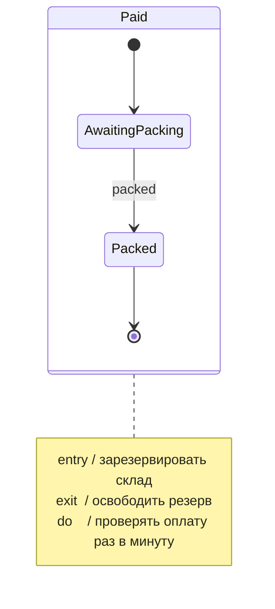
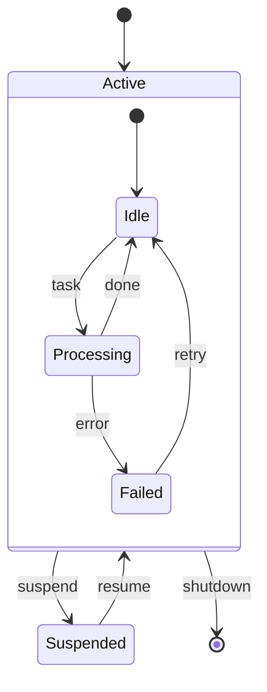
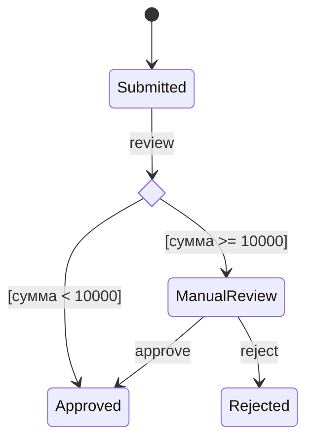
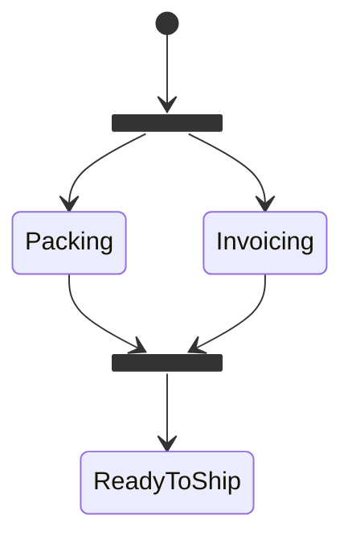

# ООАП. Лекция 4 — Диаграммы последовательности и диаграммы состояний

> Конспект лектора. Нотация — UML 2.x по Фаулеру («UML. Основы»), диаграммы — на **Mermaid**,
> код — на **C#**. Лекция 3 отвечала на вопрос «из чего состоит система»; эта — на вопросы
> «кто кого вызывает» и «в каких состояниях бывает объект».

---

## Блок 1. Зачем поведенческие диаграммы

Диаграмма классов показывает структуру: кто с кем связан. Но по ней невозможно ответить
на два вопроса, которые чаще всего и вызывают споры в команде:

- **Как выполняется сценарий?** Кто кому шлёт запросы, в каком порядке, что происходит
  при ошибке. Это диаграмма последовательности.
- **Как объект меняет своё поведение со временем?** Какие состояния допустимы, какие
  переходы разрешены и что их вызывает. Это диаграмма состояний.

Разница в фокусе: последовательность — про **один сценарий и много объектов**; состояния —
про **один объект и все его сценарии**. Это ортогональные срезы одной системы, и путать их
не стоит.

Когда рисовать:

- сценарий проходит через 3+ объекта и порядок вызовов неочевиден;
- есть асинхронность, ретраи, таймауты, компенсации;
- у сущности больше трёх состояний и переходы между ними ограничены правилами;
- вы объясняете легаси коллеге и сами не уверены, кто за что отвечает.

Когда не рисовать: тривиальный вызов «контроллер → сервис → репозиторий». Читать код
быстрее.

---

## Блок 2. Диаграмма последовательности: основа

### Что на ней есть

- **Участники (lifelines)** — объекты или роли, сверху в ряд; вертикальная штриховая
  линия — течение времени сверху вниз.
- **Сообщения** — горизонтальные стрелки между линиями жизни.
- **Активации (полосы выполнения)** — прямоугольники на линии жизни: объект сейчас
  занят обработкой.



??? note "Исходник диаграммы"

    ```
    sequenceDiagram
        autonumber
        actor User as Покупатель
        participant C as OrdersController
        participant S as OrderService
        participant R as OrderRepository

        User->>C: POST /orders
        activate C
        C->>S: Place(cart)
        activate S
        S->>R: Save(order)
        activate R
        R-->>S: order
        deactivate R
        S-->>C: order
        deactivate S
        C-->>User: 201 Created
        deactivate C
    ```


Синтаксис, который нужен для 95% диаграмм:

| Запись | Смысл |
|---|---|
| `participant A as Имя` | участник с коротким псевдонимом |
| `actor U as Пользователь` | человек, а не объект |
| `A->>B: текст` | синхронный вызов |
| `A-->>B: текст` | возврат результата |
| `A-)B: текст` | асинхронное сообщение |
| `activate A` / `deactivate A` | полоса выполнения |
| `Note over A,B: текст` | заметка |
| `autonumber` | автонумерация сообщений |

### Что здесь важно понимать

**Порядок задаёт вертикаль.** Ниже — значит позже. Стрелки не пересекаются во времени:
если два вызова нарисованы один под другим, второй начался после первого.

**Возврат рисуют не всегда.** Пунктирную стрелку возврата показывают, когда результат
существенен для сценария. Если метод возвращает `void` или значение не важно — стрелку
опускают, чтобы не засорять картинку.

**Участник — это роль, а не класс.** Можно писать `: OrderService` (безымянный объект
класса), `order : Order` (конкретный объект) или просто «Платёжный шлюз» — уровень
абстракции выбираете вы.

---

## Блок 3. Виды сообщений, создание и удаление участников

### Синхронно и асинхронно

Синхронный вызов (сплошная стрелка с закрашенным наконечником) — вызывающий ждёт ответа.
Асинхронный (открытый наконечник, в Mermaid `-)`) — отправил и пошёл дальше: постановка
в очередь, публикация события, `fire-and-forget`.



??? note "Исходник диаграммы"

    ```
    sequenceDiagram
        participant S as OrderService
        participant Q as MessageBus
        participant N as NotificationWorker
        participant M as SmtpServer

        S->>S: Validate(order)
        Note right of S: самовызов — приватный метод
        S-)Q: publish OrderPlaced
        Q-)N: OrderPlaced
        N->>M: Send(email)
        M-->>N: ok
    ```


Различие критично при обсуждении архитектуры: сплошная стрелка — вызывающий заблокирован
и зависит от доступности вызываемого; открытая — связанность слабее, но появляются вопросы
порядка, повторов и дубликатов. `async/await` в C# — по-прежнему **синхронное** по смыслу
сообщение: вызывающий ждёт результата, просто не блокирует поток. Асинхронное сообщение
в UML — это про «не жду ответа вообще».

### Создание и уничтожение объектов



??? note "Исходник диаграммы"

    ```
    sequenceDiagram
        participant S as OrderService
        create participant O as Order
        S->>O: new Order(lines)
        O-->>S: order
        S->>O: Pay(method)
        destroy O
        S->>O: Dispose()
    ```


`create` показывает, что объект появился в ходе сценария, `destroy` — что он перестал
существовать (в C# — освобождён `Dispose`, вышел из области видимости или стал недостижим).

### Заметки и условия

`Note over A,B: текст` — комментарий, охватывающий нескольких участников. Туда пишут
предусловия, таймауты, SLA: «ждём не больше 3 с», «идемпотентно по ключу заказа».

---

## Блок 4. Фрагменты: alt, opt, loop, par, break

Комбинированные фрагменты — рамки, задающие управляющую логику. Их пять, и их хватает.



??? note "Исходник диаграммы"

    ```
    sequenceDiagram
        autonumber
        participant C as Checkout
        participant P as PaymentGateway
        participant I as Inventory
        participant L as Logger

        loop для каждой позиции
            C->>I: Reserve(sku, qty)
        end

        opt промокод указан
            C->>C: ApplyDiscount(code)
        end

        C->>P: Charge(total)

        alt оплата прошла
            P-->>C: Ok
            C->>I: Commit()
        else отказ банка
            P-->>C: Declined
            C->>I: Release()
            C->>L: warn "payment declined"
        end

        par уведомления
            C-)L: audit
        and
            C-)P: receipt
        end
    ```


| Фрагмент | Когда | Аналог в коде |
|---|---|---|
| `alt` / `else` | несколько альтернатив, выполняется та, чья защита истинна | `if / else`, `switch` |
| `opt` | необязательный фрагмент; то же, что `alt` с одной веткой | `if` без `else` |
| `loop` | повторение; условие пишется в защите | `for`, `foreach`, `while` |
| `par` / `and` | параллельные ветви | `Task.WhenAll`, потоки |
| `break` | аварийный выход из сценария | ранний `return`, исключение |
| `critical` | критическая область: не прерывается | `lock`, транзакция |

Терминология: условие фрагмента в UML называется **защитой (guard)**, рамка — **фреймом**,
а сам фрейм подписан **оператором**. В стандарте критическая область обозначается оператором
`region`, а Mermaid называет её `critical` — расхождение реализации со стандартом, о котором
стоит знать. В UML есть и операторы, которых в Mermaid нет: `neg` (заведомо неверное
взаимодействие), `ref` (ссылка на другую диаграмму), `assert`, `strict`, `seq`.

Опасность, о которой предупреждает Фаулер: диаграмма последовательности **не является
блок-схемой**. Если у вас пять вложенных `alt` — вы рисуете алгоритм, а его лучше читать
кодом. Диаграмма хороша, пока показывает **взаимодействие**, а не вычисление.

---

## Блок 5. Сквозной пример: оформление заказа

Сценарий целиком, включая ошибку и компенсацию. Такой уровень детализации я жду
в отчётах.



??? note "Исходник диаграммы"

    ```
    sequenceDiagram
        autonumber
        actor U as Покупатель
        participant C as OrdersController
        participant S as OrderService
        participant I as IInventory
        participant P as IPaymentMethod
        participant R as IOrderRepository
        participant B as MessageBus

        U->>C: POST /orders {cartId, payment}
        activate C
        C->>C: Validate(request)

        alt данные некорректны
            C-->>U: 400 Bad Request
        else данные в порядке
            C->>S: Place(cartId, payment)
            activate S

            S->>I: Reserve(items)
            activate I
            I-->>S: reservationId
            deactivate I

            S->>P: Charge(total)
            activate P

            alt оплата прошла
                P-->>S: Ok
                S->>R: Save(order)
                R-->>S: saved
                S-)B: publish OrderPlaced
                S-->>C: order
                C-->>U: 201 Created
            else отказ
                P-->>S: Declined
                S->>I: Release(reservationId)
                Note right of S: компенсация: резерв снимаем всегда
                S-->>C: PaymentFailed
                C-->>U: 402 Payment Required
            end
            deactivate P
            deactivate S
        end
        deactivate C
    ```


Что эта картинка даёт помимо красоты:

- видно, что **резерв товара делается до оплаты**, а значит нужна компенсация при отказе —
  на диаграмме классов этого не увидеть никогда;
- видно, что публикация события асинхронна: заказ считается размещённым, даже если
  подписчики недоступны;
- видно, кто отвечает за HTTP-коды (контроллер) и кто за бизнес-решения (сервис) —
  прямая проверка правила «контроллер тонкий» из лекции 2.

Обсуждение с аудиторией: что произойдёт, если приложение упадёт между `Charge` и `Save`?
Диаграмма делает дырку в сценарии очевидной — и это её главная ценность.

---

## Блок 6. Диаграмма состояний: основа

### Что на ней есть

Диаграмма состояний (statechart) описывает **жизненный цикл одного объекта**: в каких
состояниях он бывает, какие события переводят его из одного в другое и какие действия
при этом выполняются.



??? note "Исходник диаграммы"

    ```
    stateDiagram-v2
        [*] --> Draft : создан
        Draft --> Paid : pay / списать деньги
        Draft --> Cancelled : cancel
        Paid --> Shipped : ship / уведомить клиента
        Paid --> Refunded : refund [срок < 14 дней]
        Shipped --> Delivered : confirm
        Cancelled --> [*]
        Refunded --> [*]
        Delivered --> [*]
    ```


Элементы:

- `[*]` — начальная и конечная псевдосостояния;
- прямоугольник со скруглением — состояние;
- стрелка — переход, подписывается по схеме **событие [условие] / действие**;
- условие в квадратных скобках — **сторож (guard)**: переход возможен, только если оно
  истинно;
- действие после слэша — что выполняется при переходе.

### Действия внутри состояния



??? note "Исходник диаграммы"

    ```
    stateDiagram-v2
        state Paid {
            [*] --> AwaitingPacking
            AwaitingPacking --> Packed : packed
            Packed --> [*]
        }
        note right of Paid
            entry / зарезервировать склад
            exit  / освободить резерв
            do    / проверять оплату раз в минуту
        end note
    ```


- `entry` — действие при входе в состояние, выполняется всегда, каким бы переходом
  ни вошли;
- `exit` — при выходе;
- `do` — длящаяся деятельность (**do-activity**), выполняется, пока объект находится
  в состоянии, и может быть прервана событием; в отличие от действий `entry`/`exit`,
  которые считаются мгновенными.

Это удобно тем, что убирает дублирование: не нужно писать «зарезервировать склад»
на каждой входящей стрелке.

### Состояние — это не поле, а поведение

Ключевая мысль блока. Состояние вводится тогда, когда **объект по-разному реагирует
на одни и те же запросы**. `Order.Pay()` в состоянии `Draft` списывает деньги,
в `Paid` — бросает ошибку, в `Cancelled` — тоже ошибку, но по другой причине. Если реакция
одинаковая, а различается только значение поля — это не состояние, это данные.

---

## Блок 7. Составные состояния, выбор, параллельность, история

### Составные (вложенные) состояния



??? note "Исходник диаграммы"

    ```
    stateDiagram-v2
        [*] --> Active
        state Active {
            [*] --> Idle
            Idle --> Processing : task
            Processing --> Idle : done
            Processing --> Failed : error
            Failed --> Idle : retry
        }
        Active --> Suspended : suspend
        Suspended --> Active : resume
        Active --> [*] : shutdown
    ```


Такое состояние называется **суперсостоянием**, вложенные в него — **подсостояниями**.
Переход `shutdown` нарисован один раз от всего суперсостояния и срабатывает из любого
подсостояния: именно ради этого общее поведение и выносят наверх. Это главный приём против «диаграммы-ежа», где из каждого состояния торчит
стрелка в `Cancelled`.

### Выбор и параллельность



??? note "Исходник диаграммы"

    ```
    stateDiagram-v2
        state check <<choice>>
        [*] --> Submitted
        Submitted --> check : review
        check --> Approved : [сумма < 10000]
        check --> ManualReview : [сумма >= 10000]
        ManualReview --> Approved : approve
        ManualReview --> Rejected : reject
    ```




??? note "Исходник диаграммы"

    ```
    stateDiagram-v2
        state fork_state <<fork>>
        state join_state <<join>>
        [*] --> fork_state
        fork_state --> Packing
        fork_state --> Invoicing
        Packing --> join_state
        Invoicing --> join_state
        join_state --> ReadyToShip
    ```


`<<choice>>` — ветвление по условиям, `<<fork>>` и `<<join>>` — параллельные ветви,
которые должны завершиться обе.

### История

`[H]` — псевдосостояние истории (в переводе книги — **предыстория**): вернувшись
в составное состояние, объект попадает туда, где был, а не в начальную точку. Стрелка,
выходящая из значка истории, показывает, куда идти, если предыстории ещё нет. Пригодится, когда моделируете возобновляемые процессы
(пауза/продолжение, восстановление сессии).

---

## Блок 8. Состояния в коде: enum, switch, паттерн State

Фаулер называет три основных способа реализовать диаграмму состояний: вложенный оператор
`switch`, паттерн State и таблица состояний. Разберём их по возрастанию цены и гибкости
(в книге, кстати, пример вложенного `switch` дан как раз на C#).

**1. Перечисление и проверки** — годится, пока состояний мало и правила простые:

```csharp
public sealed class Order
{
    public OrderStatus Status { get; private set; } = OrderStatus.Draft;

    public void Pay(IPaymentMethod method)
    {
        if (Status != OrderStatus.Draft)
            throw new DomainException($"Оплата невозможна в состоянии {Status}");
        // ...
        Status = OrderStatus.Paid;
    }
}
```

**2. Таблица переходов** — когда переходов много и хочется держать их в одном месте:

```csharp
private static readonly Dictionary<(OrderStatus From, OrderEvent Event), OrderStatus> Transitions = new()
{
    [(OrderStatus.Draft,  OrderEvent.Pay)]     = OrderStatus.Paid,
    [(OrderStatus.Draft,  OrderEvent.Cancel)]  = OrderStatus.Cancelled,
    [(OrderStatus.Paid,   OrderEvent.Ship)]    = OrderStatus.Shipped,
    [(OrderStatus.Shipped, OrderEvent.Confirm)] = OrderStatus.Delivered
};

public void Handle(OrderEvent e)
{
    if (!Transitions.TryGetValue((Status, e), out var next))
        throw new DomainException($"Переход {Status} --{e}--> невозможен");
    Status = next;
}
```

Таблица — это диаграмма, записанная данными: её можно распечатать, сверить с картинкой
и протестировать перебором всех пар.

**3. Паттерн State** — когда в каждом состоянии своё поведение, а не только запреты:

```csharp
public interface IOrderState
{
    IOrderState Pay(Order order, IPaymentMethod method);
    IOrderState Cancel(Order order);
}

public sealed class DraftState : IOrderState
{
    public IOrderState Pay(Order order, IPaymentMethod method)
    {
        method.Charge(order.Total());
        return new PaidState();                 // переход = смена объекта состояния
    }
    public IOrderState Cancel(Order order) => new CancelledState();
}

public sealed class PaidState : IOrderState
{
    public IOrderState Pay(Order order, IPaymentMethod method)
        => throw new DomainException("Заказ уже оплачен");
    public IOrderState Cancel(Order order) => throw new DomainException("Оплаченный заказ не отменяется");
}
```

Это тот самый «Replace Conditional with Polymorphism» из лекции 2, применённый к состояниям.
Цена — класс на состояние; выигрыш — новое состояние добавляется без правки существующих
(Open/Closed).

> **В других языках.** В F# и Rust состояние выражается размеченным объединением:
> `type Order = Draft of Cart | Paid of Payment | Shipped of Tracking` — компилятор
> **не даст** обратиться к номеру накладной у неоплаченного заказа и проверит, что все
> варианты обработаны. Это самая сильная форма: недопустимое состояние невыразимо, а не
> запрещено исключением. В C# ближайшее приближение — иерархия `sealed record` плюс
> `switch`-выражение с сопоставлением по типу. В экосистеме .NET готовые машины состояний:
> **Stateless** (описание в стиле таблицы переходов) и **MassTransit Saga** для
> распределённых процессов.

---

## Блок 9. Какую диаграмму когда; ошибки; сдача

### Выбор диаграммы

| Вопрос | Диаграмма |
|---|---|
| Из чего состоит система, кто с кем связан | классов |
| Как проходит конкретный сценарий | последовательности |
| Как объект живёт во времени | состояний |
| Что система делает для пользователя | вариантов использования |
| Как код разложен по модулям и сборкам | компонентов / пакетов |

### Ошибки

1. **Диаграмма последовательности как блок-схема** — вложенные `alt` в три уровня.
2. **Состояния, которых нет.** `Order.IsPaid = true` и `Order.IsShipped = true`
   независимо — это два флага, четыре комбинации и два невозможных состояния.
   Диаграмма состояний заставляет это заметить.
3. **Переходы без событий.** Стрелка без подписи не говорит, что её вызывает.
4. **Смешение уровней.** На одной диаграмме HTTP-контроллер и SQL-запросы.
5. **Отсутствие ветки ошибки.** Счастливый путь рисуют все; ценность диаграммы —
   в том, что происходит при отказе.
6. **Диаграмма ради отчёта.** Если после неё вы не приняли ни одного решения — она лишняя.

### Требования к отчётам с этой лекции

- Каждый сценарий с ветвлением сдаётся диаграммой последовательности в Mermaid,
  обязательно с веткой ошибки.
- Каждая сущность с тремя и более состояниями — диаграммой состояний, где переходы
  подписаны по схеме «событие [сторож] / действие».
- Под диаграммой — таблица переходов или ссылка на код, реализующий её.
- Диаграмма и код должны совпадать: расхождение считается ошибкой, а не мелочью.

### Литература

- **М. Фаулер. UML. Основы** — главы о диаграммах последовательности и состояний;
  там же честная критика чрезмерного моделирования.
- **Э. Гамма и др.** — паттерны State, Observer, Mediator: их описания читаются легче,
  если параллельно рисовать взаимодействие.
- [mermaid.js.org/syntax/sequenceDiagram.html](https://mermaid.js.org/syntax/sequenceDiagram.html)
  и [stateDiagram.html](https://mermaid.js.org/syntax/stateDiagram.html) — справочники
  синтаксиса.
