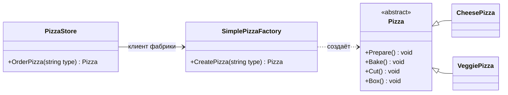
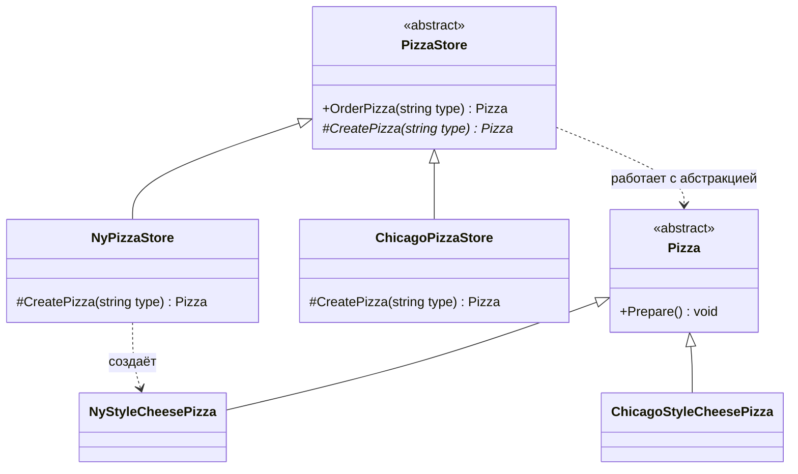
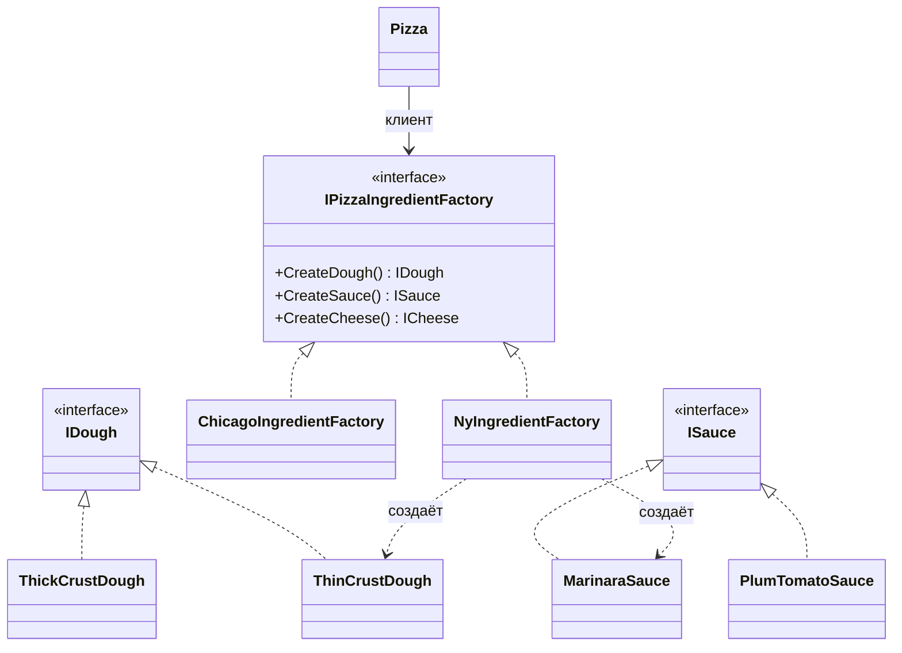
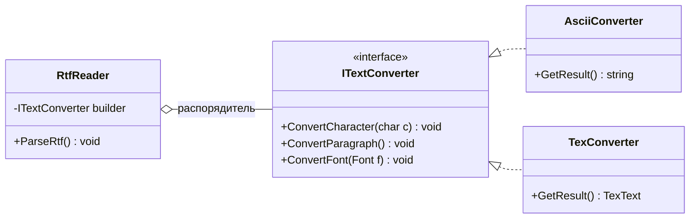
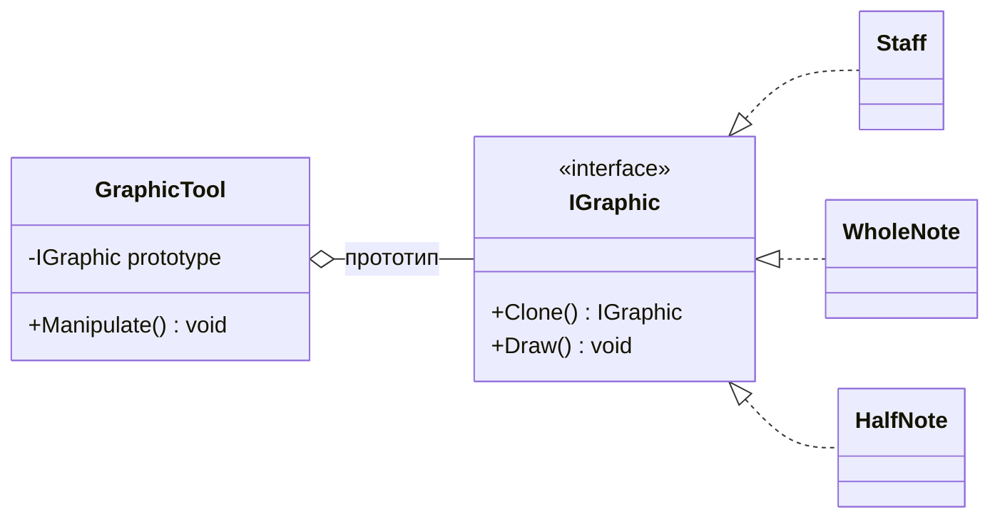
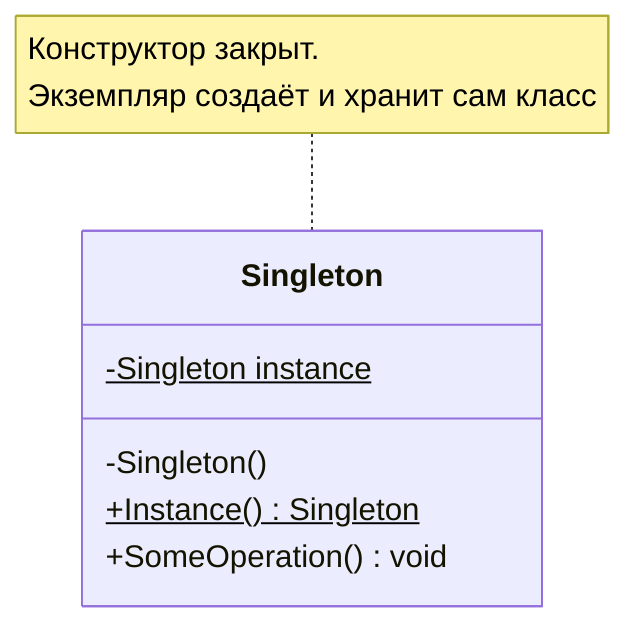
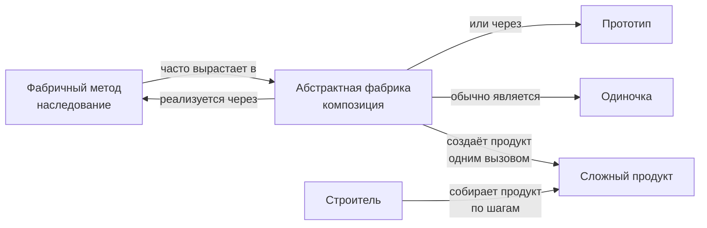

# ООАП. Лекция 5 — Классификация паттернов. Порождающие паттерны

> Конспект лектора. Источник — «Приёмы объектно-ориентированного проектирования»
> (Гамма, Хелм, Джонсон, Влиссидес). Названия, назначение и структура паттернов даются
> по книге; примеры в книге на C++ и Smalltalk, у нас — **C#**, диаграммы — **Mermaid**.

---

## Блок 1. Что такое паттерн и из чего состоит его описание

### Определение

Паттерн проектирования именует, мотивирует и объясняет приём проектирования, который
относится к задаче, часто возникающей в объектно-ориентированных системах. Он описывает
задачу, решение, область применимости и результаты применения.

Четыре обязательные части, без которых паттерна нет:

1. **Имя** — единица общего словаря. «Здесь нужен декоратор» короче и точнее, чем три минуты
   объяснений.
2. **Задача** — когда применять, при каких условиях.
3. **Решение** — схема организации классов и объектов, а не готовый код. Паттерн —
   это шаблон, который каждый раз реализуется по-своему.
4. **Результаты** — чем платим: гибкость против производительности, расширяемость против
   числа классов.

### Как устроена статья каталога

Каждый паттерн в книге описан по одному шаблону: название и классификация, назначение,
известен также под именем, мотивация, применимость, структура, участники, отношения,
результаты, реализация, пример кода, известные применения, родственные паттерны.

Из этого списка на практике чаще всего нужны три раздела: **применимость** (стоит ли
брать), **результаты** (чем заплачу) и **родственные паттерны** (что рядом и чем отличается).
Именно на них я буду делать акцент.

### Чем паттерн не является

- ❌ Библиотекой или фреймворком: паттерн нельзя подключить, его можно только применить.
- ❌ Готовым кодом: одна и та же схема в C# и в JavaScript выглядит по-разному.
- ❌ Целью. Проект, где применили двадцать паттернов, — не хороший проект, а, скорее всего,
  жертва теоретической общности из лекции 2.

---

## Блок 2. Классификация: цель и уровень

### Два критерия

**Цель** — что паттерн делает: порождает объекты, составляет структуру или распределяет
обязанности при взаимодействии.

**Уровень** — к чему применяется: к **классам** (отношения фиксируются наследованием
на этапе компиляции, статичны) или к **объектам** (отношения устанавливаются во время
выполнения и потому динамичны). Важное наблюдение из книги: почти все паттерны так или иначе
используют наследование, поэтому к «паттернам классов» отнесены только те, что сосредоточены
**исключительно** на отношениях между классами; большинство паттернов работает на уровне
объектов.

| Уровень \ Цель | Порождающие | Структурные | Поведения |
|---|---|---|---|
| **Класс** | Фабричный метод | Адаптер (классовый) | Интерпретатор, Шаблонный метод |
| **Объект** | Абстрактная фабрика, Одиночка, Прототип, Строитель | Адаптер (объектный), Декоратор, Заместитель, Компоновщик, Мост, Приспособленец, Фасад | Итератор, Команда, Наблюдатель, Посетитель, Посредник, Состояние, Стратегия, Хранитель, Цепочка обязанностей |

Заметьте: адаптер попадает в обе строки — у него есть классовая версия (через наследование)
и объектная (через композицию).

### Ключ ко всему каталогу: что именно меняется

Самый практичный способ выбрать паттерн — спросить себя, **какой аспект системы должен
меняться, не ломая остального**. В книге для этого есть отдельная таблица; вот её
порождающая часть, к которой мы сегодня и идём:

| Паттерн | Что можно менять, не трогая клиента |
|---|---|
| Абстрактная фабрика | семейства порождаемых объектов |
| Строитель | способ создания составного объекта |
| Фабричный метод | подкласс создаваемого объекта |
| Прототип | класс, на основе которого создаётся объект |
| Одиночка | единственный экземпляр класса |

Общая мысль порождающих паттернов: они **инкапсулируют знание о конкретных классах**
и скрывают, как объекты создаются и собираются. Клиент знает интерфейс, а не имя класса
и не оператор `new`.

Порождающие паттерны классов (фабричный метод) делегируют создание подклассам; порождающие
паттерны объектов (остальные четыре) передают создание другому объекту.

---

## Блок 3. Проблема оператора `new`. Простая фабрика

Прежде чем разбирать два «фабричных» паттерна каталога, введём общее понятие фабрики.
Здесь я иду за изложением Фрименов («Паттерны проектирования», глава 4) — оно построено
как раз от проблемы к решению.

### Видим `new` — подразумеваем конкретный класс

С самим оператором `new` всё в порядке: без него не создать ни одного объекта. Проблема
не в нём, а в **изменении**. Написав `new`, вы жёстко привязались к конкретному классу,
то есть к уровню реализации, а не интерфейса.

```csharp
Pizza pizza;
if (type == "cheese")        pizza = new CheesePizza();
else if (type == "greek")    pizza = new GreekPizza();
else if (type == "pepperoni") pizza = new PepperoniPizza();
// ...греческую сняли с продажи, добавили с мидиями и вегетарианскую —
// и мы снова правим этот код
```

Что здесь не так: набор конкретных классов меняется, и код, который их создаёт, **не закрыт
для изменения** (Open/Closed из лекции 2). А процедура вокруг — приготовить, выпечь, нарезать,
упаковать — не меняется годами. Классическая ситуация: одни аспекты меняются, другие нет,
значит, изменяемое пора инкапсулировать.

### Простая фабрика — идиома, а не паттерн

Выносим выбор класса в отдельный объект, единственная задача которого — создавать продукты.

=== "C#"

    ```csharp
    public class SimplePizzaFactory                     // «простая фабрика»
    {
        public Pizza CreatePizza(string type) => type switch
        {
            "cheese"    => new CheesePizza(),
            "pepperoni" => new PepperoniPizza(),
            "veggie"    => new VeggiePizza(),
            _ => throw new ArgumentOutOfRangeException(nameof(type))
        };
    }

    public class PizzaStore                              // клиент фабрики
    {
        private readonly SimplePizzaFactory _factory;
        public PizzaStore(SimplePizzaFactory factory) => _factory = factory;

        public Pizza OrderPizza(string type)
        {
            var pizza = _factory.CreatePizza(type);      // вместо new — запрос к фабрике
            pizza.Prepare(); pizza.Bake(); pizza.Cut(); pizza.Box();
            return pizza;
        }
    }
    ```

=== "Python"

    ```python
    class SimplePizzaFactory:
        _kinds = {"cheese": CheesePizza, "pepperoni": PepperoniPizza, "veggie": VeggiePizza}

        def create_pizza(self, kind: str) -> Pizza:
            return self._kinds[kind]()          # классы — объекты первого класса, if не нужен

    class PizzaStore:
        def __init__(self, factory: SimplePizzaFactory) -> None:
            self._factory = factory

        def order_pizza(self, kind: str) -> Pizza:
            pizza = self._factory.create_pizza(kind)
            pizza.prepare(); pizza.bake(); pizza.cut(); pizza.box()
            return pizza
    ```



??? note "Исходник диаграммы"

    ```
    classDiagram
        direction LR
        class PizzaStore {
            +OrderPizza(string type) Pizza
        }
        class SimplePizzaFactory {
            +CreatePizza(string type) Pizza
        }
        class Pizza {
            <<abstract>>
            +Prepare() void
            +Bake() void
            +Cut() void
            +Box() void
        }
        class CheesePizza
        class VeggiePizza
        PizzaStore --> SimplePizzaFactory : клиент фабрики
        SimplePizzaFactory ..> Pizza : создаёт
        Pizza <|-- CheesePizza
        Pizza <|-- VeggiePizza
    ```


Важная оговорка, которую делают Фримены: **простая фабрика — не паттерн проектирования,
а идиома программирования**. Но встречается она так часто, что путать её с паттернами
не стоит, а знать — стоит.

Что мы выиграли: конкретные классы упоминаются **в одном месте**; у фабрики может быть
много клиентов (`PizzaStore`, меню, доставка), и все они перестают зависеть от реализаций.
Частый вопрос на этом месте: «мы просто переложили проблему на другой объект?» Да, но
теперь она в одном объекте, а не размазана по приложению.

Фабрику часто объявляют **статическим методом** — тогда не нужен экземпляр, но теряется
возможность породить подкласс и изменить поведение создания.

### Принцип, ради которого всё затевалось

Отсюда прямой выход на **инверсию зависимостей**: *код должен зависеть от абстракций,
а не от конкретных классов.* Причём требование сильнее, чем «программируйте на уровне
интерфейсов»: и высокоуровневые, и низкоуровневые модули зависят от абстракции.

Инвертируется здесь и направление мышления: обычно проектируют сверху вниз («магазину нужны
CheesePizza, VeggiePizza…»), а надо начать с конкретных видов и спросить, **что из них
можно абстрагировать** — получится `Pizza`, и магазин будет зависеть только от неё.

Три ориентира (именно ориентира, а не железных правил — их нарушает любая программа,
и создавать `string` никто не боится):

- не хранить ссылки на конкретные классы в переменных — использовать фабрику;
- не наследоваться от конкретных классов — наследоваться от абстракций;
- не переопределять методы, уже реализованные в базовом классе: если переопределяете,
  значит, базовый класс был плохой абстракцией.

### Три «фабрики», которые надо различать

| Название | Что это | Механизм |
|---|---|---|
| Простая фабрика | идиома, не паттерн | отдельный объект или статический метод |
| **Фабричный метод** | паттерн GoF | **наследование**: подкласс решает, что создать |
| **Абстрактная фабрика** | паттерн GoF | **композиция**: объект-фабрика создаёт семейство |

Дальше — оба паттерна по порядку.

---

## Блок 4. Factory Method — фабричный метод

**Назначение.** Определяет интерфейс создания объекта, но позволяет подклассам решить,
экземпляр какого класса создавать. Класс передаёт ответственность за создание экземпляра
подклассам.

**Задача.** Продолжаем пиццерию. Сеть выросла, появились региональные стили: нью-йоркский,
чикагский, калифорнийский. Можно было бы отдать каждому филиалу свою простую фабрику
и связать её с `PizzaStore` композицией — но тогда филиалы начнут вольничать с остальными
шагами: свой режим выпечки, чужая упаковка, забыли нарезать. Нам нужна инфраструктура,
которая фиксирует **процедуру** и оставляет свободу только в **создании** продукта.

Решение: вернуть создание в `PizzaStore`, но объявить его **абстрактным методом**.

=== "C#"

    ```csharp
    public abstract class PizzaStore
    {
        public Pizza OrderPizza(string type)             // проверенная процедура, одна на всех
        {
            var pizza = CreatePizza(type);               // а вот это решит подкласс
            pizza.Prepare(); pizza.Bake(); pizza.Cut(); pizza.Box();
            return pizza;
        }

        protected abstract Pizza CreatePizza(string type);   // фабричный метод
    }

    public sealed class NyPizzaStore : PizzaStore
    {
        protected override Pizza CreatePizza(string type) => type switch
        {
            "cheese" => new NyStyleCheesePizza(),
            "veggie" => new NyStyleVeggiePizza(),
            "clam"   => new NyStyleClamPizza(),
            _ => throw new ArgumentOutOfRangeException(nameof(type))
        };
    }
    ```

=== "Python"

    ```python
    from abc import ABC, abstractmethod

    class PizzaStore(ABC):
        def order_pizza(self, kind: str) -> Pizza:
            pizza = self.create_pizza(kind)              # шаблон процедуры зафиксирован
            pizza.prepare(); pizza.bake(); pizza.cut(); pizza.box()
            return pizza

        @abstractmethod
        def create_pizza(self, kind: str) -> Pizza: ...

    class NyPizzaStore(PizzaStore):
        _kinds = {"cheese": NyStyleCheesePizza, "veggie": NyStyleVeggiePizza}

        def create_pizza(self, kind: str) -> Pizza:
            return self._kinds[kind]()
    ```



??? note "Исходник диаграммы"

    ```
    classDiagram
        direction TB
        class PizzaStore {
            <<abstract>>
            +OrderPizza(string type) Pizza
            #CreatePizza(string type)* Pizza
        }
        class NyPizzaStore {
            #CreatePizza(string type) Pizza
        }
        class ChicagoPizzaStore {
            #CreatePizza(string type) Pizza
        }
        class Pizza {
            <<abstract>>
            +Prepare() void
        }
        class NyStyleCheesePizza
        class ChicagoStyleCheesePizza
        PizzaStore <|-- NyPizzaStore
        PizzaStore <|-- ChicagoPizzaStore
        Pizza <|-- NyStyleCheesePizza
        Pizza <|-- ChicagoStyleCheesePizza
        PizzaStore ..> Pizza : работает с абстракцией
        NyPizzaStore ..> NyStyleCheesePizza : создаёт
    ```


**Кто здесь принимает решение.** Частый вопрос студентов: где в `NyPizzaStore` «решение»?
Метод `OrderPizza` объявлен в абстрактном классе и не знает, с каким конкретным продуктом
работает, — он знает только, что пиццу можно приготовить, выпечь, нарезать и упаковать.
Решение о типе продукта принимаете **вы**, когда выбираете, какую пиццерию создать; подкласс
лишь определяет, какая пицца будет произведена по запросу.

**Участники (имена GoF):** `Creator` — абстрактный создатель с фабричным методом и кодом,
работающим с продуктом; `ConcreteCreator` — реализует фабричный метод; `Product` —
абстракция продукта; `ConcreteProduct` — то, что создаётся.

**Две параллельные иерархии.** Полезный ракурс: иерархия создателей и иерархия продуктов
идут рядом, и фабричный метод — то место, где инкапсулировано знание, какой продукт
соответствует какому создателю.

**Применимость.** Класс не может заранее знать, объекты каких классов ему создавать;
хочется, чтобы подклассы определяли создаваемые объекты; создание нужно локализовать
в одном месте. Канонический пример GoF — каркас приложения с документами: `Application`
умеет открывать и сохранять документы, но какой документ создавать, знает только конкретное
приложение.

**Результаты.** Клиентский код в суперклассе отделён от кода создания в подклассе; клиент
зависит только от абстракции `Pizza`. Плата: ради одного фабричного метода приходится
порождать подкласс создателя, даже если больше ничего менять не нужно.

**Варианты.** Параметризованный фабричный метод (как здесь — по строке или перечислению)
и непараметризованный, создающий один вид продукта. Строковый параметр небезопасен:
опечатка обнаружится только в рантайме, поэтому лучше перечисление или отдельные методы.
Фабричный метод не обязан быть абстрактным — он может иметь реализацию по умолчанию.

> **В C#.** Часто вместо наследования берут делегат-фабрику (`Func<Pizza>`), регистрацию
> в DI-контейнере или обобщение `Create<T>() where T : new()`. Это тот же паттерн: точка
> создания объявлена, конкретный класс решается снаружи. В Python роль фабричного метода
> нередко играет classmethod-конструктор (`Pizza.from_order(order)`), в Kotlin — companion
> object.

## Блок 5. Abstract Factory — абстрактная фабрика

**Назначение.** Предоставляет интерфейс для создания **семейств** взаимосвязанных или
взаимозависимых объектов, не специфицируя их конкретных классов.

**Задача.** Пиццерии соблюдают процедуру, но экономят на ингредиентах. Нужны единые
стандарты качества — при этом набор ингредиентов различается по регионам: в Нью-Йорке
соус «маринара», сыр «реджано» и свежие мидии, в Чикаго — томатный соус, моцарелла
и мороженые мидии. Ингредиенты образуют **семейство**, и смешивать семейства нельзя.

=== "C#"

    ```csharp
    public interface IPizzaIngredientFactory              // интерфейс семейства
    {
        IDough CreateDough();
        ISauce CreateSauce();
        ICheese CreateCheese();
        IClams CreateClam();
    }

    public sealed class NyIngredientFactory : IPizzaIngredientFactory
    {
        public IDough CreateDough() => new ThinCrustDough();
        public ISauce CreateSauce() => new MarinaraSauce();
        public ICheese CreateCheese() => new ReggianoCheese();
        public IClams CreateClam() => new FreshClams();     // побережье — мидии свежие
    }

    public sealed class CheesePizza : Pizza                // клиент фабрики
    {
        private readonly IPizzaIngredientFactory _ingredients;
        public CheesePizza(IPizzaIngredientFactory ingredients) => _ingredients = ingredients;

        public override void Prepare()                     // рецепт один, ингредиенты — региональные
        {
            Dough  = _ingredients.CreateDough();
            Sauce  = _ingredients.CreateSauce();
            Cheese = _ingredients.CreateCheese();
        }
    }
    ```

=== "Python"

    ```python
    from typing import Protocol

    class PizzaIngredientFactory(Protocol):               # структурный интерфейс
        def create_dough(self) -> Dough: ...
        def create_sauce(self) -> Sauce: ...
        def create_cheese(self) -> Cheese: ...

    class NyIngredientFactory:                            # implements писать не нужно
        def create_dough(self) -> Dough:   return ThinCrustDough()
        def create_sauce(self) -> Sauce:   return MarinaraSauce()
        def create_cheese(self) -> Cheese: return ReggianoCheese()

    class CheesePizza(Pizza):
        def __init__(self, ingredients: PizzaIngredientFactory) -> None:
            self._ingredients = ingredients

        def prepare(self) -> None:
            self.dough  = self._ingredients.create_dough()
            self.sauce  = self._ingredients.create_sauce()
            self.cheese = self._ingredients.create_cheese()
    ```



??? note "Исходник диаграммы"

    ```
    classDiagram
        direction TB
        class IPizzaIngredientFactory {
            <<interface>>
            +CreateDough() IDough
            +CreateSauce() ISauce
            +CreateCheese() ICheese
        }
        class NyIngredientFactory
        class ChicagoIngredientFactory
        class IDough {
            <<interface>>
        }
        class ThinCrustDough
        class ThickCrustDough
        class ISauce {
            <<interface>>
        }
        class MarinaraSauce
        class PlumTomatoSauce
        IPizzaIngredientFactory <|.. NyIngredientFactory
        IPizzaIngredientFactory <|.. ChicagoIngredientFactory
        IDough <|.. ThinCrustDough
        IDough <|.. ThickCrustDough
        ISauce <|.. MarinaraSauce
        ISauce <|.. PlumTomatoSauce
        NyIngredientFactory ..> ThinCrustDough : создаёт
        NyIngredientFactory ..> MarinaraSauce : создаёт
        Pizza --> IPizzaIngredientFactory : клиент
    ```


Где фабрика попадает в пиццу: конкретная пиццерия выбирает свою фабрику ингредиентов
и передаёт её в конструктор продукта. То есть фабричный метод создаёт **пиццу**,
а абстрактная фабрика внутри неё поставляет **ингредиенты**.

```csharp
public sealed class NyPizzaStore : PizzaStore
{
    protected override Pizza CreatePizza(string type)
    {
        var ingredients = new NyIngredientFactory();          // семейство выбрано здесь
        return type switch
        {
            "cheese" => new CheesePizza(ingredients) { Name = "New York Style Cheese Pizza" },
            "clam"   => new ClamPizza(ingredients)   { Name = "New York Style Clam Pizza" },
            _ => throw new ArgumentOutOfRangeException(nameof(type))
        };
    }
}
```

**Применимость.** Система не должна зависеть от того, как создаются её продукты; продукты
образуют семейства и должны использоваться вместе; нужно предоставить библиотеку продуктов,
раскрывая только их интерфейсы.

**Результаты.**
- изолирует конкретные классы: их имена встречаются только внутри фабрики;
- позволяет заменить **всё семейство** одной строкой при сборке приложения;
- гарантирует сочетаемость продуктов одного семейства;
- ⚠️ **тяжело добавить новый вид продукта**: меняется интерфейс фабрики и все её реализации.
  Об этом минусе книга говорит прямо, и это главный критерий против паттерна.

### Фабричный метод против абстрактной фабрики

| | Фабричный метод | Абстрактная фабрика |
|---|---|---|
| Механизм | наследование: подкласс переопределяет метод | композиция: объект-фабрика передаётся клиенту |
| Что создаёт | **один** продукт | **семейство** продуктов |
| Сколько методов создания | как правило, один | по одному на каждый вид продукта |
| Как расширять новыми видами | добавить подкласс создателя | ⚠️ менять интерфейс фабрики и все реализации |
| Как расширять новыми вариантами | новый подкласс продукта | новая конкретная фабрика |
| Кто выбирает | выбор типа создателя при сборке | выбор фабрики при сборке или в рантайме |

Важное наблюдение: **внутри абстрактной фабрики почти всегда прячется фабричный метод** —
каждый её метод создания (`CreateDough`, `CreateSauce`) реализуется подклассом и производит
конкретный продукт. Паттерны не конкурируют, а вкладываются друг в друга.

> **В .NET.** `DbProviderFactory` (создаёт `DbConnection`, `DbCommand`, `DbParameter` одного
> провайдера) — учебниковый пример абстрактной фабрики в стандартной библиотеке.

## Блок 6. Builder — строитель

**Назначение.** Отделяет конструирование сложного объекта от его представления, так что
один и тот же процесс конструирования может создавать разные представления.

**Задача.** Пример книги — конвертер текста: читатель RTF идёт по документу и на каждый
элемент зовёт строителя; какой получится результат — обычный текст, TeX или виджет —
зависит от подставленного строителя. Процесс разбора один, представлений много.



??? note "Исходник диаграммы"

    ```
    classDiagram
        direction LR
        class RtfReader {
            -ITextConverter builder
            +ParseRtf() void
        }
        class ITextConverter {
            <<interface>>
            +ConvertCharacter(char c) void
            +ConvertParagraph() void
            +ConvertFont(Font f) void
        }
        class AsciiConverter {
            +GetResult() string
        }
        class TexConverter {
            +GetResult() TexText
        }
        RtfReader o-- ITextConverter : распорядитель
        ITextConverter <|.. AsciiConverter
        ITextConverter <|.. TexConverter
    ```


Участники: **Director** (здесь `RtfReader`) знает порядок шагов, **Builder** — интерфейс
шагов, **ConcreteBuilder** собирает и хранит результат, **Product** — то, что получилось.
Обратите внимание: получение результата (`GetResult`) объявлено не в общем интерфейсе,
а в конкретном строителе — продукты слишком разные, чтобы иметь общий тип.

```csharp
public interface ITextConverter
{
    void ConvertCharacter(char c);
    void ConvertParagraph();
}

public sealed class AsciiConverter : ITextConverter
{
    private readonly StringBuilder _sb = new();
    public void ConvertCharacter(char c) => _sb.Append(c);
    public void ConvertParagraph() => _sb.AppendLine();
    public string GetResult() => _sb.ToString();          // результат — только здесь
}

public sealed class RtfReader                              // распорядитель
{
    private readonly ITextConverter _builder;
    public RtfReader(ITextConverter builder) => _builder = builder;

    public void Parse(IEnumerable<RtfToken> tokens)        // порядок шагов — один на всех
    {
        foreach (var token in tokens)
            if (token.IsChar) _builder.ConvertCharacter(token.Char);
            else if (token.IsParagraph) _builder.ConvertParagraph();
    }
}
```

**Применимость.** Алгоритм создания сложного объекта не должен зависеть от того, из каких
частей объект состоит и как они стыкуются; процесс конструирования должен давать разные
представления.

**Результаты.** Позволяет менять внутреннее представление продукта; изолирует код
конструирования от представления; даёт более тонкий контроль над процессом сборки —
объект собирается по шагам, а не одним вызовом конструктора.

**Частая путаница.** Текучий интерфейс (`new PizzaBuilder().WithCheese().WithBacon().Build()`)
в литературе тоже называют строителем, но у GoF это другой акцент: там ключевое —
**один процесс, много представлений**, а не удобство длинного конструктора. Оба применения
законны, различие стоит проговорить: цель GoF-строителя — разные продукты, цель
fluent-builder — читаемая сборка одного продукта с множеством необязательных параметров.

> **В C#.** `StringBuilder` — не тот строитель (это просто накопитель), а вот
> `HostBuilder`/`WebApplicationBuilder`, `ILoggingBuilder`, EF Core `ModelBuilder` — да.
> Альтернатива для простых случаев: объектные инициализаторы, `required`-свойства
> и `with`-выражения записей.

---

## Блок 7. Prototype — прототип

**Назначение.** Задаёт виды создаваемых объектов с помощью экземпляра-прототипа и создаёт
новые объекты копированием этого прототипа.

**Задача.** Пример книги — графический редактор с палитрой инструментов: инструмент
не знает, какую фигуру он создаёт, у него есть прототип, который он клонирует. Добавить
новую фигуру — значит зарегистрировать новый прототип, а не написать новый подкласс
инструмента.



??? note "Исходник диаграммы"

    ```
    classDiagram
        direction LR
        class IGraphic {
            <<interface>>
            +Clone() IGraphic
            +Draw() void
        }
        class Staff
        class WholeNote
        class HalfNote
        class GraphicTool {
            -IGraphic prototype
            +Manipulate() void
        }
        IGraphic <|.. Staff
        IGraphic <|.. WholeNote
        IGraphic <|.. HalfNote
        GraphicTool o-- IGraphic : прототип
    ```


=== "C#"

    ```csharp
    public interface IGraphic
    {
        IGraphic Clone();
        void Draw();
    }

    public sealed class Note : IGraphic
    {
        private readonly int _duration;
        private Position _position;

        public Note(int duration) => _duration = duration;
        private Note(Note other) => (_duration, _position) = (other._duration, other._position);

        public IGraphic Clone() => new Note(this);           // копирующий конструктор
        public void Draw() { }
    }

    public sealed class GraphicTool
    {
        private readonly IGraphic _prototype;
        public GraphicTool(IGraphic prototype) => _prototype = prototype;
        public IGraphic Create() => _prototype.Clone();      // ни одного имени класса фигуры
    }
    ```

=== "Python"

    ```python
    import copy

    class GraphicTool:
        def __init__(self, prototype: Graphic) -> None:
            self._prototype = prototype

        def create(self) -> Graphic:
            return copy.deepcopy(self._prototype)   # клонирование встроено в язык

    # тонкая настройка копирования — через __copy__ / __deepcopy__ у самого объекта
    ```

**Применимость.** Классы создаваемых объектов известны только во время выполнения; нужно
избежать построения иерархии фабрик, параллельной иерархии продуктов; экземпляры класса
различаются лишь набором значений полей — дешевле склонировать заготовку, чем каждый раз
собирать вручную.

**Результаты.** Позволяет добавлять и удалять продукты во время выполнения (реестр
прототипов), задавать новые объекты изменением значений, сокращает число подклассов.
⚠️ Главная сложность — **реализация клонирования**: у каждого подкласса свой `Clone`,
а глубокое копирование объектов с ссылками и циклами нетривиально.

> **В C#.** `ICloneable` считается неудачным интерфейсом именно потому, что не определяет,
> копирование глубокое или поверхностное, — Microsoft рекомендует его не использовать.
> Практика: собственный метод `Clone()` с явной семантикой, копирующий конструктор,
> `with`-выражение для записей (поверхностная копия), сериализация для глубокой.
> В Python клонирование встроено — `copy.copy` и `copy.deepcopy`, включая протокол
> `__deepcopy__`; в JS есть `structuredClone`.

---

## Блок 8. Singleton — одиночка

**Назначение.** Гарантирует, что у класса есть только один экземпляр, и предоставляет
к нему глобальную точку доступа.

**Задача.** В системе должен быть ровно один объект: реестр окон, пул соединений,
конфигурация. Глобальная переменная это не решает — она не мешает создать второй экземпляр.



??? note "Исходник диаграммы"

    ```
    classDiagram
        class Singleton {
            -Singleton instance$
            -Singleton()
            +Instance() Singleton$
            +SomeOperation() void
        }
        note for Singleton "Конструктор закрыт.<br/>Экземпляр создаёт и хранит сам класс"
    ```


=== "C#"

    ```csharp
    public sealed class ConnectionRegistry
    {
        private static readonly Lazy<ConnectionRegistry> _instance =
            new(() => new ConnectionRegistry());              // потокобезопасно и лениво

        public static ConnectionRegistry Instance => _instance.Value;

        private ConnectionRegistry() { }                      // ключевой элемент паттерна
    }
    ```

=== "Python"

    ```python
    class ConnectionRegistry:
        _instance = None

        def __new__(cls):                       # перехватываем создание, а не инициализацию
            if cls._instance is None:
                cls._instance = super().__new__(cls)
            return cls._instance

    # но идиоматичнее в Python — модуль: он импортируется один раз
    # registry.py:  registry = ConnectionRegistry()
    ```

**Применимость.** Должен быть ровно один экземпляр, доступный клиентам из известной точки;
единственный экземпляр должен расширяться подклассами, и клиенты должны получать
расширенный объект, не меняя свой код.

**Результаты.** Контролируемый доступ к единственному экземпляру; уменьшение числа глобальных
имён; возможность подклассов и отложенной инициализации (объект создаётся при первом
обращении, а не при старте программы).

### Одиночка против статического класса

Первый вопрос, который задают студенты: зачем одиночка, если есть `static class`?

| Критерий | Одиночка | Статический класс |
|---|---|---|
| Реализует интерфейсы | да | нет |
| Наследование и полиморфизм | да | нет |
| Можно передать как зависимость в конструктор | да | нет |
| Подменяется заглушкой в тестах | да (через интерфейс) | практически нет |
| Ленивая инициализация | явная, управляемая (`Lazy<T>`) | неявная, по первому обращению |
| Состояние | экземплярное, можно пересоздать | только статическое, живёт до конца процесса |
| Управление временем жизни контейнером | да (`AddSingleton<T>`) | нет |
| Передача как аргумент, хранение в коллекции | да | нет |
| Стоимость обращения | вызов через свойство | прямой вызов, чуть дешевле |
| Что говорит сигнатура о зависимости | видно в конструкторе | не видно ничего |

Практический вывод: **статический класс уместен для чистых функций без состояния**
(`Math`, хелперы над строками, методы расширения). Как только появляется состояние,
конфигурация или обращение к внешнему миру — нужен объект, а его единственность
пусть обеспечивает контейнер.

**Критика, которую нужно сказать вслух.** Одиночка — самый узнаваемый и самый
злоупотребляемый паттерн каталога. Он вводит **глобальное состояние**, прячет зависимости
(по сигнатурам класса не видно, что он лезет в реестр), мешает тестам и создаёт проблемы
в многопоточности. Практическое правило сегодня: единственность — это требование
к **жизненному циклу**, и отвечать за неё должен DI-контейнер (`AddSingleton<T>()`),
а зависимость по-прежнему приходить через конструктор.

Обратите внимание, как книга формулирует назначение: две части — «один экземпляр»
**и** «глобальная точка доступа». Вторую часть современная практика как раз и отбрасывает.

> **В других языках.** В Python единственность естественно делается перехватом `__new__`
> или просто модулем: модуль импортируется один раз и сам по себе является одиночкой.
> В Kotlin для этого есть ключевое слово — `object Registry { }`. В C# ближайший
> «языковой» вариант — статический класс, но он не реализует интерфейсы и потому
> не подменяется в тестах.

---

## Блок 9. Как выбирать паттерн; связи между порождающими

### Способы выбора (по книге)

- подумать, **как паттерны решают задачи проектирования**: что в вашей системе меняется чаще
  всего;
- просмотреть **назначения** паттернов в каталоге — их два десятка, это быстро;
- изучить **взаимосвязи** паттернов между собой;
- посмотреть паттерны **со сходной целью** (все порождающие — про создание, вопрос лишь
  в том, что именно варьируется);
- понять **причины перепроектирования**: явное указание класса при создании объекта,
  зависимость от операций или платформы, невозможность изменить класс удобным способом.

Практический алгоритм для студента: сначала назовите **что должно меняться**, потом
откройте таблицу переменных аспектов, и только потом выбирайте паттерн. Обратный ход
(«применим-ка строитель») почти всегда даёт лишнюю сложность.

### Как порождающие связаны



??? note "Исходник диаграммы"

    ```
    flowchart LR
        FM["Фабричный метод<br/>наследование"] -->|часто вырастает в| AF["Абстрактная фабрика<br/>композиция"]
        AF -->|реализуется через| FM
        AF -->|или через| PR["Прототип"]
        AF -->|обычно является| SG["Одиночка"]
        BD["Строитель"] -->|собирает продукт<br/>по шагам| PRD["Сложный продукт"]
        AF -->|создаёт продукт<br/>одним вызовом| PRD
    ```


Из книги: абстрактная фабрика, строитель и прототип часто взаимозаменяемы —
все они инкапсулируют знание о конкретных классах. Абстрактная фабрика начинается
с фабричных методов, а при росте числа семейств переходит к прототипам. Конкретная фабрика
обычно существует в единственном экземпляре, то есть является одиночкой. Строитель отличается
акцентом: он строит объект **пошагово** и возвращает результат последним действием,
тогда как фабрика отдаёт готовый продукт сразу.

### Одна фраза на паттерн

| Паттерн | Что варьирует | Механизм |
|---|---|---|
| Фабричный метод | подкласс создаваемого объекта | наследование |
| Абстрактная фабрика | семейство продуктов | композиция |
| Строитель | способ сборки составного объекта | делегирование шагов |
| Прототип | класс, с которого снимается копия | клонирование |
| Одиночка | число экземпляров | контроль конструктора |

---

## Ошибки и домашнее задание

### Ошибки

1. **Паттерн ради паттерна.** Абстрактная фабрика при одном семействе продуктов —
   теоретическая общность из лекции 2.
2. **Одиночка вместо внедрения зависимости.** Самая частая и самая дорогая ошибка курса.
3. **Фабрика, которая ничего не скрывает** — `OrderFactory.Create()` с единственной строкой
   `new Order()`.
4. **Смешение строителя GoF и fluent-builder** без понимания разницы.
5. **`Clone()` с неопределённой глубиной копирования.**

### Литература

- **Э. Гамма, Р. Хелм, Р. Джонсон, Дж. Влиссидес. Приёмы объектно-ориентированного
  проектирования** — глава 3 «Порождающие паттерны»: назначение, применимость, результаты
  и родственные паттерны для всех пяти.
- **Э. Фримен, Э. Фримен. Паттерны проектирования** — глава 4 «Паттерн Фабрика»:
  разбор от проблемы `new` к простой фабрике, фабричному методу и абстрактной фабрике,
  на котором построен блок 3 этой лекции, и глава 5 — про одиночку.
- Документация .NET: `Lazy<T>`, `DbProviderFactory`, регистрация времени жизни в DI.

### Домашнее задание

1. В своём проекте найти место, где явно указывается имя конкретного класса при создании
   объекта, и устранить эту зависимость **двумя** способами: фабричным методом и абстрактной
   фабрикой. Сравнить в отчёте.
2. Реализовать строитель в понимании GoF: один процесс конструирования, **два** разных
   представления результата (например, отчёт в markdown и в CSV).
3. Для одного класса реализовать корректное клонирование с явно описанной семантикой
   (глубокое/поверхностное) и тестом, доказывающим её.
4. Найти в проекте одиночку (свой или из библиотеки) и описать: какие зависимости он прячет,
   как его заменить регистрацией в контейнере, что при этом станет проще тестировать.
5. Все структуры оформить диаграммами классов в Mermaid с указанием участников по книге
   (Creator, Product, Director, Builder и так далее).
