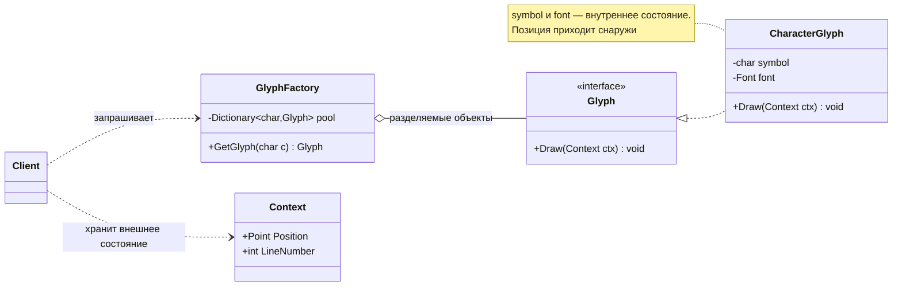
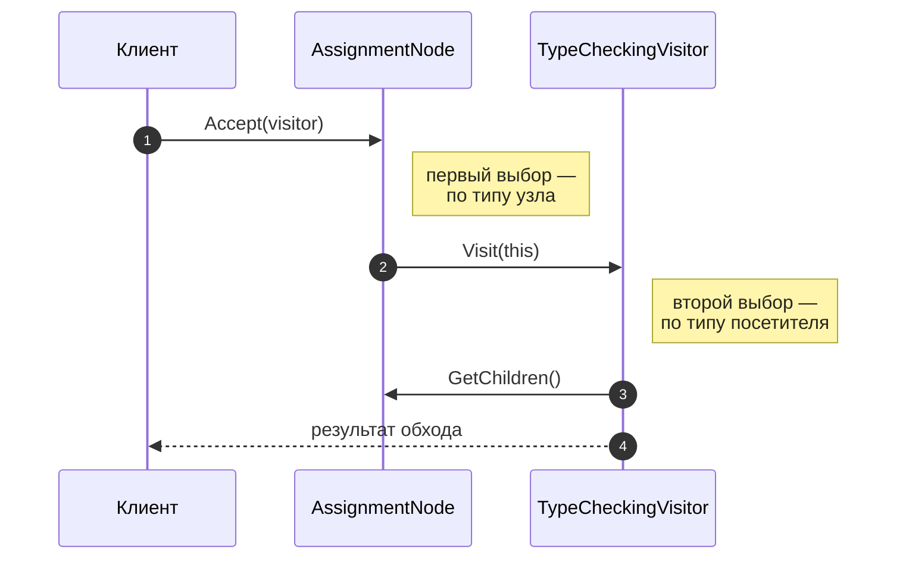
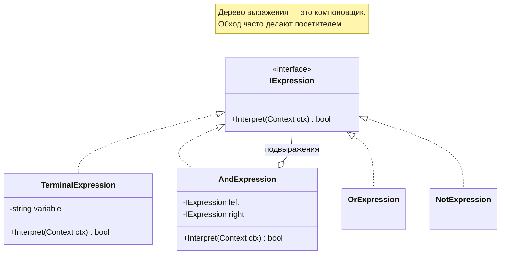

# Паттерны Flyweight, Visitor, Interpreter: углублённо

!!! info "Об этом материале"

    Объём: четыре темы, ориентировочно две недели.
    Отчётность: отчёт по каждой теме и код в репозитории.
    Требование: для каждого паттерна — сценарий применимости и противопоказание.


> Материал для самостоятельной работы после лекций 6 и 7. Три паттерна GoF, которые
> на лекции получили по пять минут, а на практике требуют самого аккуратного обращения:
> у каждого узкая область применимости и высокая цена ошибки. Источник — «Приёмы
> объектно-ориентированного проектирования»; код — **C#**, диаграммы — **Mermaid**.
> Ориентировочно две недели.

## Что входит в раздел

1. **Flyweight (приспособленец) — разделяемое состояние.**
2. **Visitor (посетитель) — операции отдельно от структуры.**
3. **Interpreter (интерпретатор) — грамматика как объектная структура.**
4. **Сценарии применимости и границы: когда эти паттерны не нужны.**

## Как работать с этим документом

- Все три паттерна легко «применить», не получив выгоды. Поэтому в каждой теме есть
  раздел про измерение и про признаки, что паттерн здесь лишний.
- Приспособленец проверяется профилировщиком памяти, посетитель — попыткой добавить
  новый узел, интерпретатор — попыткой расширить грамматику. Ставьте эти эксперименты
  сами.
- Все три активно живут в компиляторах и рантаймах: Roslyn, Expression Trees, интернирование
  строк. Заглянуть в реальную реализацию полезнее, чем прочитать три статьи.

---

## Тема 1. Flyweight — приспособленец

### 1.1. Разделение состояния

Паттерн применяет разделение (совместное использование) для эффективной поддержки
множества мелких объектов. Ключ ко всему — деление состояния:

- **внутреннее (intrinsic)** — не зависит от контекста, хранится внутри приспособленца
  и потому может разделяться всеми клиентами;
- **внешнее (extrinsic)** — зависит от контекста, хранится или вычисляется клиентом
  и передаётся в операции параметром.



??? note "Исходник диаграммы"

    ```
    classDiagram
        direction LR
        class GlyphFactory {
            -Dictionary~char,Glyph~ pool
            +GetGlyph(char c) Glyph
        }
        class Glyph {
            <<interface>>
            +Draw(Context ctx) void
        }
        class CharacterGlyph {
            -char symbol
            -Font font
            +Draw(Context ctx) void
        }
        class Context {
            +Point Position
            +int LineNumber
        }
        GlyphFactory o-- Glyph : разделяемые объекты
        Glyph <|.. CharacterGlyph
        Client ..> GlyphFactory : запрашивает
        Client ..> Context : хранит внешнее состояние
        note for CharacterGlyph "symbol и font — внутреннее состояние.<br/>Позиция приходит снаружи"
    ```


Что изучить внимательно:

- **Фабрика приспособленцев обязательна.** Клиент не создаёт объекты сам, иначе разделение
  не гарантировано. Фабрика — это по сути мультитон из соседнего материала.
- **Неизменяемость.** Разделяемый объект обязан быть неизменяемым, иначе изменение
  через одного клиента отразится у всех. В C# это `readonly`-поля и отсутствие сеттеров.
- **Потеря идентичности.** Сравнение по ссылке перестаёт означать «тот же элемент
  документа»: два разных символа «а» — это один объект. Приложение не должно зависеть
  от идентичности.
- **Стоимость внешнего состояния.** Выигрыш по памяти оплачивается временем: контекст
  надо вычислять или передавать при каждой операции. Иногда суммарно становится хуже.
- **Комбинация с компоновщиком.** В книге приспособленцы — листья дерева документа;
  у разделяемого листа не может быть ссылки на родителя, поэтому родитель передаётся
  во внешнем состоянии. Разберите этот момент: он объясняет, почему в дереве Lexi
  устроено именно так.

### 1.2. Измерение выигрыша

```csharp
// Заготовка эксперимента: 1 000 000 частиц
public readonly struct ParticleType                 // внутреннее состояние (разделяемое)
{
    public string Sprite { get; init; }
    public float Mass { get; init; }
}

public struct Particle                              // внешнее состояние (у каждого своё)
{
    public Vector2 Position;
    public Vector2 Velocity;
    public int TypeId;                              // ссылка на разделяемый тип
}
```

Задание к теме: замерьте `GC.GetTotalAllocatedBytes()` и время создания для двух вариантов —
миллион полноценных объектов и миллион структур со ссылкой на общий тип. Цифры приложите
к отчёту.

> **Где встречается.** Интернирование строк в .NET и Python (короткие строки и малые целые
> закешированы рантаймом), `ArrayPool` рядом по духу, кеш метаданных типов. В геймдеве та же
> идея лежит в основе подхода «данные отдельно от поведения»: тип частицы один, экземпляров
> миллион.

---

## Тема 2. Visitor — посетитель

### 2.1. Двойная диспетчеризация

Паттерн представляет операцию над элементами структуры объектов и позволяет добавить новую
операцию, не меняя классы элементов. Работает за счёт **двойной диспетчеризации**:
результат зависит от типа элемента и от типа посетителя.



??? note "Исходник диаграммы"

    ```
    sequenceDiagram
        autonumber
        participant C as Клиент
        participant N as AssignmentNode
        participant V as TypeCheckingVisitor

        C->>N: Accept(visitor)
        Note right of N: первый выбор —<br/>по типу узла
        N->>V: Visit(this)
        Note right of V: второй выбор —<br/>по типу посетителя
        V->>N: GetChildren()
        V-->>C: результат обхода
    ```


Что изучить:

- **Кто управляет обходом.** Три варианта: обход внутри `Accept` у элементов, обход внутри
  посетителя, обход отдельным итератором. У каждого свои последствия — разберите, где
  находится порядок обхода в каждом случае и как его поменять.
- **Накопление состояния.** Посетитель может накапливать результат по мере обхода —
  это законная замена глобальным переменным при вычислениях над деревом.
- **Проблема выражения.** Формулировка: в одной системе трудно одновременно легко
  добавлять и новые типы данных, и новые операции над ними. ООП с виртуальными методами
  делает лёгким первое, посетитель — второе. Ни то ни другое не бесплатно.
- **Нарушение инкапсуляции.** Посетителю нужен доступ к внутренностям элементов; книга
  прямо называет это платой. Подумайте, как ограничить доступ (узкий интерфейс,
  `internal`, вложенные типы).

### 2.2. Альтернативы в современном C#

```csharp
// 1. Классический посетитель — компилятор проверит, что реализованы все Visit
public interface INodeVisitor { void Visit(NumberNode n); void Visit(AddNode n); }

// 2. Сопоставление с образцом — короче, но забытый узел компилятор не заметит
static decimal Eval(Node node) => node switch
{
    NumberNode n => n.Value,
    AddNode a    => Eval(a.Left) + Eval(a.Right),
    _ => throw new NotSupportedException(node.GetType().Name)   // ← дыра в проверке
};
```

Задание: реализуйте обе версии для дерева из пяти видов узлов, затем добавьте шестой вид
и опишите, что именно сломалось в каждой версии и на каком этапе — компиляции или
выполнения.

> **Где посмотреть в бою.** Roslyn: `CSharpSyntaxVisitor`, `CSharpSyntaxWalker`,
> `CSharpSyntaxRewriter` — посетитель, обходчик и переписывающий посетитель как часть
> публичного API компилятора. `ExpressionVisitor` в System.Linq.Expressions — то же самое
> для деревьев выражений; именно так EF Core превращает LINQ в SQL. Разберите один
> `ExpressionVisitor` из открытого кода — это лучший учебник по паттерну.

---

## Тема 3. Interpreter — интерпретатор

### 3.1. Грамматика как иерархия классов

Паттерн для заданного языка определяет представление его грамматики и интерпретатор,
использующий это представление для разбора предложений языка. Каждое правило грамматики
становится классом; предложение — деревом объектов.



??? note "Исходник диаграммы"

    ```
    classDiagram
        direction TB
        class IExpression {
            <<interface>>
            +Interpret(Context ctx) bool
        }
        class TerminalExpression {
            -string variable
            +Interpret(Context ctx) bool
        }
        class AndExpression {
            -IExpression left
            -IExpression right
            +Interpret(Context ctx) bool
        }
        class OrExpression
        class NotExpression
        IExpression <|.. TerminalExpression
        IExpression <|.. AndExpression
        IExpression <|.. OrExpression
        IExpression <|.. NotExpression
        AndExpression o-- IExpression : подвыражения
        note for IExpression "Дерево выражения — это компоновщик.<br/>Обход часто делают посетителем"
    ```


```csharp
public interface ISpecification<T> { bool IsSatisfiedBy(T candidate); }

public sealed class AndSpecification<T> : ISpecification<T>
{
    private readonly ISpecification<T> _left, _right;
    public AndSpecification(ISpecification<T> left, ISpecification<T> right)
        => (_left, _right) = (left, right);

    public bool IsSatisfiedBy(T c) => _left.IsSatisfiedBy(c) && _right.IsSatisfiedBy(c);
}

// Правило собирается из объектов, а не пишется кодом
var rule = new AndSpecification<Order>(
    new MinTotalSpecification(1000),
    new NotSpecification<Order>(new BlacklistedCustomerSpecification()));
```

Что изучить:

- **Родство с компоновщиком** — дерево выражения строится ровно по нему; и с посетителем —
  когда операций над деревом становится много (интерпретация, печать, оптимизация),
  их выносят в посетителей.
- **Применимость по книге:** грамматика проста, а эффективность не критична. Для сложных
  грамматик паттерн не годится — классов становится столько же, сколько правил.
- **Контекст интерпретации** — где хранятся значения переменных и промежуточные результаты.
- **Специализация паттерна — Specification** (бизнес-правила как объекты): узкая и очень
  полезная форма, которую стоит уметь применять.

### 3.2. Что использовать вместо

| Задача | Инструмент вместо интерпретатора |
|---|---|
| Полноценный язык или сложная грамматика | генератор парсеров (ANTLR), рукописный рекурсивный спуск |
| Динамические условия над объектами | `Expression<Func<T, bool>>` и деревья выражений |
| Формулы и правила от пользователя | готовые движки правил, скриптовые языки (Lua, JS) |
| Простые бизнес-правила | Specification и композиция предикатов |

> **В .NET.** Деревья выражений — это интерпретатор, встроенный в язык: `Expression<Func<T,bool>>`
> хранит структуру, а `ExpressionVisitor` её обходит и превращает в SQL. Написав раз
> собственный интерпретатор простой грамматики, вы будете гораздо лучше понимать,
> что делает EF Core.

---

## Тема 4. Сценарии применимости и границы

### 4.1. Признаки, что паттерн уместен

| Паттерн | Берём, когда | Не берём, когда |
|---|---|---|
| Приспособленец | объектов десятки тысяч и больше; большую часть состояния можно вынести наружу; идентичность не важна; замер подтверждает выигрыш | объектов немного; состояние почти всё контекстное; нужна идентичность |
| Посетитель | иерархия элементов стабильна, операций много и они растут; операции не место в самих элементах | иерархия растёт; операций одна-две; хватает виртуального метода |
| Интерпретатор | грамматика маленькая и стабильная; выражения нужно строить в рантайме; производительность не критична | язык сложный; нужна скорость; есть готовый движок |

### 4.2. Общее правило

Все три паттерна — **специализированные инструменты**. Их применение почти всегда должно
быть обосновано либо цифрой (приспособленец), либо ожидаемым направлением роста системы
(посетитель), либо требованием строить логику в рантайме (интерпретатор). Если обоснования
нет, это теоретическая общность из лекции 2 — и она обойдётся дороже, чем прямой код.

### Проверь себя

1. Почему приспособленец обязан быть неизменяемым и почему у него не может быть ссылки
   на родителя в дереве?
2. Что такое двойная диспетчеризация и как она реализована в паттерне посетитель?
3. Сформулируйте проблему выражения и объясните, по какую её сторону стоит посетитель.
4. Чем `switch` с сопоставлением по типу хуже посетителя и чем лучше?
5. Почему интерпретатор не годится для сложных грамматик? Что применяют вместо него?
6. Какие два паттерна GoF почти всегда сопровождают интерпретатор и почему?

### Практика

1. **Приспособленец.** Реализовать систему частиц или текстовый буфер на миллион элементов
   в двух вариантах — с разделяемым состоянием и без. Приложить замеры памяти и времени,
   объяснить результат.
2. **Посетитель.** Построить дерево выражений (число, сложение, умножение, переменная,
   вызов функции) и написать три посетителя: вычисление, печать в инфиксной форме,
   подсчёт глубины. Затем добавить шестой вид узла и описать последствия.
3. **Интерпретатор.** Реализовать мини-язык фильтров вида
   `total > 1000 and not blacklisted` — разбор в дерево и интерпретация. Отдельно
   реализовать ту же задачу через `Expression<Func<Order, bool>>` и сравнить объём кода
   и гибкость.
4. Для каждого паттерна написать по абзацу: где в **вашем** проекте он был бы уместен,
   а где применение было бы ошибкой.

## Литература

- **Э. Гамма и др. Приёмы объектно-ориентированного проектирования** — приспособленец
  (гл. 4), посетитель и интерпретатор (гл. 5); в главе 2 приспособленец разбирается
  на примере редактора Lexi, это самый подробный разбор паттерна в книге.
- Исходники Roslyn (`CSharpSyntaxWalker`, `CSharpSyntaxRewriter`) и
  `System.Linq.Expressions.ExpressionVisitor` — посетитель промышленного уровня.
- Документация по деревьям выражений .NET — интерпретатор, встроенный в платформу.

## Как я буду это проверять

Три отчёта и код в репозитории. Для приспособленца обязательны цифры замеров; для
посетителя — описание того, что сломалось при добавлении узла; для интерпретатора —
сравнение своей реализации с вариантом на деревьях выражений. Диаграммы — в Mermaid,
имена участников — по книге.
