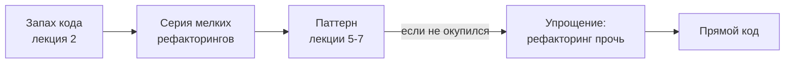
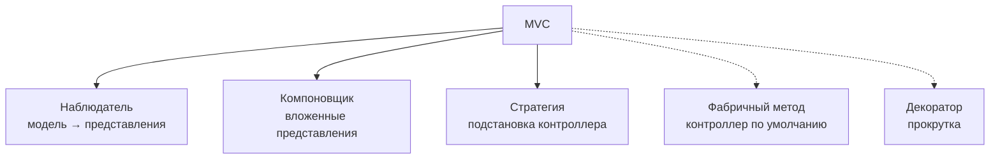

# Антипаттерны, рефакторинг к паттернам и комбинирование паттернов

!!! info "Об этом материале"

    Объём: три темы, ориентировочно две недели.
    Отчётность: аудит применения паттернов, история коммитов рефакторинга, связка паттернов в коде.
    Требование: в отчёте по каждому паттерну — раздел «чем платим».


> Материал для самостоятельной работы, завершающий раздел о паттернах. Каталог вы уже
> знаете; теперь три навыка, которые отличают применение паттернов от их коллекционирования:
> распознавать вредные решения, приходить к паттерну **из существующего кода**, а не из
> головы, и собирать паттерны вместе. Источники — GoF, «Рефакторинг» Фаулера,
> «Рефакторинг с использованием шаблонов» Кериевского. Код — **C#**, диаграммы — **Mermaid**.
> Ориентировочно две недели.

## Что входит в раздел

1. **Антипаттерны: общие, объектные и связанные с самими паттернами.**
2. **Рефакторинг к паттернам: от запаха к решению.**
3. **Комбинирование паттернов.**

## Как работать с этим документом

- Первая тема требует примеров: к каждому антипаттерну найдите случай в своём или
  открытом коде. Без примера пункт не изучен.
- Вторая тема — практическая: каждый переход «запах → паттерн» надо проделать руками,
  маленькими шагами и под тестами, как учили в лекции 2.
- Третья тема опирается на главу 2 GoF (проектирование редактора Lexi) — прочитайте её
  целиком, это лучший в книге пример совместной работы паттернов.

---

## Тема 1. Антипаттерны

### 1.1. Три группы

**Архитектурные и кодовые** (уже знакомы по лекции 2): Big Ball of Mud, God Object,
Spaghetti, Lava Flow, Anemic Domain Model, Distributed Monolith, Golden Hammer,
Inner-Platform Effect.

**Процессные:** Analysis Paralysis, Design by Committee, Cargo Cult, Resume-Driven
Development. Последние два прямо касаются паттернов: применение формы без понимания причины
и выбор решения ради строчки в резюме.

**Связанные с применением паттернов** — то, ради чего эта тема:

| Антипаттерн | Как выглядит | Чем лечится |
|---|---|---|
| **Patternitis** («паттернит») | паттерны применяются повсюду, слоёв больше, чем логики | вернуться к вопросу «что здесь варьируется?» |
| **Singletonitis** | одиночки вместо зависимостей, глобальное состояние везде | внедрение зависимости, singleton-время жизни в контейнере |
| **Фабрика-обёртка** | `OrderFactory.Create()` с телом `new Order()` | убрать; фабрика оправдана, когда скрывает выбор класса |
| **Абстракция ради абстракции** | интерфейс с одной реализацией «на будущее» | YAGNI; абстракция после второй реализации |
| **Декоратор с расширенным интерфейсом** | обёртка добавила публичные методы, клиент знает её тип | вернуть интерфейс компонента или признать, что это не декоратор |
| **Посредник-God Object** | вся логика переехала в посредника | разделить по группам взаимодействий |
| **Наблюдатель без отписки** | утечка памяти, «мёртвые» подписчики | явная отписка, слабые ссылки, время жизни через контейнер |
| **Anemic + сервисы-менеджеры** | сущности без поведения, `OrderManager` на всё | перенести поведение к данным (Move Method) |
| **Стратегия из одного варианта** | интерфейс, у которого одна реализация навсегда | встроить обратно (Inline Class) |

### 1.2. Как отличить паттерн от паттернита

Три вопроса к каждому применённому паттерну:

1. **Что здесь варьируется?** Если ответ «пока ничего, но вдруг» — это теоретическая
   общность.
2. **Сколько реализаций у абстракции?** Одна и не предвидится второй — абстракция лишняя.
3. **Что стало проще?** Если после применения паттерна код длиннее, а изменение вносится
   в стольких же местах — паттерн не сработал.

Полезная формулировка: паттерн окупается, когда **следующее** изменение обходится дешевле.
Если следующего изменения не будет — паттерн был расходом без дохода.

### 1.3. Что об этом говорят авторы

Сами GoF предупреждают, что паттерны не следует применять без нужды: гибкость и
изменяемость покупаются ценой сложности и косвенности. Отсюда практическое следствие
для курса: **в отчёте по паттерну обязателен раздел «чем платим»** — если вы не можете
назвать плату, вы не поняли паттерн.

---

## Тема 2. Рефакторинг к паттернам

### 2.1. Идея

Паттерн — не то, что закладывают в начале, а то, к чему **приходят**, когда код показал,
что именно в нём меняется. Джошуа Кериевский описал это в отдельной книге: движение идёт
не «выбрал паттерн → написал код», а «увидел запах → сделал серию мелких рефакторингов →
получил паттерн».

Направление важно и в обратную сторону: если паттерн оказался лишним, от него так же
рефакторят **прочь** (упрощение — тоже движение).



??? note "Исходник диаграммы"

    ```
    flowchart LR
        S["Запах кода<br/>лекция 2"] --> R["Серия мелких<br/>рефакторингов"]
        R --> P["Паттерн<br/>лекции 5-7"]
        P -->|если не окупился| R2["Упрощение:<br/>рефакторинг прочь"]
        R2 --> S2["Прямой код"]
    ```


### 2.2. Карта переходов

| Запах | Куда приводит рефакторинг | Первые шаги |
|---|---|---|
| Switch Statements по типу | Стратегия или Состояние | Extract Method → Extract Class → Replace Conditional with Polymorphism |
| Условия выбора алгоритма в контексте | Стратегия | вынести ветку в класс, передать через конструктор |
| Дублирование в подклассах, разный порядок шагов | Шаблонный метод | Form Template Method |
| Явное создание с именами классов | Фабричный метод / Абстрактная фабрика | Replace Constructor with Factory Method |
| Конструктор на десять параметров | Строитель | Introduce Parameter Object → сборка по шагам |
| Комбинаторный взрыв подклассов | Мост или Декоратор | Replace Inheritance with Delegation |
| Ручной обход внутренностей коллекции | Итератор | Encapsulate Collection |
| Клиенты знают всю подсистему | Фасад | Extract Class + Hide Delegate |
| Тяжёлый объект создаётся всегда | Заместитель / отложенная инициализация | обернуть тем же интерфейсом |
| Ветвление по состоянию сущности | Состояние | Replace Type Code with State/Strategy |
| Ручные уведомления «руками» после изменения | Наблюдатель | Duplicate Observed Data |
| Много несвязанных операций в узлах дерева | Посетитель | Move Method из узлов в посетителя |
| Объекты знают друг о друге «все со всеми» | Посредник | выделить класс взаимодействия |

### 2.3. Правила безопасного перехода

1. Сначала тесты, фиксирующие текущее поведение.
2. Один рефакторинг — один коммит, поведение неизменно.
3. Паттерн появляется **в конце** серии, а не объявляется в начале.
4. После каждого шага задайте вопрос: стало ли проще внести следующее изменение?
   Если нет — остановитесь, возможно, паттерн не тот.
5. Не рефакторьте к паттерну код, который скоро выкинут.

Пример последовательности (Switch → Стратегия), которую нужно проделать руками:
выделить тело каждой ветки в метод → выделить класс на ветку → ввести общий интерфейс →
заменить `switch` на поле-стратегию → передать стратегию через конструктор → удалить
перечисление, если оно больше не нужно.

---

## Тема 3. Комбинирование паттернов

### 3.1. Паттерны почти не встречаются поодиночке

Классический пример из самой книги: **MVC в Smalltalk** — это не один паттерн, а связка.
Отношение «модель уведомляет представления» — **наблюдатель**; вложенные представления
(представление, содержащее другие представления) — **компоновщик**; сменная реакция
представления на действия пользователя, то есть подстановка контроллера, — **стратегия**.
Плюс в MVC используются **фабричный метод** (класс контроллера по умолчанию) и **декоратор**
(добавление прокрутки). Основными авторы называют первые три.



??? note "Исходник диаграммы"

    ```
    flowchart TB
        MVC["MVC"] --> OB["Наблюдатель<br/>модель → представления"]
        MVC --> CO["Компоновщик<br/>вложенные представления"]
        MVC --> ST["Стратегия<br/>подстановка контроллера"]
        MVC -.-> FM["Фабричный метод<br/>контроллер по умолчанию"]
        MVC -.-> DE["Декоратор<br/>прокрутка"]
    ```


Второй пример — **глава 2 книги**: проектирование текстового редактора Lexi, где
последовательно применяются восемь паттернов к семи задачам: компоновщик (структура
документа), стратегия (алгоритмы форматирования), декоратор (рамки и прокрутка),
абстрактная фабрика (переносимость между оконными системами), мост (реализация окна),
команда (операции и отмена), итератор (обход структуры), посетитель (проверка правописания
и расстановка переносов). Прочитайте главу целиком: она показывает не паттерны, а **ход
рассуждения** — сначала задача, потом решение.

### 3.2. Устойчивые связки

| Связка | Зачем |
|---|---|
| Абстрактная фабрика + Одиночка | фабрика существует в одном экземпляре |
| Абстрактная фабрика + Фабричный метод / Прототип | два способа реализовать саму фабрику |
| Компоновщик + Итератор + Посетитель | дерево, обход дерева, операции над деревом |
| Компоновщик + Декоратор | общий интерфейс, разные намерения (см. лекцию 6) |
| Команда + Хранитель | отмена операции требует снимка состояния |
| Команда + Компоновщик | макрокоманда как составная команда |
| Стратегия + Приспособленец | стратегии без состояния разделяются между контекстами |
| Наблюдатель + Посредник | посредник получает уведомления и координирует коллег |
| Интерпретатор + Компоновщик + Посетитель | дерево выражения, его структура и операции над ним |
| Заместитель + отложенная инициализация | ленивое создание за тем же интерфейсом |

### 3.3. Как не превратить связку в кашу

- Каждый паттерн в связке должен отвечать за **свою** ось изменения. Если два паттерна
  введены ради одного и того же — один лишний.
- Называйте участников по книге (`Component`, `Strategy`, `Invoker`, `Originator`):
  комбинация становится читаемой, когда роли подписаны.
- Рисуйте связку диаграммой классов и отдельно — диаграммой последовательности: только
  вторая покажет, кто кого зовёт в реальном сценарии.
- Проверяйте суммарную плату: три паттерна дают три уровня косвенности, и отладка
  становится заметно дороже.

### Проверь себя

1. Чем паттернит отличается от осознанного применения паттернов? Дайте три проверочных
   вопроса.
2. Почему фабрика с телом `new Order()` — антипаттерн, а фабрика с выбором класса — нет?
3. Опишите последовательность рефакторингов от `switch` по типу к стратегии.
4. Какие три паттерна образуют основу MVC и за что отвечает каждый?
5. Приведите две устойчивые связки паттернов и объясните, какую ось изменения закрывает
   каждый участник.
6. Когда правильно рефакторить **от** паттерна к прямому коду?

### Практика

1. **Аудит.** Найти в открытом проекте (или своём) пять применений паттернов. Для каждого
   ответить: что варьируется, сколько реализаций, что стало проще. Минимум одно применение
   должно быть признано неоправданным — с обоснованием.
2. **Рефакторинг к паттерну.** Взять код с `switch` по типу и провести полную серию
   рефакторингов до стратегии или состояния: отдельный коммит на шаг, тесты зелёные
   на каждом шаге, в описании коммита — название приёма.
3. **Рефакторинг от паттерна.** Найти (или создать) избыточную абстракцию и упростить её,
   показав, что читаемость выросла, а поведение не изменилось.
4. **Связка.** Реализовать древовидную структуру с компоновщиком, обходом-итератором и
   двумя посетителями, где один из посетителей использует стратегию. Приложить диаграмму
   классов и диаграмму последовательности одного сценария.
5. **Отчёт.** Для каждого применённого паттерна — обязательный раздел «чем платим».

## Литература

- **Э. Гамма и др. Приёмы объектно-ориентированного проектирования** — глава 1 (раздел
  о паттернах в MVC), глава 2 (проектирование Lexi) и разделы «Родственные паттерны»
  в конце каждой статьи каталога.
- **М. Фаулер. Рефакторинг** — приёмы, из которых складывается путь к паттерну.
- **Дж. Кериевский. Рефакторинг с использованием шаблонов** — переходы «запах → паттерн»
  подробно и по шагам.
- **У. Браун и др. AntiPatterns** — первоисточник термина «антипаттерн».

## Как я буду это проверять

Аудит, история коммитов рефакторинга и связка паттернов в коде. Смотрю на историю
изменений: рефакторинг должен быть виден пошагово, а не одним коммитом «переписал».
В отчёте по каждому паттерну обязательны ответы на три вопроса из темы 1 и раздел
о плате. Диаграммы — в Mermaid, роли участников подписаны по книге.
