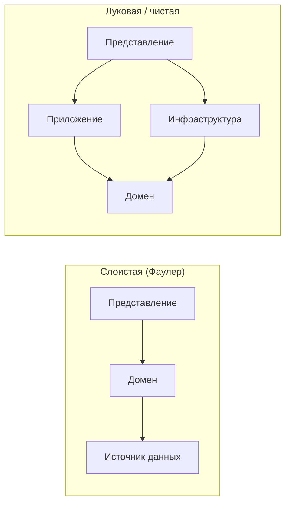

# Слоистая архитектура корпоративных приложений; DTO и маппинг

!!! info "Об этом материале"

    Объём: четыре темы, ориентировочно неделя-полторы.
    Отчётность: раскладка проекта на слои, архитектурный тест, три варианта маппинга.
    Требование: у каждого слоя названа своя причина для изменения.


> Материал для самостоятельной работы после лекции 8. Источник — **М. Фаулер, «Шаблоны
> корпоративных приложений»**: слои, Service Layer, Data Transfer Object, Remote Facade;
> плюс современные варианты той же идеи (луковая и чистая архитектура, вертикальные срезы).
> Код — **C#**, диаграммы — **Mermaid**. Ориентировочно неделя-полторы.

## Что входит в этот материал

1. **Слои: зачем они и где проходят границы**
2. **DTO: что это, где живёт и от чего защищает**
3. **Маппинг: способы, цена, ошибки**
4. **Сценарии: как разложить конкретное приложение**

## Что уже было в лекции

Три слоя Фаулера — представление, домен, источник данных; Service Layer как граница
приложения; репозиторий и Unit of Work в слое доступа к данным; правило направления
зависимостей. Дальше — как это выглядит в реальном проекте на .NET и что делать с данными
на границах.

## Как работать с этим документом

- Всё, что здесь описано, проверяется одним вопросом: **какие ссылки между проектами
  разрешены?** Ответ должен быть виден в файлах `.csproj`, а не только в документации.
- К каждому решению записывайте цену: лишний слой — это лишний маппинг, лишние файлы
  и лишние минуты на понимание.
- Диаграмма пакетов из материала по UML — основной инструмент этой темы.

---

## Тема 1. Слои: зачем они и где проходят границы

### Классические три слоя и их современные варианты



??? note "Исходник диаграммы"

    ```
    flowchart LR
        subgraph "Слоистая (Фаулер)"
            P1[Представление] --> D1[Домен] --> S1[Источник данных]
        end
        subgraph "Луковая / чистая"
            P2[Представление] --> A2[Приложение] --> D2[Домен]
            I2[Инфраструктура] --> D2
            P2 --> I2
        end
    ```


Ключевое различие: в классической слоистой схеме домен зависит от слоя данных, в луковой
и чистой — зависимость **инвертирована**: интерфейс репозитория объявлен в домене,
реализация лежит в инфраструктуре. Это тот же DIP, что и в лекции 1, но на уровне сборок.

Что изучить:

- **Типовая раскладка на проекты в .NET**: `Domain`, `Application`, `Infrastructure`, `Api`.
  Какие ссылки допустимы, а какие — архитектурный дефект.
- **Где живут интерфейсы.** `IOrderRepository` в `Domain` (или в `Application`), реализация
  в `Infrastructure`. Почему именно так и что сломается, если объявить интерфейс рядом
  с реализацией.
- **Вертикальные срезы (vertical slice)** как альтернатива: код группируется не по слоям,
  а по сценариям (`Features/PlaceOrder/…`). Разберите, какую проблему это решает — и какую
  создаёт.
- **Сколько слоёв нужно.** Лишний слой без собственной ответственности — это Middle Man
  из лекции 2. Слой оправдан, если у него есть своя причина меняться.

```csharp
// Правило зависимостей как тест, а не как пожелание (см. раздел 1)
[Fact]
public void Домен_не_зависит_от_инфраструктуры() =>
    Assert.True(Types.InAssembly(typeof(Order).Assembly)
        .ShouldNot().HaveDependencyOn("Shop.Infrastructure")
        .GetResult().IsSuccessful);
```

### Практическое задание к теме

Нарисуйте диаграмму пакетов своего проекта, отметьте все ссылки между сборками и найдите
хотя бы одно нарушение направления. Затем добавьте архитектурный тест, фиксирующий правило.

---

## Тема 2. DTO: что это, где живёт и от чего защищает

### Определение и происхождение

**Data Transfer Object** у Фаулера — объект, который переносит данные между процессами,
чтобы сократить число удалённых вызовов. Исходная мотивация чисто техническая: каждый
удалённый вызов дорог, поэтому вместо десяти обращений за полями делается одно, возвращающее
пакет данных.

Сегодня к этому добавилась вторая, более важная роль: **DTO — это контракт границы**.
Он отделяет то, что видит внешний мир, от того, как устроена ваша модель.


??? note "Исходник диаграммы"

    ```
    flowchart LR
        Client[Клиент HTTP] -- JSON --> API[Контроллер]
        API -- "OrderDto" --> APP[Слой приложения]
        APP -- "Order (агрегат)" --> DOM[Домен]
        DOM --> INF[Инфраструктура]
        APP -- "OrderDto" --> API
    ```


От чего защищает DTO:

- **От утечки модели наружу.** Отдав сущность в JSON, вы превратили внутреннюю структуру
  в публичный контракт: любое переименование поля станет ломающим изменением API.
- **От утечки данных.** Сериализация сущности вытащит наружу и хеш пароля, и внутренние
  комментарии, и служебные поля.
- **От циклов и ленивой загрузки.** Сериализатор пойдёт по навигационным свойствам
  и утянет половину базы.
- **От невозможности эволюции.** Контракт и модель должны меняться независимо: версия API
  живёт своей жизнью.

Что изучить:

- **DTO против ViewModel против доменной сущности** — три разных объекта с тремя разными
  причинами меняться; научитесь их называть.
- **Где DTO не нужен.** Внутри одного слоя, в маленьком внутреннем сервисе, в прототипе.
  Дублирование ради дублирования — тоже цена.
- **Remote Facade** — крупнозернистый фасад над мелкозернистой моделью; DTO почти всегда
  ходит с ним в паре.
- **Проекция вместо маппинга.** В EF Core можно не загружать сущность вовсе:
  `Select(o => new OrderDto { ... })` превращается в SQL, который выбирает только нужные
  колонки. Часто это лучший ответ и по производительности, и по простоте.

```csharp
// Проекция: сущность даже не материализуется
var dto = await db.Orders
    .Where(o => o.Id == id)
    .Select(o => new OrderDto(
        o.Id,
        o.Customer.Email,
        o.Lines.Sum(l => l.Quantity * l.UnitPrice),
        o.Status.ToString()))
    .SingleOrDefaultAsync(ct);
```

---

## Тема 3. Маппинг: способы, цена, ошибки

### Четыре способа и их последствия

| Способ | Плюсы | Минусы |
|---|---|---|
| **Руками** (конструктор, метод `ToDto()`) | явно, отлаживается, компилятор ловит ошибки | много однообразного кода |
| **Проекция LINQ** | один SQL, ничего лишнего не грузится | только для чтения, выражение должно транслироваться |
| **Генератор кода** (Mapperly, source generators) | без рефлексии, ошибки на этапе компиляции | нужен ещё один инструмент |
| **Рефлексивный маппер** (AutoMapper) | мало кода на старте | ошибки в рантайме, «магия», трудная отладка, скрытая цена |

Что изучить и о чём подумать:

- **Почему рефлексивный маппинг спорен.** Переименовали свойство — конфигурация молча
  перестала совпадать, поле уехало пустым, тест этого не заметил. Плюс правило
  «автоматически маппится по имени» превращает переименование в скрытое изменение поведения.
  Если используете такой маппер, обязательно подключайте проверку конфигурации
  (`AssertConfigurationIsValid`) в тестах.
- **Куда класть маппинг.** Метод `ToDto()` на DTO (а не на сущности!), отдельный класс-маппер
  или проекция в запросе. Ключевое правило: **домен не должен знать о DTO**. У Фаулера этот
  отдельный класс называется **сборщиком (assembler)**: он перекладывает данные между
  доменными объектами и DTO и живёт на стороне границы, а не внутри домена.
- **Изначальная мотивация DTO — техническая:** сократить число удалённых вызовов, отдав
  за один раз пакет данных вместо десяти обращений за отдельными полями. Всё остальное —
  контракт, безопасность, независимая эволюция — надстроилось позже.
- **Маппинг в обратную сторону.** Из DTO в доменный объект напрямую маппить нельзя:
  сущность создаётся через конструктор или фабрику, которая проверяет инварианты.
  Обратный маппинг — верный признак анемичной модели.
- **Цена цепочки.** В четырёхслойном приложении данные могут проходить через сущность,
  доменную модель чтения, DTO приложения и контракт API — четыре класса на одно понятие.
  Иногда это оправдано, чаще — нет. Считайте слои и спрашивайте, что даёт каждый.

```csharp
// Маппинг живёт на стороне DTO — домен о нём не знает
public sealed record OrderDto(Guid Id, string CustomerEmail, decimal Total, string Status)
{
    public static OrderDto From(Order order) =>
        new(order.Id, order.Customer.Email, order.Total().Amount, order.Status.ToString());
}

// Обратно — только через фабрику домена, с проверкой инвариантов
var order = Order.Create(request.Lines.Select(l => new OrderLine(l.Sku, l.Qty, l.Price)));
```

---

## Тема 4. Сценарии: как разложить конкретное приложение

### Три типовые ситуации

**Небольшой внутренний сервис, простые правила.** Два слоя: API и инфраструктура,
`DbContext` напрямую в обработчиках, DTO только на границе HTTP. Слои домена и приложения
не заводятся — им нечего в себе держать. Это не лень, а соразмерность.

**Система со сложными правилами и долгим сроком жизни.** Четыре проекта: `Domain`
(сущности, объекты-значения, интерфейсы репозиториев), `Application` (сценарии, DTO,
границы транзакций), `Infrastructure` (EF Core, внешние API), `Api` (контроллеры,
контракты). Правило зависимостей закреплено архитектурным тестом.

**Читающая часть с высокой нагрузкой.** Запись через доменную модель, чтение — отдельными
запросами с проекцией в DTO, минуя домен. Формально это уже CQRS в лёгком варианте:
две модели для двух задач.

### Чек-лист «слои разложены правильно»

1. У каждого слоя названа своя причина для изменения.
2. Направление ссылок проверяется тестом, а не памятью.
3. Наружу не уходит ни одна доменная сущность.
4. Обратного маппинга DTO → сущность нет, есть фабрики с проверкой инвариантов.
5. Число преобразований одного понятия по пути «база → клиент» вы можете назвать
   и обосновать.
6. Лишний слой удалён: если он только передаёт вызовы дальше, это Middle Man.

---

## Вопросы для самопроверки

1. Чем классическая слоистая схема отличается от луковой в направлении зависимостей?
2. Где должен быть объявлен интерфейс репозитория и почему именно там?
3. Назовите три вещи, от которых защищает DTO на границе HTTP.
4. Почему проекция в EF Core часто лучше загрузки сущности с последующим маппингом?
5. Почему обратный маппинг DTO → сущность считается признаком анемичной модели?
6. Когда четыре слоя — избыточность? Сформулируйте критерий.

## Практика

1. Разложить свой проект на слои (или обосновать, почему их два, а не четыре). Нарисовать
   диаграмму пакетов, добавить архитектурный тест на направление зависимостей и приложить
   вывод упавшего теста до исправления.
2. Для трёх сценариев реализовать выдачу данных тремя способами: сущность → DTO вручную,
   проекция LINQ, генератор маппинга. Сравнить SQL, количество кода и поведение при
   переименовании свойства.
3. Показать в тесте, что доменные сущности не сериализуются наружу: контракт API описан
   отдельными типами.
4. Найти в своём коде преобразование, которое ничего не добавляет, и удалить его,
   зафиксировав, что стало проще.

## Литература

- **М. Фаулер. Шаблоны корпоративных приложений** — слои, Service Layer, Data Transfer
  Object, Remote Facade; каталог: [martinfowler.com/eaaCatalog](https://martinfowler.com/eaaCatalog/).
- **Р. Мартин. Чистая архитектура** — границы и направление зависимостей.
- **Microsoft. .NET Microservices: Architecture for Containerized .NET Applications** —
  бесплатная книга с готовой раскладкой проектов на .NET.
- Документация EF Core по проекциям и `AsNoTracking`; документация Mapperly и AutoMapper —
  сравните подходы к генерации маппинга.

## Как я буду это проверять

Репозиторий со слоями, архитектурный тест, три варианта маппинга и письменное обоснование
раскладки. Отдельно спрошу за каждый слой: какая у него причина для изменения. Слой, для
которого ответа нет, придётся убрать.
