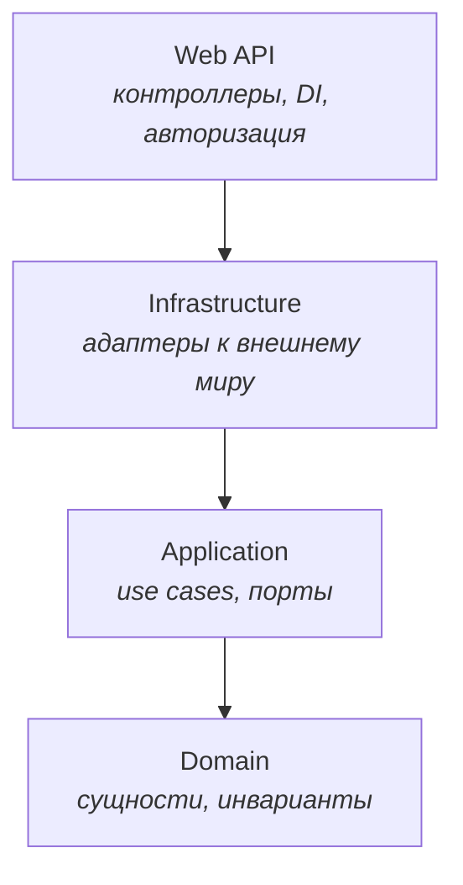
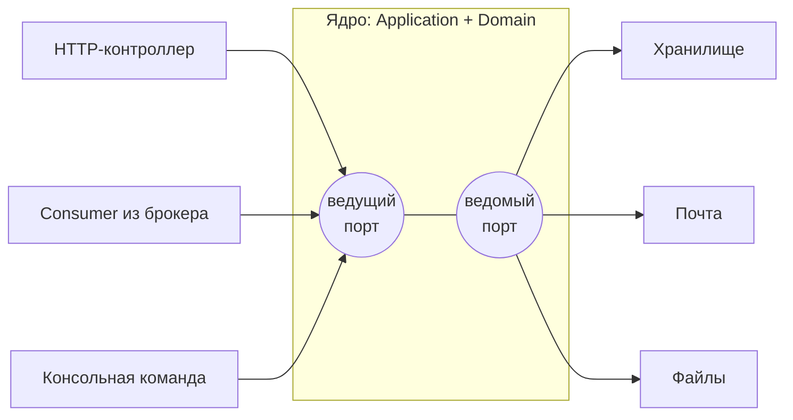
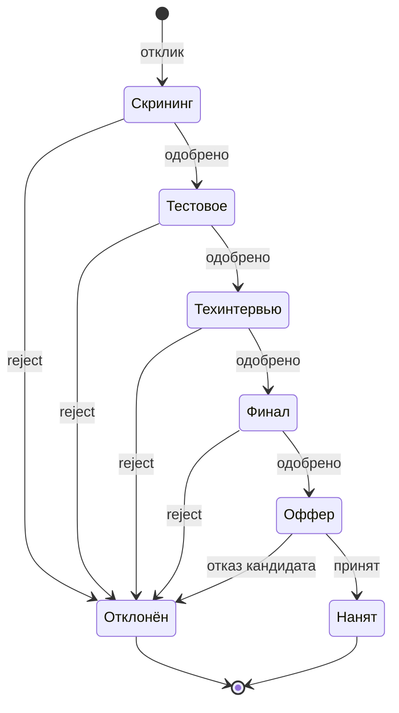

# ТП. Лекция 1 — Архитектура приложения: слои, зависимости, границы

> Конспект лектора. Это первая лекция курса, и она задаёт рамку для всех остальных.
> Ни одной новой языковой конструкции здесь нет — весь C# знаком с ООАП. Новое одно:
> вопрос сменился. В ООАП мы спрашивали «как устроен класс»; здесь спрашиваем
> «где этот класс живёт и от чего ему позволено зависеть». Сквозной пример курса —
> HR-система найма — вводится в блоке 7 и дальше не меняется до самого конца.

Глоссарий в конце — раздаточный материал, вслух не читаем.

---

## Блок 1. От объектов к системе

### Что говорим

ООАП дал инструменты масштаба «несколько классов»: инкапсуляция, полиморфизм, SOLID,
паттерны GoF. Этого достаточно, чтобы аккуратно устроить одну подсистему, и совершенно
недостаточно, чтобы устроить приложение целиком. Классы можно написать безупречно
и всё равно получить систему, в которой любое изменение задевает всё.

Этот курс — про следующий масштаб. Единица рассмотрения теперь не класс, а **слой**
и **граница** между слоями.

Рабочее определение, которым будем пользоваться весь семестр:

> **Архитектура** — это множество решений, которые дорого менять потом. Хорошая
> архитектура — та, которая откладывает такие решения и делает их обратимыми.

Отсюда практический критерий, по которому мы будем оценивать любой свой ход:
после изменения требования — сколько файлов пришлось тронуть и **в скольких слоях**?
Если правило «отклонённого кандидата нельзя двигать дальше» меняется, а трогать
приходится контроллер, три сервиса и SQL-запрос — архитектуры нет, есть привычка.

### Ключевая мысль блока

Архитектура — это ограничения, которые вы накладываете на себя **добровольно**.
Компилятор не заставит вас положить бизнес-правило в правильное место. Заставит
только структура проекта и тесты, которые вы напишете сами.

---

## Блок 2. Приложение без архитектуры

### Что говорим

Покажем код, который пишут все и всегда. Он работает. Именно поэтому он опасен.

```csharp
[HttpPost("applications/{id}/approve")]
public async Task<IActionResult> Approve(Guid id)
{
    var app = await _storage.LoadApplicationAsync(id);

    if (app is null) return NotFound();
    if (app.Status == "Rejected") return BadRequest("уже отклонён");
    if (app.StageIndex >= app.Vacancy.Stages.Count - 1)
        return BadRequest("этапов больше нет");

    app.StageIndex++;                                  // правило перехода
    await _storage.SaveAsync(app);

    await _smtp.SendAsync(app.CandidateEmail,          // письмо
        "Вы прошли на следующий этап");

    return Ok();
}
```

Разберём, что здесь сломано, по пунктам — и заметим, что «всё в одном методе» в этом
списке даже не самое серьёзное.

- **Правило нельзя найти.** Условие «отклонённый не двигается» живёт в контроллере.
  Через месяц появится второй вход в систему — фоновый обработчик, импорт, админка, —
  и правило будет продублировано. Или не будет.
- **Правило нельзя проверить.** Чтобы протестировать одну строчку `StageIndex++`,
  нужно поднять хранилище, почтовый сервер и HTTP-запрос.
- **Письмо уходит отдельно от решения.** Сохранение прошло, отправка упала — кандидат
  переведён, но не уведомлён. Или наоборот. К этой проблеме мы вернёмся всерьёз
  в лекции про события и надёжную доставку.
- **Правило намертво связано с деталью.** Меняется способ хранения — переписывается
  бизнес-логика, потому что она вплетена в обращение к хранилищу.
- **Модель анемична.** `Application` — мешок публичных свойств. Любой код в системе
  вправе написать `app.Status = "Rejected"` и никому ничего не должен.

Последний пункт знаком с ООАП под другим именем: инкапсуляция сломана, инвариант негде
проверять. Фаулер называет такой стиль **транзакционным скриптом**, и это не ругательство:
для простого CRUD он честно лучше всего остального. Но наш домен — не CRUD, и это будет
видно уже в блоке 7.

### Ловушка для студентов

Услышав «слои», половина аудитории заводит папки `Models`, `Services`, `Repositories`
и считает задачу решённой. **Папка — не слой.** Слой определяется не тем, что в нём
лежит, а тем, на что он **не имеет права сослаться**. Если из `Services` можно написать
`using Microsoft.EntityFrameworkCore` — слоя нет, есть каталог.

---

## Блок 3. Правило зависимостей и инверсия

### Формулировка

Расположим слои концентрически: в центре то, что меняется реже всего и ради чего
существует система, снаружи — детали.

> **Правило зависимостей:** исходный код внутреннего слоя не должен ничего знать
> о внешнем. Ни имён типов, ни пространств имён, ни пакетов.



??? note "Исходник диаграммы"

    ```
    flowchart TB
      W["Web API<br/><i>контроллеры, DI, авторизация</i>"]
      I["Infrastructure<br/><i>адаптеры к внешнему миру</i>"]
      A["Application<br/><i>use cases, порты</i>"]
      D["Domain<br/><i>сущности, инварианты</i>"]
      W --> I --> A --> D
    ```


Цепочка ссылок линейная: каждый слой ссылается ровно на один соседний. Web API
в этой схеме занимает место, которое в кругах чистой архитектуры отведено
пользовательскому интерфейсу: самое внешнее кольцо, деталь доставки, которую
можно заменить, не тронув ничего внутри.

Сразу возникает возражение, и его нужно проговорить вслух, потому что оно правильное:
«Юзкейсу нужно достать кандидатуру из базы. Значит, `Application` зависит от базы.
Как правило зависимостей вообще может выполняться?»

Ответ — буква **D** из SOLID, инверсия зависимостей. Интерфейс объявляется **там, где
он нужен**, а реализуется снаружи.

```csharp
// Application/Abstractions/IApplicationRepository.cs — ПОРТ, внутренний слой
public interface IApplicationRepository
{
    Task<JobApplication?> FindAsync(ApplicationId id, CancellationToken ct);
    Task AddAsync(JobApplication application, CancellationToken ct);
}
```

```csharp
// Infrastructure/Persistence/EfApplicationRepository.cs — АДАПТЕР, внешний слой
internal sealed class ApplicationRepository(IStorageSession session) : IApplicationRepository
{
    public Task<JobApplication?> FindAsync(ApplicationId id, CancellationToken ct) =>
        session.LoadAsync<JobApplication>(id.Value, ct);

    public Task AddAsync(JobApplication application, CancellationToken ct) =>
        session.StoreAsync(application, ct);
}
```

### Ключевая мысль блока

Зависимость **по коду** и зависимость **по потоку управления** направлены в разные
стороны. Во время выполнения `Application` действительно вызывает адаптер — управление
идёт наружу. Но в исходниках стрелка идёт внутрь: это `Infrastructure` знает про
интерфейс, а не наоборот. Разворот этой стрелки и называется инверсией.

### Ловушка для студентов

Интерфейс репозитория, положенный рядом с реализацией в `Infrastructure`, не инвертирует
ничего. Получается лишний файл и ложное чувство правильности. **Место объявления
интерфейса и есть весь смысл приёма.** Проверка простая: удалите проект `Infrastructure`
из решения — `Domain` и `Application` обязаны продолжать компилироваться.

---

## Блок 4. Четыре слоя нашего проекта

### Раскладка

| Слой | Что живёт | Ссылается на | Причина изменения |
|---|---|---|---|
| **Domain** | сущности, объекты-значения, агрегаты, доменные события, доменные исключения | ни на что (только BCL) | изменились **правила бизнеса** |
| **Application** | сценарии (команды и запросы), интерфейсы портов, DTO | Domain | изменился **сценарий работы** |
| **Infrastructure** | адаптеры к внешнему миру: хранение, отправка почты, файлы | Application, Domain | сменилась **технология** |
| **Web API** | контроллеры, DI, аутентификация, маппинг ошибок в HTTP | Infrastructure, и через неё — остальные | изменился **контракт наружу** |

Колонка «причина изменения» — самая важная. Это принцип единственной ответственности,
поднятый с уровня класса на уровень сборки: у каждого слоя ровно одна категория причин,
по которым его вообще открывают.

### Domain

Здесь живёт то, ради чего система написана. Никаких атрибутов ORM, никаких
`[JsonPropertyName]`, ничего из того, что относится к способу хранения.

Это не значит, что домену запрещены внешние пакеты вообще. Библиотека для описания
конечных автоматов, средство работы с денежными суммами, набор для моделирования
временных интервалов — всё это выражает предметную область, а не техническую деталь,
и в домене уместно. Критерий не «есть ли зависимости», а «о чём они»: пакет,
описывающий понятия вашей области, — часть языка; пакет, знающий про хранение,
сеть или формат передачи, — нет.

```csharp
public sealed class JobApplication
{
    private readonly List<StageTransition> _history = [];

    public ApplicationId Id { get; }
    public ApplicationStatus Status { get; private set; }   // private set — не мешок свойств
    public IReadOnlyList<StageTransition> History => _history;

    public void Approve(EmployeeId by, IClock clock)
    {
        if (Status is ApplicationStatus.Rejected)
            throw new DomainException("отклонённая кандидатура не двигается");
        // ... переход на следующий этап
    }
}
```

### Application

Сценарий — это ответ на вопрос «что система умеет делать», выраженный без единого
слова про HTTP и SQL. Один класс — один сценарий.

```csharp
public sealed class ApproveApplicationHandler(
    IApplicationRepository repository,
    IUnitOfWork unitOfWork,
    IClock clock) : ICommandHandler<ApproveApplicationCommand>
{
    public async Task HandleAsync(ApproveApplicationCommand cmd, CancellationToken ct)
    {
        var application = await repository.FindAsync(cmd.ApplicationId, ct)
            ?? throw new NotFoundException(cmd.ApplicationId);

        application.Approve(cmd.ApprovedBy, clock);   // решение принимает домен

        await unitOfWork.CommitAsync(ct);
    }
}
```

Обратите внимание: сценарий ничего не решает сам. Он находит нужные объекты, вызывает
доменный метод и фиксирует транзакцию. Вся развилка — внутри `Approve`. Если в хендлере
заводится `if` про бизнес-правило, значит правило утекло из домена.

Здесь прячется неприятность, к которой мы вернёмся позже. Правило иногда требует
данных, которых у объекта нет: чтобы проверить `BR-02`, нужно знать, есть ли у этого
человека другая активная кандидатура, а это вопрос к хранилищу. Совместить полноту
правил в домене, независимость домена от инфраструктуры и отсутствие лишних обращений
наружу одновременно не получается — приходится чем-то жертвовать. У этого выбора есть
имя, трилемма предметно-ориентированного проектирования, и отдельная лекция.

### Infrastructure

Всё, что общается с внешним миром. Сегодня про этот слой достаточно знать одно:
он существует и он снаружи. Чем именно вы будете хранить состояние, как устроите
отправку писем и что положите в файлы — вопросы, к которым мы вернёмся на четвёртой
лабораторной. Принимать эти решения сейчас не только не нужно, но и вредно:
принятые рано, они начинают диктовать форму домена.

Проверка правильного порядка работы простая. Если ответ на вопрос «как устроена
кандидатура» зависит от ответа на вопрос «чем мы её храним» — вы проектируете
снизу вверх, и предметная область подстраивается под инструмент вместо обратного.

### Web API

Тонкий слой. Его работа — принять HTTP, превратить в команду, вызвать сценарий,
превратить исключение в код ответа.

Ссылается он только на `Infrastructure` — и через неё видит всё остальное. Это делает
цепочку ссылок линейной и заодно решает бытовой вопрос: **композиционному корню** нужно
знать про адаптеры, чтобы их зарегистрировать, и других причин видеть инфраструктуру
у веб-слоя нет.

```csharp
builder.Services.AddApplication();      // сценарии
builder.Services.AddInfrastructure();   // адаптеры к внешнему миру
```

### Ловушка для студентов

Самый частый способ незаметно сломать всю конструкцию — вернуть доменную сущность
наружу как ответ API. Тогда переименование приватного поля в домене ломает контракт
для мобильного клиента, и связь восстановлена в обход всех слоёв.

С объектами-значениями соблазн сильнее: `Money`, `EmailAddress`, `DateRange` выглядят
безобидно, они неизменяемы и сериализуются сами собой. И всё же наружу выходит только
DTO. Причина не в устройстве объекта, а в том, кому принадлежит решение о форме ответа:
как только внешний контракт начинает зависеть от доменного типа, домен теряет право
меняться свободно. Отдельный тип-ответ стоит трёх строк и снимает этот вопрос навсегда.

---

## Блок 5. Порты и адаптеры

### Что говорим

То же самое, что в блоке 3, но нарисованное иначе. Гексагональная архитектура Алистера
Кокбёрна смотрит не на этажи, а на границу: приложение — это ядро с дырками по периметру.
Дырка — **порт** (интерфейс), затычка — **адаптер** (реализация).



??? note "Исходник диаграммы"

    ```
    flowchart LR
      HTTP["HTTP-контроллер"] --> P1
      CONS["Consumer из брокера"] --> P1
      CLI["Консольная команда"] --> P1
      subgraph CORE["Ядро: Application + Domain"]
        P1(("ведущий<br/>порт"))
        P2(("ведомый<br/>порт"))
        P1 --- P2
      end
      P2 --> DB["Хранилище"]
      P2 --> SMTP["Почта"]
      P2 --> S3["Файлы"]
    ```


Порты делятся на два вида, и различать их полезно:

- **Ведущие** (driving, primary) — через них систему вызывают. HTTP-контроллер,
  обработчик сообщения из очереди, cron-задача. Их адаптеры находятся слева.
- **Ведомые** (driven, secondary) — через них система вызывает других. Репозиторий,
  отправка почты, часы, генератор идентификаторов.

### Ключевая мысль блока

HTTP — это **тоже адаптер**, а не главный вход и не центр системы. Проверочный
вопрос, который стоит задавать себе весь семестр: смогу ли я вызвать этот сценарий
из фонового воркера, не тронув ни строчки в `Application`? Если да — граница проведена
верно.

Заодно это объясняет, почему `IClock` и `IIdGenerator` — тоже порты. `DateTime.Now`
внутри домена делает поведение непроверяемым: тест «оффер истекает через 7 дней»
нельзя написать, не подождав неделю.

---

## Блок 6. Тесты как следствие слоёв

### Что говорим

Разложение на слои окупается ровно в тот момент, когда вы садитесь писать тесты.
Каждому слою соответствует свой вид проверки — это не отдельная тема курса,
а прямое следствие предыдущих блоков.

| Слой | Вид тестов | Что подменяем | Инструмент |
|---|---|---|---|
| Domain | модульные | **ничего** | xUnit |
| Application | модульные | все порты | тест-даблы, вручную или Moq/NSubstitute |
| Infrastructure | интеграционные | ничего, зависимости настоящие | Testcontainers |
| Web API | сквозные | внешние сервисы | `WebApplicationFactory` + Testcontainers |

Терминология тест-даблов (по Мезаросу), потому что путают постоянно:

- **Стаб** отвечает заранее заданным значением. «Репозиторий вернёт вот эту кандидатуру».
- **Мок** проверяет факт вызова. «Убедись, что письмо было отправлено ровно один раз».
- **Фейк** — рабочая, но упрощённая реализация. In-memory репозиторий на `Dictionary`.
  Часто удобнее моков: тест читается как сценарий, а не как список ожиданий.

```csharp
[Fact]
public void BR_04_rejected_application_cannot_be_approved()
{
    var application = JobApplicationBuilder.Rejected();      // домен, никаких моков

    var act = () => application.Approve(EmployeeId.New(), FixedClock.Default);

    act.Should().Throw<DomainException>();
}
```

### Ключевая мысль блока

Чем ближе к центру, тем тесты быстрее и тем их больше. Доменных тестов будут сотни,
и все они проходят за секунду. Сквозных — единицы, и они поднимают контейнер с базой.
Это и есть пирамида тестирования, только выведенная из архитектуры, а не постулированная.

### Ловушка для студентов

Два предупреждения, которые сэкономят вам вечер на четвёртой лабораторной.

Первое: **если для теста доменного правила понадобился мок — граница проведена неверно.**
Домен не должен ни у кого ничего спрашивать; всё нужное ему передают аргументами.

Второе: **упрощённая подделка внешней зависимости — не то же самое, что сама
зависимость.** Подмена, которая ведёт себя «примерно так же», даёт зелёный тест
и падение в бою. На четвёртой лабораторной мы разберём конкретный случай, где эта
разница обходится дороже всего; пока достаточно запомнить само правило.

---

## Блок 7. Предметная область курса: HR-система

### Сюжет

Компания публикует **вакансию**. У вакансии есть **пайплайн** — последовательность
этапов отбора: скрининг резюме, тестовое задание, техническое интервью, финальное
интервью, оффер. Пайплайн у каждой вакансии свой.

Внешний человек — **кандидат** — откликается на вакансию. С этого момента появляется
**кандидатура**: связка «кандидат + вакансия + текущий этап».

Решение по кандидатуре принимают сотрудники компании — но не любые. На каждый этап
назначены исполнители: либо поимённо, либо через профессиональную роль вроде «любой
сеньор-разработчик». Решать может только тот, кто назначен на текущий этап. Отклонение —
**терминальное** состояние: обратного пути нет.



??? note "Исходник диаграммы"

    ```
    stateDiagram-v2
      [*] --> Скрининг: отклик
      Скрининг --> Тестовое: одобрено
      Тестовое --> Техинтервью: одобрено
      Техинтервью --> Финал: одобрено
      Финал --> Оффер: одобрено
      Оффер --> Нанят: принят
      Скрининг --> Отклонён: reject
      Тестовое --> Отклонён: reject
      Техинтервью --> Отклонён: reject
      Финал --> Отклонён: reject
      Оффер --> Отклонён: отказ кандидата
      Отклонён --> [*]
      Нанят --> [*]
    ```


Оговорка, важная для дальнейшего: на диаграмме нарисован **один конкретный пайплайн**.
Названия этапов принадлежат вакансии и у другой вакансии будут другими, а вот
«отклонён» и «нанят» одинаковы для всей системы. Значит, перед вами два разных
измерения, сведённые в одну картинку. Разделить их — первое, что вам предстоит
сделать в лабораторной работе.

### Почему выбран именно этот домен

Потому что это **не CRUD**. Здесь есть настоящие инварианты — утверждения, которые
обязаны быть истинны всегда:

- этап нельзя перепрыгнуть: из скрининга нельзя попасть сразу в оффер;
- из терминального состояния нет переходов;
- нельзя иметь две одновременно активные кандидатуры на одну вакансию;
- по закрытой вакансии кандидатуру нельзя продвинуть, а отклонить — можно;
- история решений только дополняется, задним числом её не правят.

Каждое из этих правил — кандидат в метод доменного объекта и в модульный тест.
В интернет-магазине с товарами и корзиной таких правил почти нет, поэтому учебные
проекты на нём вырождаются в перекладывание полей.

### Вопросы, на которые сегодня ответа не будет

Их стоит задать вслух и оставить висеть — на них мы будем отвечать весь семестр.

1. Пайплайн принадлежит вакансии. Что произойдёт с кандидатами, которые уже идут
   по процессу, если рекрутер отредактирует вакансию и удалит этап?
2. Кто имеет право одобрить кандидатуру? «Любой сотрудник» — точно нет. В задании
   право даётся назначением на конкретный этап, причём назначить можно и человека,
   и профессиональную роль вроде «любой сеньор-разработчик». Такую проверку нельзя
   сделать атрибутом над контроллером: она требует данных.
3. Кандидат — это пользователь системы? У него нет пароля, но он должен видеть
   статус своего отклика.

### Ключевая мысль блока

Главные решения в этом проекте — про **границы и правила**, а не про фреймворки.
Любой фреймворк вы освоите за неделю. Ответ на вопрос «что произойдёт с идущими
кандидатами при редактировании вакансии» отличает специалиста от исполнителя.

---

## Блок 8. Структура решения и архитектурные тесты

### Раскладка проекта

```text
Hr.slnx
├── src/
│   ├── Hr.Domain/               ← только предметно-ориентированные пакеты
│   ├── Hr.Application/          → Domain
│   ├── Hr.Infrastructure/       → Application            (пока пустой)
│   └── Hr.WebApi/               → Infrastructure
└── tests/
    ├── Hr.Domain.Tests/
    ├── Hr.Application.Tests/
    ├── Hr.Infrastructure.Tests/ ← Testcontainers
    └── Hr.Architecture.Tests/
```

Ссылки между проектами — первая линия обороны: `Hr.Domain` физически не может
обратиться к внешним библиотекам инфраструктуры, потому что не видит их.
Компилятор здесь работает на вас, и это лучше любой договорённости в чате.

### Чего ссылки не ловят

Ссылок недостаточно. `Hr.Application` законно видит `Hr.Domain`, но ничто не мешает
случайно вернуть доменную сущность наружу или разложить сценарии не по тем папкам.
Такие правила проверяются тестом:

```csharp
[Fact]
public void Domain_must_not_depend_on_outer_layers()
{
    var result = Types.InAssembly(typeof(JobApplication).Assembly)
        .ShouldNot()
        .HaveDependencyOnAny("Hr.Infrastructure", "Hr.WebApi")
        .GetResult();

    result.IsSuccessful.Should().BeTrue(
        because: string.Join(", ", result.FailingTypeNames ?? []));
}

[Fact]
public void Command_handlers_must_be_sealed_and_suffixed()
{
    Types.InAssembly(typeof(ApproveApplicationHandler).Assembly)
        .That().ImplementInterface(typeof(ICommandHandler<>))
        .Should().BeSealed().And().HaveNameEndingWith("Handler")
        .GetResult().IsSuccessful.Should().BeTrue();
}
```

### Ключевая мысль блока

Здесь та же логика, что в ООАП была про инкапсуляцию. Там мы говорили: если поле
открыто наружу, инвариант превращается в устную договорённость. Теперь то же самое
уровнем выше: **архитектурное правило, которое не падает в CI, — это не правило,
а пожелание.** Через два месяца и три дедлайна пожелание перестанет соблюдаться,
и виноватых не будет.

---

## Блок 9. Как устроен курс и что сдаётся

### Формат

Один сквозной проект на весь семестр. Каждая лабораторная добавляет к нему
**вертикальный срез** — новый слой или новую сквозную возможность. Ничего не
выбрасывается и не переписывается с нуля: то, что вы напишете на второй неделе,
доживёт до защиты.

| № | Тема лабораторной | Что появляется |
|---|---|---|
| 1 | Моделирование | глоссарий, диаграммы, границы — **без кода** |
| 2 | Domain | сущности, инварианты, модульные тесты |
| 3 | Application | сценарии, порты, тест-даблы |
| 4 | Infrastructure | хранение, миграции, Testcontainers |
| 5 | Web API | REST, обработка ошибок, OpenAPI |
| 6 | Безопасность | аутентификация, роли, ресурсные политики |
| 7 | События | доменные события, outbox, уведомления |
| 8 | Приём извне | вебхук, inbox, идемпотентность |
| 9 | Защита | архитектурные тесты, ADR, демонстрация |

Первая лабораторная не содержит кода намеренно. Если разрешить сразу открыть IDE,
проектирование пойдёт снизу вверх: сначала появится способ хранения, а предметная
область подстроится под него.

### Что означает «сделано»

Работа ведётся в одном репозитории весь семестр. Репозиторий создаётся автоматически,
когда вы регистрируетесь на курс в организации
[github.com/radilov-spsu](https://github.com/radilov-spsu) — заводить свой не нужно.

**Каждая лабораторная — отдельный pull request.** Он вливается в основную ветку только
после моего ревью и одобрения. Замечания правятся в той же ветке, а не следующей
работой поверх. Смысл здесь не в бюрократии: ревью — это тот самый разговор про
границы и решения, ради которого курс существует, а формат pull request'а —
единственный способ вести его предметно, по конкретным строкам.

Правила репозитория, общие для всего семестра:

- Код только на английском: имена типов, методов, тестов, файлов, веток. По-русски — комментарии, документация и сообщения коммитов, если вам так удобнее.
- Диаграммы только на Mermaid, файлами `.mmd` или блоками внутри markdown. GitHub рисует их сам, отдельных инструментов не нужно, и такую диаграмму видно в ревью построчно.
- Документы — markdown в каталоге `docs/`.

Каждая сдача проверяется по одинаковому списку: проект поднимается одной командой,
модульные и интеграционные тесты зелёные, архитектурные тесты зелёные, изменения
описаны в **ADR** — короткой записи вида «решение / рассмотренные альтернативы /
почему выбрано это».

И главный критерий, ради которого всё затевается. На защите вопрос будет не
«что вы применили», а **«зачем здесь этот слой и где он был бы лишним»**.
Проект, набитый абстракциями, которые студент не может объяснить, на собеседовании
работает против кандидата, а не за него. Поэтому в README финальной версии будет
обязательный раздел «что я упростил бы, будь это стартап на трёх человек».

---

## Итоги лекции

1. Архитектура — это решения, которые дорого менять; хорошая архитектура делает их обратимыми.
2. Слой определяется не содержимым, а тем, на что он не имеет права ссылаться.
3. Правило зависимостей: исходники внутренних слоёв ничего не знают о внешних.
4. Инверсия зависимостей делает правило выполнимым: порт объявляется внутри, адаптер живёт снаружи.
5. Четыре слоя курса различаются причиной изменения: правила, сценарии, технологии, контракт.
6. HTTP — такой же адаптер, как база данных; сценарий обязан вызываться и из воркера.
7. Вид тестов — следствие слоя: домен без моков, приложение на тест-даблах, инфраструктура на настоящей базе.
8. Ссылки между проектами — первая линия обороны, архитектурные тесты — вторая.
9. Домен курса выбран за инварианты: наём — конечный автомат, а не таблица.

Одна фраза на всю лекцию: **бизнес-правила не должны знать, где они хранятся
и как их вызвали.**

---

## Глоссарий (раздаточный материал)

| Термин | Определение | Где это в нашем проекте |
|---|---|---|
| **Адаптер** | Реализация порта, знающая конкретную технологию | `EfApplicationRepository`, `SmtpNotifier` |
| **Анемичная модель** | Объект без поведения: только публичные свойства; логика вынесена в сервисы | антипример из блока 2 |
| **Архитектурный тест** | Автотест, проверяющий структурное правило, а не поведение | `Hr.Architecture.Tests` |
| **Ведомый порт** (driven) | Интерфейс, через который система вызывает внешний мир | `IApplicationRepository`, `IClock` |
| **Ведущий порт** (driving) | Интерфейс, через который систему вызывают снаружи | обработчик команды |
| **Гексагональная архитектура** | Взгляд на систему как на ядро с портами по периметру (Кокбёрн) | вся раскладка курса |
| **Домен** | Слой бизнес-правил и понятий предметной области | `Hr.Domain` |
| **Доменное исключение** | Сигнал о нарушении бизнес-правила, не об ошибке техники | `DomainException` |
| **Инвариант** | Утверждение о состоянии, истинное всё время жизни объекта | «отклонённый не двигается» |
| **Инверсия зависимостей** | Приём: и модуль, и деталь зависят от абстракции, объявленной модулем | буква D в SOLID |
| **Композиционный корень** | Единственная точка сборки графа зависимостей | `Program.cs` |
| **Мок** | Тест-дабл, проверяющий факт и параметры вызова | проверка отправки письма |
| **Порт** | Интерфейс на границе ядра, объявленный внутренним слоем | `Application/Abstractions` |
| **Правило зависимостей** | Исходный код внутреннего слоя не ссылается на внешний | проверяется тестом |
| **Сквозной тест** (e2e) | Проверка через реальную внешнюю границу системы | `WebApplicationFactory` |
| **Слой** | Группа модулей с общей причиной изменения и общими правами на ссылки | четыре проекта в `src/` |
| **Стаб** | Тест-дабл, возвращающий заранее заданный ответ | репозиторий в тестах сценариев |
| **Транзакционный скрипт** | Стиль: сценарий целиком в одной процедуре (Фаулер) | код из блока 2 |
| **Фейк** | Упрощённая, но работающая реализация порта | in-memory репозиторий |
| **ADR** | Короткая запись архитектурного решения и его альтернатив | `docs/adr/` |
| **DTO** | Объект передачи данных через границу слоя | тела запросов и ответов API |
| **Testcontainers** | Библиотека запуска настоящих зависимостей в Docker для тестов | интеграционные тесты |

---

## Вопросы для самопроверки

1. Почему папка `Services` внутри одного проекта не является слоем?
2. В каком проекте объявляется `IApplicationRepository` и почему не в том, где он реализован?
3. Зависимость по коду и по потоку управления направлены в разные стороны. Объясните, как это возможно.
4. Назовите причину изменения для каждого из четырёх слоёв. Приведите по одному примеру требования.
5. Почему `DateTime.Now` в доменном объекте — архитектурная ошибка, а не мелочь?
6. Чем стаб отличается от мока, а мок от фейка? Приведите по примеру из HR-домена.
7. Почему для теста доменного правила не нужен ни один мок?
8. Почему упрощённая подделка внешней зависимости в интеграционном тесте опаснее её отсутствия?
9. Что означает «проектировать сверху вниз» и в какой момент курса появляется право говорить о хранении?
10. Зачем нужен архитектурный тест, если ссылки между проектами и так запрещают лишнее?
11. Приведите три инварианта HR-домена, которых нет в блоке 7.
12. Почему возврат доменной сущности из контроллера ломает архитектуру, хотя компилируется?

## Домашнее задание

Домашняя работа по этой лекции — не отдельное задание, а первая лабораторная. Полный
перечень того, что сдаётся, и критерии оценки — в её методичке; здесь только то,
что нужно сделать **до** занятия, чтобы не тратить на это аудиторное время.

**Первое.** Зарегистрируйтесь на курс в организации
[github.com/radilov-spsu](https://github.com/radilov-spsu) по ссылке, которую я выдам
на занятии. Репозиторий создастся автоматически — вся работа за семестр идёт в нём,
заводить свой не нужно. Создайте ветку `lab-01`.

**Второе.** Соберите скелет решения: четыре проекта из блока 8, ссылки между ними
расставлены, `dotnet build` проходит. Проверка приёмки: попытка добавить ссылку
`Hr.Domain → Hr.Infrastructure` должна ломать сборку. Проекты пустые — ни классов,
ни пакетов.

**Третье.** Напишите первый ADR в `docs/adr/0001-layers.md`: почему слоёв четыре,
а не три. Раздел «Альтернативы» обязателен — без него запись превращается в пересказ
того, что и так видно в структуре решения.

**Со звёздочкой.** Найдите в открытых источниках описание процесса найма реальной
компании и сравните со схемой из блока 7: какие этапы и переходы наша модель
не выражает.
