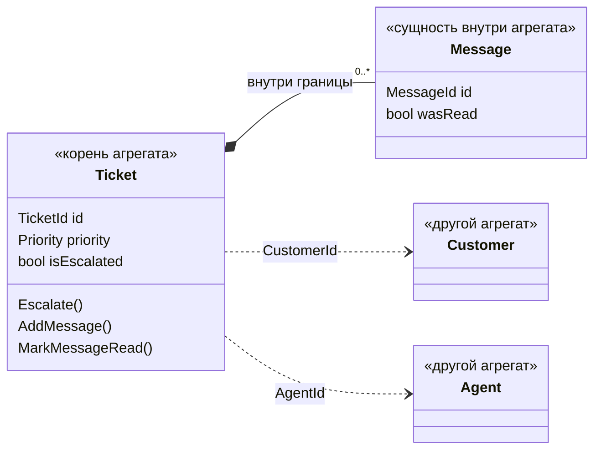
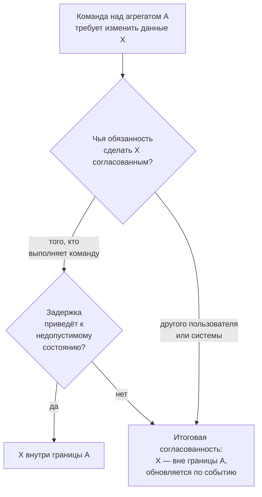

# ТП. Лекция 2 — Модель предметной области: строительные блоки

> Конспект лектора. В первой лекции мы договорились, где живёт бизнес-логика: во внутреннем
> слое, который ничего не знает о внешнем мире. Сегодня — из чего этот слой собирается.
> Лекция опирается на две книги: главу 6 «Проработка сложной бизнес-логики» Влада Хононова
> и главы 5–8 и 10 Вона Вернона. Термины даются так, как они переведены в русских изданиях;
> где переводы расходятся, в конце приведена таблица соответствия. Трилемма в блоке 9
> взята из статьи Владимира Хорикова — в этих двух книгах её нет. Лекция готовит ко второй
> лабораторной, но не отвечает на её главный вопрос — где проходит граница между вакансией
> и кандидатурой. Этот ответ студенты должны найти сами.

Глоссарий и таблица соответствия терминов в конце — раздаточный материал.

---

## Блок 1. Когда нужна модель предметной области

### Что говорим

Хононов описывает несколько способов организовать бизнес-логику и прямо говорит, что
ни один из них не является правильным всегда. Для простой логики он предлагает
**транзакционный сценарий** — процедуру, которая выполняет операцию целиком, — и
**активную запись** — объект, который хранит данные и сам умеет себя сохранять.
Транзакционный сценарий мы видели в первой лекции: контроллер, в котором правило,
сохранение и отправка письма сплетены в одну процедуру.

Когда правил становится много и они начинают зависеть друг от друга, эти подходы
перестают справляться: правила дублируются, а состояние системы становится
противоречивым. Для этого случая Хононов предлагает паттерн **модель предметной
области** — объектную модель, в которой поведение и данные собраны вместе.

Вернон приводит в первой главе анкету, помогающую решить, нужен ли проекту этот подход.
Её смысл сводится к одному: если система — редактор таблиц, где каждая операция по сути
создание, чтение, изменение или удаление записи, модель предметной области не окупится.
Если операций десятки и между ними есть правила — окупится.

### Ключевая мысль блока

Модель предметной области — инструмент для **сложной** бизнес-логики, а не обязательный
атрибут хорошего кода. Хононов связывает её с **основным поддоменом**: той частью
системы, ради которой её вообще пишут. У нас это процесс найма — этапы, решения,
назначения и их правила. Справочник подразделений той же системы вполне может остаться
транзакционным сценарием, и это будет правильным решением, а не компромиссом.

---

## Блок 2. Единый язык и одержимость примитивами

### Что говорим

Модель предметной области не содержит ничего, кроме бизнес-логики: ни обращений
к хранилищу, ни зависимостей от фреймворков. Хононов подчёркивает следствие: раз
в модели нет технических деталей, код может говорить на **едином языке** — том же,
на котором разработчики разговаривают с экспертами предметной области. Глоссарий
из первой лабораторной и есть начало единого языка.

Первое, что этот язык разрушает, — **одержимость примитивами**: привычка выражать
понятия предметной области стандартными типами — строками, числами, словарями.

=== "C#"

    ```csharp
    // Всё строки и числа, всё держится на соглашениях
    var candidate = new Candidate(
        id: Guid.NewGuid(),
        fullName: "Ivan Petrov",
        email: "IVAN@MAIL.RU ",       // регистр? пробелы? кто проверит?
        phone: "0777 12345",
        salaryFrom: 3000,
        salaryTo: 1500);               // «от» больше «до» — и никто не заметил
    ```

=== "Go"

    ```go
    // Всё строки и числа, всё держится на соглашениях
    candidate := Candidate{
        ID:         uuid.New(),
        FullName:   "Ivan Petrov",
        Email:      "IVAN@MAIL.RU ",  // регистр? пробелы? кто проверит?
        Phone:      "0777 12345",
        SalaryFrom: 3000,
        SalaryTo:   1500,             // «от» больше «до» — и никто не заметил
    }
    ```

=== "Python"

    ```python
    # Всё строки и числа, всё держится на соглашениях
    candidate = Candidate(
        id=uuid4(),
        full_name="Ivan Petrov",
        email="IVAN@MAIL.RU ",        # регистр? пробелы? кто проверит?
        phone="0777 12345",
        salary_from=3000,
        salary_to=1500,               # «от» больше «до» — и никто не заметил
    )
    ```

Хононов называет три беды такого подхода. Проверка дублируется везде, где появляется
значение. Невозможно гарантировать, что проверка вообще была вызвана перед
использованием. И с ростом кода, когда в нём работают другие люди, становится
только хуже.

Решение — выразить каждое понятие собственным типом. Тогда сигнатура сама
говорит, что в неё можно передать:

=== "C#"

    ```csharp
    var candidate = new Candidate(
        CandidateId.New(),
        FullName.Create("Ivan", "Petrov"),
        EmailAddress.Create("IVAN@MAIL.RU "),   // нормализуется и проверяется здесь
        PhoneNumber.Create("0777 12345"),
        SalaryRange.Create(lower: 1500, upper: 3000));
    ```

=== "Go"

    ```go
    candidate, err := NewCandidate(
        NewCandidateID(),
        MustFullName("Ivan", "Petrov"),
        MustEmailAddress("IVAN@MAIL.RU "),      // нормализуется и проверяется здесь
        MustPhoneNumber("0777 12345"),
        MustSalaryRange(1500, 3000),
    )
    ```

=== "Python"

    ```python
    candidate = Candidate(
        CandidateId.new(),
        FullName.create("Ivan", "Petrov"),
        EmailAddress.create("IVAN@MAIL.RU "),   # нормализуется и проверяется здесь
        PhoneNumber.create("0777 12345"),
        SalaryRange(lower=Decimal(1500), upper=Decimal(3000)),
    )
    ```

### Ключевая мысль блока

Тип — это место, где живёт правило. Если «адрес почты» — строка, правило о формате
адреса не живёт нигде, и его приходится повторять везде. Если «адрес почты» — тип,
правило написано один раз, и неправильного адреса в системе просто не может существовать.

### Ловушка для студентов

«Это же лишние классы». Посчитайте, сколько раз в проекте появится проверка формата
почты, если адрес останется строкой, — и сколько раз её забудут. Названия типов —
часть единого языка: код с ними длиннее, но читается как описание предметной области.

---

## Блок 3. Объект-значение

### Определение

У Хононова **объект-значение** — объект, который можно идентифицировать по составляющим
его значениям. Его пример — цвет: три числа определяют цвет полностью, а отдельное поле
«номер цвета» не только избыточно, но и опасно: можно завести два одинаковых цвета
с разными номерами, и сравнение по номеру их не узнает.

Вернон разворачивает определение в шесть **характеристик значений**. По ним удобно
проверять каждого кандидата в объекты-значения:

| Характеристика | Смысл | В нашей области |
|---|---|---|
| Измерение, количественная оценка или описание | значение описывает что-то, а не является чем-то | вилка зарплаты описывает вакансию |
| Неизменяемость | после создания не меняется | срок оффера не «сдвигают», а выдают новый |
| Концептуальное целое | несколько атрибутов имеют смысл только вместе | «от» и «до» вилки по отдельности бессмысленны |
| Заменяемость | меняют целиком, а не по частям | новая вилка вместо старой |
| Равенство значений | равны, если равны все атрибуты | две вилки 1500–3000 — одна и та же вилка |
| Функция без побочных эффектов | методы возвращают новое значение, не меняя старое | «поднять верхнюю границу» даёт новую вилку |

### Пример

Вилка зарплаты подходит для примера лучше адреса почты: у неё есть не только проверка,
но и поведение.

=== "C#"

    ```csharp
    public sealed record SalaryRange
    {
        public decimal Lower { get; }
        public decimal Upper { get; }

        private SalaryRange(decimal lower, decimal upper) => (Lower, Upper) = (lower, upper);

        public static SalaryRange Create(decimal lower, decimal upper)
        {
            if (lower < 0 || upper < lower)
                throw new DomainException("salary range is invalid");
            return new SalaryRange(lower, upper);
        }

        public bool Contains(decimal amount) => amount >= Lower && amount <= Upper;

        // функция без побочных эффектов: старая вилка не меняется
        public SalaryRange RaiseUpperTo(decimal newUpper) => Create(Lower, newUpper);
    }
    ```

=== "Go"

    ```go
    type SalaryRange struct{ lower, upper decimal.Decimal }

    func NewSalaryRange(lower, upper decimal.Decimal) (SalaryRange, error) {
        if lower.IsNegative() || upper.LessThan(lower) {
            return SalaryRange{}, ErrInvalidSalaryRange
        }
        return SalaryRange{lower: lower, upper: upper}, nil
    }

    func (r SalaryRange) Contains(amount decimal.Decimal) bool {
        return !amount.LessThan(r.lower) && !amount.GreaterThan(r.upper)
    }

    // функция без побочных эффектов: получатель передан по значению
    func (r SalaryRange) RaiseUpperTo(newUpper decimal.Decimal) (SalaryRange, error) {
        return NewSalaryRange(r.lower, newUpper)
    }
    ```

=== "Python"

    ```python
    @dataclass(frozen=True)
    class SalaryRange:
        lower: Decimal
        upper: Decimal

        def __post_init__(self) -> None:
            if self.lower < 0 or self.upper < self.lower:
                raise DomainError("salary range is invalid")

        def contains(self, amount: Decimal) -> bool:
            return self.lower <= amount <= self.upper

        # функция без побочных эффектов: возвращается новый объект
        def raise_upper_to(self, new_upper: Decimal) -> "SalaryRange":
            return SalaryRange(self.lower, new_upper)
    ```

Языки по-разному дают равенство по значению. Запись в C# и замороженный датакласс
в Python сравниваются по составу автоматически. В Go структура из сравнимых полей
тоже сравнивается оператором `==` — но только пока в ней нет срезов и отображений;
стоит добавить список, и равенство придётся писать самому. Ещё одна разница:
в Python проверка стоит в `__post_init__`, потому что датакласс создаётся конструктором
напрямую, — и это надёжнее отдельной фабрики, которую можно обойти.

Для денег Хононов делает отдельное предупреждение: сумма, хранимая числом с плавающей
точкой, приводит к ошибкам округления. Поэтому в примере `decimal`, а не `double`.

### Ключевая мысль блока

Объект-значение — не «маленький класс», а способ перенести правило из места
использования в место создания. После этого проверять значение больше не нужно
нигде: неправильное значение не может существовать.

### Ловушка для студентов

Объект-значение с изменяемыми полями — это не объект-значение, а структура данных.
Как только вилку можно поменять «на месте», две вакансии, которым достался один и тот же
экземпляр, начинают незаметно влиять друг на друга.

---

## Блок 4. Сущность

### Что говорим

Хононов вводит **сущность** как противоположность объекта-значения: ей нужно явное
поле идентификации, чтобы различать экземпляры. Два кандидата с одинаковыми именем
и фамилией — разные люди, и никакой набор атрибутов этого не выразит. Отсюда два
различия, и оба важны:

- **идентификатор уникален и почти никогда не меняется** за всё время жизни объекта;
- **сущность изменяема**: кандидатура движется по этапам, но остаётся той же кандидатурой.

Третье наблюдение Хононова стоит проговорить отдельно: объекты-значения **описывают**
сущность. `CandidateId`, `FullName`, `EmailAddress` — значения; `Candidate` — сущность,
которую они описывают. Сам идентификатор — тоже объект-значение.

### Когда появляется идентификатор

Вернон разбирает, откуда идентификатор берётся: его вводит пользователь, генерирует
приложение, выдаёт механизм постоянного хранения или присваивает другой ограниченный
контекст. И отдельно — когда он появляется: **рано**, при создании объекта, или **поздно**,
при первом сохранении.

Для нас важен его довод в пользу раннего идентификатора. Если при создании объекта
возникает событие предметной области, а идентификатор появится только после сохранения,
то событие не сможет сказать, *с кем* это случилось. Кандидатура порождает событие в момент
отклика, поэтому идентификатор генерирует приложение сразу. Требование `NFR-10` о монотонно
возрастающих UUID версии 7 как раз это и обеспечивает.

### Ключевая мысль блока

Хононов делает неожиданное замечание: он не включает сущность в список строительных
блоков модели. Причина в том, что сущности, по его словам, реализуются не сами по себе,
а только внутри агрегата. Сущность — то, из чего агрегат состоит, а не то, с чем
работает внешний мир.

### Ловушка для студентов

Сравнивать сущности по всем полям. Две кандидатуры с одинаковым текущим этапом —
не одна кандидатура. Если язык по умолчанию сравнивает объекты по полям, для сущности
равенство нужно переопределить: равны те, у кого равны идентификаторы.

---

## Блок 5. Агрегат: граница согласованности

### Определение

По Хононову, агрегат — тоже сущность: у него есть идентификатор и изменяемое состояние.
Но цель паттерна шире — **защита согласованности данных**. Агрегат проводит границу между
собой и внешним миром, и внутри неё бизнес-правила соблюдаются всегда.

Технически это обеспечивается одним ограничением: **изменять состояние агрегата может
только его собственная бизнес-логика**. Внешний код состояние читает, а меняет только
через открытые методы, которые Хононов называет **командами** агрегата.

Из этого вытекают три свойства, и все три есть у Хононова.

**Граница транзакции.** Все изменения агрегата фиксируются одной атомарной операцией:
либо все, либо ни одного. И обратное: за одну транзакцию изменяется только один агрегат.
Если сценарию нужно атомарно изменить два агрегата, это сигнал, что границы выбраны неверно.

**Иерархия сущностей.** Если несколько объектов обязаны меняться вместе — потому что
правила одного зависят от состояния другого, — они принадлежат одному агрегату.
Отсюда и название: агрегат объединяет сущности и объекты-значения одной границы.

**Корень агрегата.** Из всех сущностей иерархии только одна служит открытым интерфейсом
агрегата. Даже если команда меняет внутреннюю сущность, вызывают её через корень.

Пример Хононова — заявка в службу поддержки. Заявка и её сообщения — один агрегат:
правило «переназначить заявку, если сотрудник не прочитал сообщения за половину срока»
требует, чтобы сведения о прочтении были строго согласованы с заявкой. А клиент
и назначенный сотрудник — отдельные агрегаты, и заявка ссылается на них только
по идентификаторам.



??? note "Исходник диаграммы"

    ```
    classDiagram
      direction LR
      class Ticket {
        <<корень агрегата>>
        TicketId id
        Priority priority
        bool isEscalated
        Escalate()
        AddMessage()
        MarkMessageRead()
      }
      class Message {
        <<сущность внутри агрегата>>
        MessageId id
        bool wasRead
      }
      class Customer {
        <<другой агрегат>>
      }
      class Agent {
        <<другой агрегат>>
      }
      Ticket *-- "0..*" Message : внутри границы
      Ticket ..> Customer : CustomerId
      Ticket ..> Agent : AgentId
    ```


### Команда агрегата

Как выглядит команда, хорошо видно на отклонении кандидатуры: `BR-04` запрещает действия
над терминальной кандидатурой, `BR-09` требует содержательную причину, `BR-10` —
чтобы история только дополнялась.

=== "C#"

    ```csharp
    public sealed class JobApplication
    {
        private readonly List<StageDecision> _decisions = [];

        public ApplicationId Id { get; }
        public ApplicationStatus Status { get; private set; }
        public IReadOnlyList<StageDecision> Decisions => _decisions.AsReadOnly();

        public void Reject(Decider decider, RejectionReason reason, IClock clock)
        {
            if (Status is not ApplicationStatus.InProgress)
                throw new DomainException("candidacy is in a terminal state");   // BR-04

            _decisions.Add(StageDecision.Reject(decider, reason, clock.UtcNow)); // BR-10
            Status = ApplicationStatus.Rejected;
        }
    }
    ```

=== "Go"

    ```go
    type JobApplication struct {
        id        ApplicationID
        status    ApplicationStatus
        decisions []StageDecision
    }

    func (a *JobApplication) Decisions() []StageDecision {
        return slices.Clone(a.decisions)      // наружу — копия, а не сам срез
    }

    func (a *JobApplication) Reject(d Decider, reason RejectionReason, clock Clock) error {
        if a.status != StatusInProgress {
            return ErrTerminalState           // BR-04
        }
        a.decisions = append(a.decisions, RejectDecision(d, reason, clock.UtcNow())) // BR-10
        a.status = StatusRejected
        return nil
    }
    ```

=== "Python"

    ```python
    class JobApplication:
        def __init__(self, id: ApplicationId) -> None:
            self._id = id
            self._status = ApplicationStatus.IN_PROGRESS
            self._decisions: list[StageDecision] = []

        @property
        def decisions(self) -> tuple[StageDecision, ...]:
            return tuple(self._decisions)     # наружу — неизменяемый кортеж

        def reject(self, decider: Decider, reason: RejectionReason, clock: Clock) -> None:
            if self._status is not ApplicationStatus.IN_PROGRESS:
                raise DomainError("candidacy is in a terminal state")          # BR-04
            self._decisions.append(StageDecision.reject(decider, reason, clock.utc_now()))  # BR-10
            self._status = ApplicationStatus.REJECTED
    ```

`BR-09` в этом методе не проверяется — и не должен. Причина отклонения — объект-значение
`RejectionReason`, и слишком короткую причину просто невозможно создать. Агрегат получает
уже правильное значение.

### Ключевая мысль блока

Агрегат — это не «главная сущность со списком дочерних». Это **граница, внутри которой
правила соблюдаются всегда**, и одновременно граница транзакции. Размер агрегата
определяется не тем, что «логически связано», а тем, что обязано меняться вместе.

### Ловушка для студентов

Отдавать наружу внутреннюю коллекцию. Если свойство возвращает сам список решений,
любой код может его очистить, и `BR-10` нарушен без единой строчки в агрегате.
Все три варианта выше отдают неизменяемое представление или копию — и в Go это
приходится делать явно, потому что срез иначе разделяет память с оригиналом.

---

## Блок 6. Пирамида строительных блоков

### Что говорим

Строительные блоки не равноправны: они стоят друг на друге. Фундамент — объекты-значения,
на них опираются сущности, наверху — агрегат, который объединяет сущности и значения
одной границы.

<figure style="margin:1.6em 0; text-align:center">
<svg viewBox="0 0 660 330" role="img" aria-label="Пирамида строительных блоков: в основании объекты-значения, выше сущности, на вершине агрегат" style="width:100%; max-width:660px; height:auto; font-family:var(--sans)">
<polygon points="270,20 370,20 432,108 208,108" fill="var(--accent)" stroke="var(--accent)" stroke-width="1.5"/>
<text x="320" y="60" text-anchor="middle" font-size="19" font-weight="600" fill="var(--panel)">Агрегат</text>
<text x="320" y="84" text-anchor="middle" font-size="12.5" fill="var(--panel)">граница согласованности</text>
<text x="320" y="99" text-anchor="middle" font-size="12.5" fill="var(--panel)">и транзакции</text>
<polygon points="203,116 437,116 507,206 133,206" fill="var(--accent-soft)" stroke="var(--accent)" stroke-width="1.5"/>
<text x="320" y="156" text-anchor="middle" font-size="19" font-weight="600" fill="var(--ink)">Сущности</text>
<text x="320" y="180" text-anchor="middle" font-size="13" fill="var(--ink-soft)">идентичность и жизненный цикл</text>
<polygon points="128,214 512,214 584,304 56,304" fill="var(--panel)" stroke="var(--accent)" stroke-width="1.5"/>
<text x="320" y="254" text-anchor="middle" font-size="19" font-weight="600" fill="var(--ink)">Объекты-значения</text>
<text x="320" y="278" text-anchor="middle" font-size="13" fill="var(--ink-soft)">правила, неизменяемость, единый язык</text>
<line x1="624" y1="36" x2="624" y2="288" stroke="var(--ink-faint)" stroke-width="1.5"/>
<polygon points="617,286 631,286 624,302" fill="var(--ink-faint)"/>
<text x="0" y="0" transform="translate(646,166) rotate(-90)" text-anchor="middle" font-size="12" fill="var(--ink-faint)">знать можно только то, что ниже</text>
</svg>
<figcaption style="font-size:13px; color:var(--ink-faint); margin-top:4px">Фундамент — объекты-значения; сущности стоят на них; агрегат объединяет всё, что под ним, в одну границу</figcaption>
</figure>

Из пирамиды следует простое правило: **знать можно только то, что ниже или рядом,
и никогда — то, что выше.** Это правило зависимостей из первой лекции, применённое
на уровень глубже: тогда мы говорили о слоях, теперь — о блоках внутри домена.

| Блок | Может содержать и знать | Не может |
|---|---|---|
| **Объект-значение** | другие значения, примитивы языка | сущности и агрегаты |
| **Сущность** | значения; другие сущности — только своего агрегата | сущности чужих агрегатов |
| **Корень агрегата** | значения, сущности своей иерархии, идентификаторы других агрегатов | другие агрегаты объектом |
| **Событие предметной области** | значения, в том числе идентификаторы | сущности и агрегаты |
| **Доменный сервис** | значения и агрегаты, полученные аргументами | собственное состояние между вызовами |

Две строки таблицы стоит проговорить отдельно.

**Сущность в сущности — можно, но только внутри одного агрегата.** Это и есть иерархия
сущностей Хононова: сообщение внутри заявки — сущность внутри сущности. Снаружи до неё
добираются только через корень.

**Связь между агрегатами проходит через фундамент.** Ссылка на другой агрегат —
это идентификатор, а идентификатор — объект-значение. Верхние этажи соседних пирамид
никогда не соединяются напрямую; соединяются только их основания.

### Значение не знает сущность

Самое частое нарушение пирамиды — значение, которое держит сущность. Возьмём запись
в истории решений: кто, когда и какое решение принял на этапе.

=== "C#"

    ```csharp
    // Плохо: значение держит сущность — и перестаёт быть значением
    public sealed record StageDecision(
        int StageIndex, Verdict Verdict, Employee DecidedBy, DateTimeOffset DecidedAt);

    // Хорошо: значение держит идентификатор, который сам является значением
    public sealed record StageDecision(
        int StageIndex, Verdict Verdict, EmployeeId DecidedBy, DateTimeOffset DecidedAt);
    ```

=== "Go"

    ```go
    // Плохо: значение держит сущность — и перестаёт быть значением
    type StageDecisionBad struct {
        StageIndex int
        Verdict    Verdict
        DecidedBy  *Employee
        DecidedAt  time.Time
    }

    // Хорошо: значение держит идентификатор, который сам является значением
    type StageDecision struct {
        StageIndex int
        Verdict    Verdict
        DecidedBy  EmployeeID
        DecidedAt  time.Time
    }
    ```

=== "Python"

    ```python
    # Плохо: значение держит сущность — и перестаёт быть значением
    @dataclass(frozen=True)
    class StageDecisionBad:
        stage_index: int
        verdict: Verdict
        decided_by: Employee
        decided_at: datetime

    # Хорошо: значение держит идентификатор, который сам является значением
    @dataclass(frozen=True)
    class StageDecision:
        stage_index: int
        verdict: Verdict
        decided_by: EmployeeId
        decided_at: datetime
    ```

Что сломано в первом варианте. Запись объявлена неизменяемой, но внутри неё изменяемая
сущность: сотрудник сменил подразделение или фамилию — и решение полугодовой давности
«изменилось» задним числом. `BR-10` требует, чтобы история только дополнялась, а здесь
она меняется без единого вызова. Неизменяемость значения, которое держит сущность, —
иллюзия: оно неизменяемо ровно настолько, насколько неизменяемо самое изменчивое из того,
что внутри.

Честная оговорка: в оригинальной книге Эрика Эванса ссылка значения на сущность
допускалась. Правило курса строже классики, и причина в примере выше: как только значение
держит сущность, оно теряет главное своё свойство. Если связь нужна — храните идентификатор.

### Ключевая мысль блока

Зависимости внутри домена направлены вниз, к фундаменту. Значение не знает сущность,
сущность не знает чужой агрегат, агрегаты связаны только идентификаторами. Каждое
нарушение этого правила — место, где изменение наверху незаметно просачивается вниз.

### Ловушка для студентов

«Навигационные» свойства для удобства: `application.Vacancy.Title`, чтобы не искать
название вакансии отдельно. Фреймворки охотно подталкивают к таким ссылкам, и выглядят они
безобидно. Но через такое свойство можно не только прочитать, но и изменить соседний
агрегат, — и граница исчезает. Если сценарию нужны данные двух агрегатов, он загружает
оба, а не проходит из одного в другой.

---

## Блок 7. Четыре правила проектирования агрегатов

### Что говорим

Вернон в главе 10 сводит проектирование агрегатов к четырём правилам. Хононов
формулирует те же идеи короче, но по смыслу они совпадают, поэтому держим в голове
формулировки Вернона.

**1. Моделируйте истинные инварианты в границах согласованности.** Инвариант — бизнес-правило,
которое всегда сохраняет непротиворечивость. Вернон различает **транзакционную
согласованность** — мгновенную и атомарную — и **итоговую согласованность**, которая
достигается с задержкой. Граница агрегата очерчивается вокруг того, что требует первой.

**2. Проектируйте небольшие агрегаты.** Крупный агрегат загружается целиком ради любого
изменения и мешает всем, кто работает с ним одновременно. Вернон показывает это на продукте
с тысячами задач: чтобы добавить одну, пришлось бы поднять в память все остальные.
Хононов приходит к тому же через согласованность: в агрегат входит только то, что обязано
быть строго согласованным.

**3. Ссылайтесь на другие агрегаты по идентификаторам.** Ссылка объектом создаёт иллюзию
общей границы: из одного агрегата можно пройти в другой и изменить его. Идентификатор
делает границу видимой.

**4. Используйте принцип итоговой согласованности за пределами границы.** Если команда
над одним агрегатом требует изменений в других, эти изменения происходят позже — через
события предметной области, а не в той же транзакции.

### Как отличить одно от другого

Самый практичный инструмент — раздел Вернона **«Спрашивайте, чья это обязанность»**;
сам принцип он приписывает разговору с Эриком Эвансом. Чья задача — привести данные
в согласованное состояние? Если того самого пользователя, который выполняет действие, —
нужна транзакционная согласованность. Если другого пользователя или системы — достаточно
итоговой.

Хононов предлагает проверку с другой стороны: представьте, что данные согласуются
с задержкой. Приведёт ли это к недопустимому состоянию системы? Если да — данные внутри
границы. Если нет — снаружи.



??? note "Исходник диаграммы"

    ```
    flowchart TB
      Q["Команда над агрегатом A<br/>требует изменить данные X"] --> R{"Чья обязанность<br/>сделать X согласованным?"}
      R -->|"того, кто<br/>выполняет команду"| T{"Задержка<br/>приведёт к<br/>недопустимому<br/>состоянию?"}
      R -->|"другого пользователя<br/>или системы"| E["Итоговая согласованность:<br/>X — вне границы A,<br/>обновляется по событию"]
      T -->|да| I["X внутри границы A"]
      T -->|нет| E
    ```


Разберём на нашем задании, но на примере, который **не** является вопросом второй
лабораторной. `FR-06` требует, чтобы сотрудник видел число кандидатур на каждом этапе
вакансии. Должна ли вакансия хранить эти счётчики и обновлять их в той же транзакции,
что и решение по кандидатуре?

Чья обязанность, чтобы счётчик был точным, — сотрудника, который одобряет кандидата?
Нет: он принимает решение по одному человеку, а счётчик нужен для обзора. Приведёт ли
задержка в секунду к недопустимому состоянию? Нет: ни одно правило задания от счётчика
не зависит. Значит, счётчики — вне границы и обновляются по событиям. А живи они внутри
вакансии, каждое решение по любому кандидату блокировало бы всю вакансию — ровно то,
от чего предостерегает второе правило.

### Когда правила нарушают

Вернон честно перечисляет причины, по которым опытный проектировщик иногда меняет
несколько агрегатов в одной транзакции: удобство пользовательского интерфейса,
отсутствие технических механизмов, глобальные транзакции и производительность запросов.
Но каждый такой случай — осознанное исключение с веской причиной, и его место в ADR.

### Ловушка для студентов

Вернон предупреждает: **не доверяйте каждому сценарию использования.** Если требование
звучит как «атомарно изменить три агрегата», это ещё не значит, что так и нужно делать.
Чаще это значит, что автор требования не думал о границах, а цель бизнеса достижима
итоговой согласованностью. Такие места — повод вернуться к заказчику с вопросом,
а не повод увеличить агрегат.

---

## Блок 8. События предметной области

### Что говорим

Хононов определяет **событие предметной области** как сообщение, описывающее значимый факт,
произошедший в бизнес-области. У него три свойства:

- **прошедшее время** — событие описывает то, что уже случилось: «кандидатура отклонена»,
  а не «отклонить кандидатуру»;
- **полнота** — в событии есть все данные, нужные тем, кто на него отреагирует: что, с кем,
  когда, почему;
- **часть публичного интерфейса агрегата** — наряду с командами это второй способ
  взаимодействия агрегата с внешним миром; на события подписываются другие агрегаты,
  процессы и системы.

Это то, что вы уже делали на первой лабораторной, только теперь события становятся типами:

=== "C#"

    ```csharp
    public sealed record ApplicationRejected(
        ApplicationId ApplicationId,
        VacancyId VacancyId,
        EmployeeId DecidedBy,
        RejectionReason Reason,
        DateTimeOffset OccurredAt) : IDomainEvent;
    ```

=== "Go"

    ```go
    type ApplicationRejected struct {
        ApplicationID ApplicationID
        VacancyID     VacancyID
        DecidedBy     EmployeeID
        Reason        RejectionReason
        OccurredAt    time.Time
    }
    ```

=== "Python"

    ```python
    @dataclass(frozen=True)
    class ApplicationRejected(DomainEvent):
        application_id: ApplicationId
        vacancy_id: VacancyId
        decided_by: EmployeeId
        reason: RejectionReason
        occurred_at: datetime
    ```

Агрегат создаёт событие внутри команды и накапливает его. Как событие надёжно доберётся
до подписчиков — отдельная задача; Хононов откладывает её до главы 9, мы — до седьмой лекции.

### Ключевая мысль блока

Событие — факт, а не команда. Оно никого ни о чём не просит, оно сообщает, что уже
произошло. Поэтому через события и строится итоговая согласованность из предыдущего блока:
агрегат фиксирует факт, остальные узнают о нём позже.

---

## Блок 9. Доменный сервис и трилемма

### Что говорим

Иногда бизнес-логика не принадлежит ни одному агрегату или объекту-значению либо относится
сразу к нескольким. Для таких случаев Хононов предлагает **доменный сервис** — объект
без состояния, реализующий бизнес-логику. В переводе Вернона тот же паттерн называется
**служба предметной области**.

Два ограничения оба автора оговаривают прямо.

- **Доменный сервис не обходит правило одного агрегата на транзакцию.** Он может *читать*
  несколько агрегатов, чтобы принять решение, но изменить за транзакцию по-прежнему можно
  только один.
- **Доменный сервис — не прикладная служба и не микросервис.** Вернон отдельно разводит
  службу предметной области и **прикладную службу**: первая содержит бизнес-логику,
  вторая только координирует сценарий. Хононов добавляет, что слово «сервис» здесь
  не имеет отношения к сервисно-ориентированной архитектуре.

В нашем задании хороший кандидат — правило `BR-02`: у одного адреса почты не может быть
двух одновременно активных кандидатур на одну вакансию. Ни кандидатура, ни вакансия этого
сами не знают: правило смотрит на несколько кандидатур сразу.

=== "C#"

    ```csharp
    public static class ReapplicationPolicy
    {
        // без состояния: всё нужное приходит аргументами
        public static void EnsureCanApply(
            EmailAddress email, VacancyId vacancy, IEnumerable<JobApplication> existing)
        {
            if (existing.Any(a => a.VacancyId == vacancy
                               && a.CandidateEmail == email
                               && a.Status == ApplicationStatus.InProgress))
                throw new DomainException("active candidacy already exists");      // BR-02
        }
    }
    ```

=== "Go"

    ```go
    // без состояния: всё нужное приходит аргументами
    func EnsureCanApply(email EmailAddress, vacancy VacancyID, existing []*JobApplication) error {
        for _, a := range existing {
            if a.VacancyID() == vacancy && a.CandidateEmail() == email &&
                a.Status() == StatusInProgress {
                return ErrActiveCandidacyExists                                   // BR-02
            }
        }
        return nil
    }
    ```

=== "Python"

    ```python
    # без состояния: всё нужное приходит аргументами
    def ensure_can_apply(email: EmailAddress, vacancy: VacancyId,
                         existing: Iterable[JobApplication]) -> None:
        if any(a.vacancy_id == vacancy and a.candidate_email == email
               and a.status is ApplicationStatus.IN_PROGRESS for a in existing):
            raise DomainError("active candidacy already exists")                  # BR-02
    ```

Обратите внимание, чего здесь нет: сервис не загружает кандидатуры сам — их кто-то должен
передать. И вот здесь вся конструкция упирается в выбор, от которого не уйти.

### Трилемма

Владимир Хориков в статье «Domain model purity vs. domain model completeness» (2020)
назвал этот выбор **трилеммой DDD**. Он выделяет три желаемых свойства:

- **полнота модели** (completeness) — вся бизнес-логика находится в слое предметной области
  и не раздроблена по другим слоям;
- **чистота модели** (purity) — слой предметной области не зависит от внешних процессов:
  хранилища, сети, файлов;
- **производительность** (performance) — нет лишних обращений к внешним зависимостям.

Иметь все три одновременно нельзя — только любые два.

<figure style="margin:1.6em 0; text-align:center">
<svg viewBox="0 0 700 350" role="img" aria-label="Трилемма: полнота модели, чистота модели, производительность; каждый вариант даёт только две вершины" style="width:100%; max-width:700px; height:auto; font-family:var(--sans)">
<line x1="306" y1="60" x2="126" y2="272" stroke="var(--accent)" stroke-width="2.5"/>
<line x1="354" y1="60" x2="534" y2="272" stroke="var(--ink-faint)" stroke-width="2" stroke-dasharray="7 6"/>
<line x1="200" y1="292" x2="460" y2="292" stroke="var(--accent)" stroke-width="2.5"/>
<rect x="245" y="20" width="170" height="40" rx="6" fill="var(--panel)" stroke="var(--accent)" stroke-width="1.5"/>
<text x="330" y="45" text-anchor="middle" font-size="15" font-weight="600" fill="var(--ink)">Полнота модели</text>
<rect x="20" y="272" width="180" height="40" rx="6" fill="var(--panel)" stroke="var(--accent)" stroke-width="1.5"/>
<text x="110" y="297" text-anchor="middle" font-size="15" font-weight="600" fill="var(--ink)">Чистота модели</text>
<rect x="460" y="272" width="190" height="40" rx="6" fill="var(--panel)" stroke="var(--accent)" stroke-width="1.5"/>
<text x="555" y="297" text-anchor="middle" font-size="15" font-weight="600" fill="var(--ink)">Производительность</text>
<text x="200" y="158" text-anchor="end" font-size="13.5" font-weight="600" fill="var(--accent)">1. Загрузить всё заранее</text>
<text x="200" y="176" text-anchor="end" font-size="12" fill="var(--ink-soft)">полнота + чистота</text>
<text x="494" y="150" text-anchor="start" font-size="13.5" font-weight="600" fill="var(--ink-faint)">2. Дать домену доступ</text>
<text x="494" y="167" text-anchor="start" font-size="13.5" font-weight="600" fill="var(--ink-faint)">к хранилищу</text>
<text x="494" y="185" text-anchor="start" font-size="12" fill="var(--ink-faint)">полнота + производительность</text>
<text x="494" y="202" text-anchor="start" font-size="12" font-style="italic" fill="var(--hot)">в нашей архитектуре закрыт</text>
<text x="330" y="330" text-anchor="middle" font-size="13.5" font-weight="600" fill="var(--accent)">3. Разделить решение</text>
<text x="330" y="346" text-anchor="middle" font-size="12" fill="var(--ink-soft)">чистота + производительность</text>
</svg>
<figcaption style="font-size:13px; color:var(--ink-faint); margin-top:4px">Каждый вариант даёт две вершины из трёх. Сплошные рёбра доступны в нашей архитектуре, пунктир закрыт правилом зависимостей из первой лекции</figcaption>
</figure>

Приложим к `BR-02`.

**1. Загрузить всё заранее — полнота и чистота ценой производительности.** Сценарий загружает
все кандидатуры вакансии и передаёт их доменному сервису, как в примере выше. Правило целиком
в домене, домен ни от чего не зависит. Но у популярной вакансии тысячи кандидатур, и все они
поднимаются в память ради одной проверки.

**2. Дать домену доступ к хранилищу — полнота и производительность ценой чистоты.** Доменный
сервис сам спрашивает у репозитория, есть ли активная кандидатура. Быстро, и правило в одном
месте. Но домен теперь зависит от внешнего процесса. В нашей архитектуре этот путь закрыт
физически: интерфейс репозитория объявлен в слое приложения, и домен его не видит. У Вернона
интерфейсы хранилищ живут в самом слое предметной области, и там этот вариант доступен, —
это одно из решений, которым наш курс отличается от книги.

**3. Разделить решение — чистота и производительность ценой полноты.** Сценарий сам задаёт
узкий вопрос хранилищу — «есть ли активная кандидатура с этой почтой на этой вакансии» —
и передаёт ответ в домен или сам отказывает. Быстро и чисто, но часть правила `BR-02` теперь
живёт в сценарии. Это ровно тот `if` в обработчике, от которого мы предостерегали
в первой лекции, — только теперь осознанный.

Сам Хориков советует выбирать чистоту, а не полноту, то есть обычно третий вариант.
Модель, зависящую от хранилища, трудно тестировать и трудно понимать, а раздроблённую
логику можно держать под контролем: явно отмечать такие места и покрывать их тестами
сценариев.

Нас эта трилемма касается не абстрактно. Одно из свойств мы уже зафиксировали
в первой лекции: домен не видит внешнего мира. Значит, для каждого правила, которому нужны
данные извне, выбор идёт между первым и третьим вариантом, и делается он **для каждого
правила отдельно**. Для `BR-02` первый вариант может оказаться вполне приемлемым, если
загружать только кандидатуры одного адреса, — но заметьте: как только запрос сам
фильтрует по почте и статусу, часть правила уже переехала в запрос.

И последнее, чтобы не было иллюзий. Ни один из трёх вариантов не защищает от двух
одновременных откликов: оба пройдут проверку, прежде чем любой из них сохранится.
Окончательно защитить `BR-02` может только хранилище, и это тема четвёртой лекции.

### Ловушка для студентов

Вернон предупреждает прямо: увлечение службами ведёт к **анемичной модели предметной
области**, где вся логика в службах, а сущности и значения — пустые контейнеры. Прежде
чем выносить логику в доменный сервис, спросите: действительно ли ей негде жить внутри
агрегата или значения? В подавляющем большинстве случаев такое место есть.

---

## Блок 10. Зачем всё это: степени свободы

### Что говорим

Хононов заканчивает главу аргументом, который отвечает на вопрос «зачем столько
ограничений». Он опирается на определение сложности Элияху Голдратта: сложность
системы — это трудность контролировать и предсказывать её поведение, и измеряется она
**степенями свободы** — числом независимых величин, которые нужны, чтобы описать состояние.

=== "C#"

    ```csharp
    // Пять степеней свободы: допустима любая комбинация
    public class ClassA
    {
        public int A { get; set; }
        public int B { get; set; }
        public int C { get; set; }
        public int D { get; set; }
        public int E { get; set; }
    }

    // Две степени свободы: B, C и E вычисляются из A и D
    public class ClassB
    {
        private int _a, _d;
        public int A { get => _a; set { _a = value; B = value / 2; C = value / 3; } }
        public int D { get => _d; set { _d = value; E = value * 2; } }
        public int B { get; private set; }
        public int C { get; private set; }
        public int E { get; private set; }
    }
    ```

=== "Go"

    ```go
    // Пять степеней свободы: допустима любая комбинация
    type ClassA struct{ A, B, C, D, E int }

    // Две степени свободы: B, C и E вычисляются из a и d
    type ClassB struct{ a, d int }

    func (c *ClassB) SetA(v int) { c.a = v }
    func (c *ClassB) SetD(v int) { c.d = v }
    func (c ClassB) B() int      { return c.a / 2 }
    func (c ClassB) C() int      { return c.a / 3 }
    func (c ClassB) E() int      { return c.d * 2 }
    ```

=== "Python"

    ```python
    # Пять степеней свободы: допустима любая комбинация
    @dataclass
    class ClassA:
        a: int
        b: int
        c: int
        d: int
        e: int

    # Две степени свободы: b, c и e вычисляются из a и d
    class ClassB:
        def __init__(self, a: int, d: int) -> None:
            self._a, self._d = a, d

        @property
        def b(self) -> int:
            return self._a // 2

        @property
        def c(self) -> int:
            return self._a // 3

        @property
        def e(self) -> int:
            return self._d * 2
    ```

На первый взгляд `ClassB` сложнее: в нём больше кода. Но его состояние описывается двумя
числами, а состояние `ClassA` — пятью. Поведение `ClassB` предсказать проще, потому что он
допускает меньше состояний. **Инварианты уменьшают сложность.**

Это ответ на вопрос всей лекции. Объекты-значения и агрегаты не добавляют сложности —
они её отнимают, закрывая состояния, которые не должны существовать. Кандидатура, у которой
статус «отклонена», а текущий этап продолжает меняться, — лишняя степень свободы.
Агрегат её убирает.

### Ключевая мысль блока

Каждое правило, выраженное в типе или в методе агрегата, — это состояние, которое больше
не нужно проверять, тестировать и объяснять. Кода становится больше, а система — проще.

---

## Итоги лекции

1. Модель предметной области — паттерн для сложной бизнес-логики основного поддомена; для простой логики транзакционный сценарий честно лучше.
2. Код говорит на едином языке; одержимость примитивами этот язык разрушает.
3. Объект-значение идентифицируется своими значениями, неизменяем и переносит правило из места использования в место создания.
4. Сущность идентифицируется идентификатором, который уникален и почти не меняется; сущности живут внутри агрегатов.
5. Агрегат — граница согласованности и граница транзакции; его состояние меняют только его команды через корень.
6. Пирамида: значения — фундамент, на них сущности, наверху агрегат; знать можно только то, что ниже, агрегаты связаны идентификаторами.
7. Четыре правила Вернона: истинные инварианты в границах, небольшие агрегаты, ссылки по идентификаторам, итоговая согласованность снаружи.
8. «Чья это обязанность?» — главный вопрос при выборе между транзакционной и итоговой согласованностью.
9. Событие предметной области — факт в прошедшем времени и часть публичного интерфейса агрегата.
10. Доменный сервис — логика без состояния, которой нет места в агрегате; злоупотребление им ведёт к анемичной модели.
11. Трилемма Хорикова: полнота, чистота, производительность — только две из трёх; у нас чистота зафиксирована, выбор идёт между полнотой и производительностью для каждого правила.
12. Инварианты уменьшают число степеней свободы — поэтому ограничения делают систему проще.

Одна фраза на всю лекцию: **агрегат — это то, что обязано меняться вместе, и ничего больше.**

---

## Глоссарий (раздаточный материал)

| Термин | Определение | Источник |
|---|---|---|
| **Агрегат** | Иерархия сущностей и объектов-значений с общей границей согласованности и транзакции | Хононов, гл. 6; Вернон, гл. 10 |
| **Активная запись** | Объект, который хранит данные и сам умеет их сохранять | Хононов, гл. 5 |
| **Анемичная модель предметной области** | Модель, в которой объекты лишены поведения, а логика вынесена в службы | Вернон, гл. 1 и 7 |
| **Граница согласованности** | Граница, внутри которой бизнес-правила соблюдаются всегда | Хононов, гл. 6; Вернон, гл. 10 |
| **Доменный сервис** | Объект без состояния с бизнес-логикой, не принадлежащей одному агрегату | Хононов, гл. 6 |
| **Единый язык** | Язык предметной области, общий для экспертов и разработчиков и используемый в коде | Хононов, гл. 6; Вернон, гл. 1 |
| **Инвариант** | Бизнес-правило, которое всегда сохраняет непротиворечивость | Вернон, гл. 10 |
| **Итоговая согласованность** | Согласованность, достигаемая с задержкой, а не в той же транзакции | Вернон, гл. 10 |
| **Команда агрегата** | Открытый метод, через который меняется состояние агрегата | Хононов, гл. 6 |
| **Корень агрегата** | Единственная сущность агрегата, служащая его открытым интерфейсом | Хононов, гл. 6 |
| **Модель предметной области** | Объектная модель, объединяющая поведение и данные | Хононов, гл. 6 |
| **Объект-значение** | Объект, идентифицируемый своими значениями; неизменяем | Хононов, гл. 6; Вернон, гл. 6 |
| **Одержимость примитивами** | Выражение понятий предметной области стандартными типами языка | Хононов, гл. 6 |
| **Полнота модели** | Свойство: вся бизнес-логика находится в слое предметной области | Хориков, статья 2020 |
| **Основной поддомен** | Часть предметной области, дающая компании конкурентное преимущество | Хононов, гл. 1 |
| **Чистота модели** | Свойство: слой предметной области не зависит от внешних процессов | Хориков, статья 2020 |
| **Прикладная служба** | Координирует сценарий и не содержит бизнес-логики | Вернон, гл. 7 и 14 |
| **Событие предметной области** | Сообщение о значимом факте в бизнес-области, в прошедшем времени | Хононов, гл. 6; Вернон, гл. 8 |
| **Степени свободы** | Число независимых величин, описывающих состояние системы | Хононов, гл. 6, по Голдратту |
| **Сущность** | Объект с явным идентификатором и изменяемым состоянием | Хононов, гл. 6; Вернон, гл. 5 |
| **Транзакционная согласованность** | Мгновенная и атомарная согласованность внутри одной транзакции | Вернон, гл. 10 |
| **Транзакционный сценарий** | Процедура, выполняющая бизнес-операцию целиком | Хононов, гл. 5 |
| **Трилемма DDD** | Невозможность одновременно получить полноту, чистоту модели и производительность | Хориков, статья 2020 |

### Соответствие терминов

Русские издания переводят часть терминов по-разному. Курс берёт термины из источников
и не изобретает третий вариант; в колонке «В курсе» — какой из двух используется
в наших материалах.

| Оригинал | Хононов | Вернон | В курсе |
|---|---|---|---|
| Domain Model | модель предметной области | модель предметной области | модель предметной области |
| Value Object | объект-значение | объект-значение | объект-значение |
| Entity | сущность | сущность | сущность |
| Aggregate | агрегат | агрегат | агрегат |
| Domain Event | событие предметной области | событие предметной области | событие предметной области |
| Domain Service | доменный сервис | служба предметной области | доменный сервис |
| Application Service | — | прикладная служба | прикладная служба |
| Repository | репозиторий | хранилище | репозиторий |
| Eventual Consistency | согласованность в конечном счёте | итоговая согласованность | итоговая согласованность |
| Ubiquitous Language | единый язык | единый язык | единый язык |
| Transaction Script | транзакционный сценарий | — | транзакционный сценарий |
| Domain Model Completeness / Purity | — | — | полнота / чистота модели (по Хорикову) |

---

## Вопросы для самопроверки

1. Когда транзакционный сценарий — правильный выбор, а не упрощение?
2. Назовите три беды одержимости примитивами по Хононову.
3. Проверьте вилку зарплаты по шести характеристикам значений Вернона. Все ли выполняются?
4. Почему у объекта-значения не должно быть поля-идентификатора?
5. Почему Хононов не включает сущность в список строительных блоков модели?
6. Зачем генерировать идентификатор рано, если его можно получить при сохранении?
7. Что означает «один агрегат на одну транзакцию» и о чём сигнализирует его нарушение?
8. Перечислите четыре правила проектирования агрегатов Вернона.
9. Примените вопрос «чья это обязанность?» к уведомлению исполнителей об отклике (`FR-21`). Какая нужна согласованность?
10. Чем доменный сервис отличается от прикладной службы?
11. Почему доменный сервис не вправе изменить два агрегата в одной транзакции?
12. Объясните на примере степеней свободы, почему инвариант уменьшает сложность, хотя добавляет код.
13. Почему объект-значение не может держать сущность, даже если объявлен неизменяемым? Приведите пример из нашего задания.
14. Может ли сущность содержать другую сущность? При каком условии?
15. Назовите три свойства трилеммы и три варианта выбора. Какое свойство в нашем курсе зафиксировано заранее и чем?
16. Почему ни один вариант трилеммы не защищает `BR-02` от двух одновременных откликов?

## Домашнее задание

**Чтение.** Хононов, глава 6 целиком. Вернон, глава 10 — разделы с четырьмя правилами
и «Спрашивайте, чья это обязанность»; глава 6 — раздел «Характеристики значений».

**Подготовка ко второй лабораторной.** Возьмите свой `docs/boundaries.md` из первой работы
и для каждого понятия ответьте письменно:

- объект-значение это или сущность — проверьте по характеристикам Вернона;
- если сущность — в какой агрегат она входит и что является его корнем;
- какие правила `BR-xx` этот агрегат защищает и какие данные ему для этого нужны.

Главный вопрос лабораторной — где граница между вакансией и кандидатурой — принесите
в виде двух вариантов с ценой каждого. Выбирать будем на занятии.

Отдельно: выпишите правила `BR-xx`, которым для проверки нужны данные вне одного агрегата.
Для каждого — какой вариант трилеммы вы выберете и почему.

**Со звёздочкой.** Найдите в задании пример, где вопрос «чья это обязанность?»
и проверка Хононова «приведёт ли задержка к недопустимому состоянию?» дают разные ответы.
Если не найдёте — объясните, почему их не может быть.

## Литература

- Хононов В. Изучаем DDD — предметно-ориентированное проектирование. 2024.
  Глава 5 «Реализация простой бизнес-логики», глава 6 «Проработка сложной бизнес-логики».
- Вернон В. Реализация методов предметно-ориентированного проектирования.
  Глава 1 «Знакомство с DDD», главы 5–8 «Сущности», «Объекты-значения», «Службы»,
  «События предметной области», глава 10 «Агрегаты».
- Khorikov V. Domain model purity vs. domain model completeness (DDD Trilemma). 2020.
  enterprisecraftsmanship.com.
