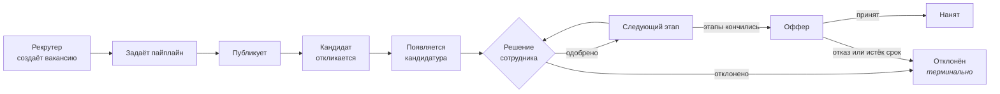
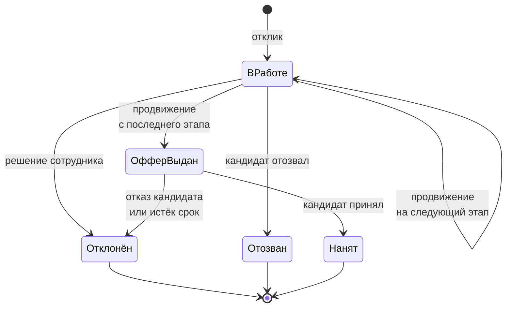
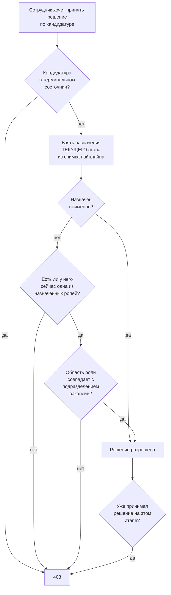

# Техническое задание. HR-система найма

!!! info "Об этом материале"

    Статус: версия 1.1. Уточнения выдаются по ходу курса и нумеруются как дополнения.
    Трассируемость: требования FR, BR, AC и NFR пронумерованы; ссылки в лабораторных идут по номерам.
    Приёмка: раздел 13. Частично выполненная работа не принимается.


> Документ описывает требования к системе, которую вы разрабатываете в течение семестра.
> Он написан со стороны **заказчика**: здесь сказано, что система должна делать и каким
> правилам подчиняться, но не сказано, из каких классов её собрать. Архитектурные решения —
> ваши, и защищать их будете вы. Требования пронумерованы; в лабораторных и на защите
> ссылки идут по этим номерам, поэтому нумерацию не меняйте.

## 1. Назначение и контекст

Компания нанимает сотрудников. Сейчас процесс живёт в почте и таблицах: рекрутер получает
резюме на общий ящик, пересылает нанимающему менеджеру, тот отвечает «берём на техсобес»,
и всё это теряется. Никто не может ответить, на каком этапе конкретный кандидат, сколько
человек застряло на тестовом задании и почему кандидата отклонили полгода назад.

Система должна стать единственным местом, где живёт процесс найма: от публикации вакансии
до выхода человека на работу.

**Что считается успехом.** Рекрутер за один экран видит всех кандидатов по вакансии
с текущими этапами. Любое решение по кандидату зафиксировано: кто, когда, с какой
формулировкой. Кандидат в любой момент может посмотреть статус своего отклика, не написав
письмо. Ни одно решение нельзя тихо переиграть задним числом.

## 2. Действующие лица и роли

В системе два независимых вида ролей, и путать их нельзя.

### 2.1. Системные роли — что человеку позволено делать в приложении

| Роль | Права |
|---|---|
| **Администратор** | заводит сотрудников, ведёт справочник профессиональных ролей, назначает роли |
| **Рекрутер** | создаёт, публикует и закрывает вакансии, настраивает пайплайн и назначения на этапы |
| **Сотрудник** | базовая роль: видит этапы, на которые назначен, и принимает решения на них |

Системная роль отвечает на вопрос «какие экраны и операции доступны». Она **не** даёт
права принимать решения по конкретному кандидату.

### 2.2. Профессиональные роли — кто человек в компании

Справочник, который ведёт администратор: `Сеньор-разработчик`, `Тимлид`, `Системный
аналитик`, `Руководитель подразделения`. Роль может быть привязана к подразделению:
«тимлид подразделения Платежи» — это та же роль `Тимлид` с областью действия `Платежи`.

Профессиональная роль отвечает на вопрос «кого можно поставить на этап отбора».
Именно она позволяет сказать «техническое интервью проводит любой сеньор-разработчик»,
не перечисляя людей поимённо.

### 2.3. Внешний участник

**Кандидат** — человек вне компании. Учётной записи не имеет, доступ к своему отклику
получает по ссылке с токеном.

Один сотрудник может иметь несколько системных и несколько профессиональных ролей
одновременно. **Право принять решение по конкретной кандидатуре** не даётся ни одной
из них напрямую — оно вытекает из назначения на этап (раздел 8).

## 3. Глоссарий предметной области

Термины этого раздела обязательны к использованию в коде, тестах и документации.
Если в коде появляется сущность, которой нет в глоссарии, — либо она лишняя, либо
глоссарий надо дополнить и защитить дополнение.

| Термин | Значение |
|---|---|
| **Вакансия** | Открытая позиция в компании, на которую идёт набор |
| **Пайплайн** | Упорядоченный набор этапов отбора, заданный для конкретной вакансии |
| **Этап** | Одна ступень отбора: скрининг, тестовое задание, интервью, оффер |
| **Кандидат** | Человек, откликнувшийся хотя бы на одну вакансию |
| **Отклик** | Действие кандидата: заявка на конкретную вакансию |
| **Кандидатура** | Продвижение конкретного кандидата по конкретной вакансии |
| **Продвижение** | Перевод кандидатуры на следующий этап пайплайна |
| **Отклонение** | Решение прекратить рассмотрение кандидатуры; необратимо |
| **Оффер** | Предложение о работе с ограниченным сроком действия |
| **Заметка** | Текстовый комментарий сотрудника к кандидатуре |
| **История** | Неизменяемая последовательность решений по кандидатуре |
| **Тестовое задание** | Этап, результат которого приходит из внешнего сервиса |
| **Резюме** | Файл, приложенный кандидатом к отклику |
| **Системная роль** | Набор прав на операции в приложении |
| **Профессиональная роль** | Позиция человека в компании, возможно с областью действия — подразделением |
| **Назначение** | Указание, кто проводит конкретный этап: поимённо или по профессиональной роли |
| **Исполнитель этапа** | Сотрудник, имеющий право принять решение на данном этапе данной кандидатуры |
| **Правило решения** | Сколько положительных решений нужно для продвижения: одно любое или от каждого |
| **Позднее связывание** | Определение конкретных исполнителей в момент решения, а не в момент отклика |
| **Основание** | Причина, по которой сотрудник оказался исполнителем: лично или по такой-то роли |

## 4. Обзор процесса



??? note "Исходник диаграммы"

    ```
    flowchart LR
      A["Рекрутер<br/>создаёт вакансию"] --> B["Задаёт пайплайн"]
      B --> C["Публикует"]
      C --> D["Кандидат<br/>откликается"]
      D --> E["Появляется<br/>кандидатура"]
      E --> F{"Решение<br/>сотрудника"}
      F -->|одобрено| G["Следующий этап"]
      G --> F
      F -->|отклонено| H["Отклонён<br/><i>терминально</i>"]
      G -->|этапы кончились| I["Оффер"]
      I -->|принят| J["Нанят"]
      I -->|отказ или истёк срок| H
    ```


## 5. Функциональные требования

Формулировка «система должна» означает обязательное требование. Требования, помеченные
**(★)**, необязательны и оцениваются дополнительно.

### 5.1. Вакансии

- **FR-01.** Рекрутер создаёт вакансию: заголовок, описание, подразделение, вилка зарплаты, город, формат работы. Созданная вакансия находится в состоянии «черновик» и не видна кандидатам.
- **FR-02.** Рекрутер задаёт пайплайн вакансии: упорядоченный список этапов, у каждого — название и тип (`Screening`, `Assessment`, `Interview`, `Offer`).
- **FR-03.** Рекрутер публикует вакансию. С этого момента она видна в публичном списке и принимает отклики.
- **FR-04.** Рекрутер закрывает вакансию. Закрытая вакансия не принимает новые отклики.
- **FR-05.** Публичный список опубликованных вакансий доступен без аутентификации, с фильтрами по подразделению, городу и формату работы и с постраничной выдачей.
- **FR-06.** Сотрудник видит список своих вакансий с количеством кандидатур на каждом этапе.
- **FR-07.** Рекрутер задаёт назначения **для каждого этапа в отдельности**. Назначение — это список целей, каждая из которых либо конкретный сотрудник, либо профессиональная роль (с областью действия или без). Один этап может сочетать оба вида: «тимлид подразделения Платежи и любой системный аналитик».
- **FR-07а.** Для каждого этапа рекрутер задаёт правило решения: `Любой` — достаточно решения одного исполнителя, `Все` — требуется решение каждого назначенного.

### 5.2. Отклик

- **FR-08.** Кандидат откликается на опубликованную вакансию, указав имя, электронную почту, телефон (необязательно) и приложив резюме.
- **FR-09.** В ответ на отклик система выдаёт кандидату ссылку с токеном отслеживания.
- **FR-10.** По этой ссылке кандидат без аутентификации видит название вакансии, текущий этап и дату последнего изменения. Заметки сотрудников и причину отклонения он не видит.
- **FR-11.** Кандидат может отозвать свой отклик по той же ссылке, пока кандидатура не в терминальном состоянии.

### 5.3. Работа с кандидатурами

- **FR-12.** Сотрудник видит список кандидатур по вакансии с фильтром по этапу и статусу и сортировкой по дате отклика.
- **FR-13.** Сотрудник открывает карточку кандидатуры: анкета, ссылка на резюме, текущий этап, полная история решений, заметки.
- **FR-14.** Исполнитель текущего этапа принимает положительное решение. Кандидатура переходит на следующий этап, когда набрано столько решений, сколько требует правило решения этапа.
- **FR-15.** Исполнитель текущего этапа отклоняет кандидатуру с обязательным указанием причины.
- **FR-16.** Сотрудник добавляет заметку к кандидатуре. Заметки не удаляются и не редактируются.
- **FR-17.** На последнем этапе пайплайна продвижение означает выдачу оффера со сроком действия.
- **FR-18.** Кандидат принимает или отклоняет оффер по ссылке отслеживания.
- **FR-19.** Оффер, не принятый до истечения срока, автоматически переводит кандидатуру в отклонённые с системной причиной.
- **FR-20. (★)** Полнотекстовый поиск по кандидатам: имя, почта, содержимое заметок.

### 5.4. Уведомления

- **FR-21.** При появлении кандидатуры на этапе уведомление получают исполнители **этого** этапа: поимённо назначенные — лично, назначенные по роли — все текущие обладатели роли.
- **FR-22.** При продвижении и при отклонении кандидат получает уведомление на указанную почту.
- **FR-23.** За сутки до истечения срока оффера кандидат получает напоминание.
- **FR-24.** Уведомление отправляется не более одного раза на одно событие, даже при повторной обработке или перезапуске системы.
- **FR-25.** Отказ почтового сервиса не должен отменять или откатывать бизнес-решение, которое уже принято.

### 5.5. Внешний сервис тестовых заданий

- **FR-26.** При переводе кандидатуры на этап типа `Assessment` система отправляет во внешний сервис запрос на выдачу задания.
- **FR-27.** Результат приходит обратно вебхуком: идентификатор задания, балл, вердикт.
- **FR-28.** Один и тот же результат может прийти несколько раз; повторные доставки не должны приводить к повторному изменению состояния.
- **FR-29.** Результат, относящийся к неизвестной или уже завершённой кандидатуре, отбрасывается с записью в журнал, без ошибки для отправителя.

### 5.6. Администрирование

- **FR-30.** Администратор заводит сотрудников и назначает им системные роли.
- **FR-31.** Сотрудник входит по почте и паролю, получает пару токенов доступа и обновления.
- **FR-32. (★)** Журнал действий: кто, когда и какое решение принял, с фильтром по сотруднику и периоду.

### 5.7. Роли и назначения

- **FR-33.** Администратор ведёт справочник профессиональных ролей: название, признак «привязана к подразделению».
- **FR-34.** Администратор назначает сотруднику профессиональную роль и отзывает её. Роль с областью действия назначается вместе с подразделением.
- **FR-35.** Сотрудник видит входящую очередь: кандидатуры, ожидающие его решения, с указанием вакансии, этапа и основания — лично или по роли.
- **FR-36.** В карточке кандидатуры видно, кто назначен на текущий этап, кто уже принял решение и чьё решение ещё ожидается.
- **FR-37.** Рекрутер может переопределить назначение на текущем этапе конкретной кандидатуры, не меняя пайплайн вакансии. Переопределение фиксируется в истории.
- **FR-38.** Каждое решение фиксирует не только автора, но и основание: лично или по такой-то роли.
- **FR-39. (★)** Отчёт по вакансиям, у которых на каком-либо этапе не осталось ни одного исполнителя: назначенный поимённо сотрудник уволен или роль ни за кем не закреплена.

## 6. Бизнес-правила

Это ядро задания. Каждое правило обязано быть выражено в коде **в одном месте**
и покрыто отдельным тестом с именем, содержащим номер правила.

- **BR-01.** Откликнуться можно только на опубликованную вакансию.
- **BR-02.** Один и тот же адрес почты не может иметь две одновременно активные кандидатуры по одной вакансии. После терминального исхода повторный отклик разрешён.
- **BR-03.** Кандидатура движется строго по порядку этапов своего пайплайна. Пропуск этапа и возврат назад запрещены.
- **BR-04.** «Отклонён» — терминальное состояние. Никакие действия над отклонённой кандидатурой невозможны.
- **BR-05.** «Нанят» — терминальное состояние.
- **BR-06.** Кандидатуры по закрытой вакансии нельзя продвигать. Отклонить — можно.
- **BR-07.** Пайплайн фиксируется в момент отклика. Последующее редактирование вакансии не изменяет ход уже существующих кандидатур и применяется только к новым откликам.
- **BR-08.** Пайплайн содержит от одного до десяти этапов, названия этапов внутри вакансии уникальны, последний этап всегда имеет тип `Offer`.
- **BR-09.** Причина отклонения обязательна, не короче десяти символов.
- **BR-10.** История решений только дополняется. Изменение и удаление записей истории невозможно ни через какой сценарий.
- **BR-11.** Срок действия оффера — не менее одного и не более тридцати календарных дней с момента выдачи.
- **BR-12.** Резюме принимается в форматах PDF, DOC, DOCX размером не более 5 МБ.
- **BR-13.** Токен отслеживания даёт доступ ровно к одной кандидатуре и не даёт доступа ни к чему другому.
- **BR-14.** Все моменты времени хранятся и сравниваются в UTC.
- **BR-15.** Два сотрудника не могут одновременно применить конкурирующие решения к одной кандидатуре: второе должно быть отклонено, а не перезаписать первое.
- **BR-16.** У каждого этапа опубликованной вакансии есть хотя бы одно назначение. Публикация вакансии, у которой есть этап без назначений, запрещена.
- **BR-17.** Решение по кандидатуре принимает только исполнитель её **текущего** этапа. Назначение на другие этапы той же вакансии права решать не даёт.
- **BR-18.** Право по роли определяется **на момент решения**, а не на момент отклика. Сотрудник, получивший роль вчера, может принимать решения по кандидатурам, откликнувшимся месяц назад.
- **BR-19.** Отзыв роли немедленно лишает сотрудника права решать на этапах, назначенных этой роли. Решения, принятые до отзыва, остаются в силе и из истории не исчезают.
- **BR-20.** Правило `Все` допустимо только для назначений на конкретных людей. Сочетать его с назначением по роли запрещено: множество обладателей роли не фиксировано.
- **BR-21.** При правиле `Все` кандидатура продвигается, когда положительное решение принял каждый назначенный. Любое отрицательное решение отклоняет кандидатуру немедленно, не дожидаясь остальных.
- **BR-22.** Один сотрудник принимает решение на одном этапе одной кандидатуры не более одного раза. Повторная попытка отклоняется, изменить своё решение нельзя.
- **BR-23.** Назначения фиксируются снимком вместе с пайплайном (уточнение BR-07): поимённые назначения — по идентификатору сотрудника, ролевые — по идентификатору роли, состав обладателей роли не фиксируется.
- **BR-24.** Переопределение назначения (FR-37) действует только на одну кандидатуру и не изменяет ни вакансию, ни другие кандидатуры.

> ⚠️ BR-07, BR-15 и BR-18 — те правила, которые чаще всего обнаруживаются слишком поздно.
> BR-07 и BR-23 меняют модель данных, BR-15 — способ работы с транзакциями, BR-18 —
> устройство проверки прав. Продумайте их до того, как начнёте писать код четвёртой
> лабораторной.
>
> Обратите внимание на пару BR-23 и BR-18: пайплайн фиксируется, а состав ролей — нет.
> Это не противоречие, а осознанное решение заказчика, и вам предстоит объяснить,
> где проходит граница между «зафиксировано» и «вычисляется каждый раз».

## 7. Состояния кандидатуры



??? note "Исходник диаграммы"

    ```
    stateDiagram-v2
      [*] --> ВРаботе: отклик
      ВРаботе --> ВРаботе: продвижение<br/>на следующий этап
      ВРаботе --> ОфферВыдан: продвижение<br/>с последнего этапа
      ОфферВыдан --> Нанят: кандидат принял
      ВРаботе --> Отклонён: решение сотрудника
      ВРаботе --> Отозван: кандидат отозвал
      ОфферВыдан --> Отклонён: отказ кандидата<br/>или истёк срок
      Отклонён --> [*]
      Отозван --> [*]
      Нанят --> [*]
    ```


Внутри состояния «в работе» кандидатура дополнительно характеризуется **текущим этапом
пайплайна**. Смешивать статус и этап в одно поле нельзя: этапы у каждой вакансии свои,
а набор статусов один на всю систему.

## 8. Права доступа

Доступ проверяется в два шага. Сначала **системная роль**: разрешена ли операция вообще.
Затем **назначение**: имеет ли этот человек отношение к этому объекту. Первый шаг
отвечается по токену, второй — только обращением к данным.

| Действие | Кандидат | Сотрудник | Рекрутер | Админ |
|---|---|---|---|---|
| Смотреть публичные вакансии | да | да | да | да |
| Создавать, публиковать, закрывать вакансию | нет | нет | да | нет |
| Настраивать пайплайн и назначения | нет | нет | да | нет |
| Откликаться | да | нет | нет | нет |
| Смотреть кандидатуру | своя | назначен на любой её этап | по своим вакансиям | все |
| Добавлять заметку | нет | назначен на любой её этап | по своим вакансиям | нет |
| Продвигать и отклонять | нет | **исполнитель текущего этапа** | нет | нет |
| Переопределять назначение этапа | нет | нет | по своим вакансиям | нет |
| Вести справочник ролей, назначать роли | нет | нет | нет | да |

### Как определяется исполнитель



??? note "Исходник диаграммы"

    ```
    flowchart TB
      S["Сотрудник хочет принять решение<br/>по кандидатуре"] --> A{"Кандидатура<br/>в терминальном<br/>состоянии?"}
      A -->|да| NO["403"]
      A -->|нет| B["Взять назначения<br/>ТЕКУЩЕГО этапа<br/>из снимка пайплайна"]
      B --> C{"Назначен<br/>поимённо?"}
      C -->|да| YES["Решение разрешено"]
      C -->|нет| D{"Есть ли у него<br/>сейчас одна из<br/>назначенных ролей?"}
      D -->|нет| NO
      D -->|да| E{"Область роли<br/>совпадает с<br/>подразделением<br/>вакансии?"}
      E -->|нет| NO
      E -->|да| YES
      YES --> F{"Уже принимал<br/>решение на этом<br/>этапе?"}
      F -->|да| NO
    ```


- **AC-01.** Право принять решение даёт только назначение на **текущий** этап кандидатуры — лично или через профессиональную роль. Ни системная роль, ни владение вакансией такого права не дают.
- **AC-02.** Роль в токене доступа не является достаточным основанием. Проверка требует чтения снимка назначений кандидатуры и актуального состава ролей сотрудника.
- **AC-03.** «По своим вакансиям» для рекрутера означает: он создал эту вакансию. Передача вакансии другому рекрутеру в объём не входит.
- **AC-04.** Видимость шире права действовать: назначенный на любой этап видит карточку кандидатуры целиком, включая историю и заметки, но действовать может только на своём этапе, когда до него дошла очередь.
- **AC-05.** Отсутствие прав на объект возвращается как `403`, если объект существует и пользователь аутентифицирован; `404` — если объект не существует или скрыт от этой категории пользователей.
- **AC-06.** Ответ `403` не должен раскрывать, кто именно назначен на этап.

## 9. Требования к HTTP-интерфейсу

Контракт фиксирован: приёмочные тесты курса обращаются именно по этим адресам.
Внутреннее устройство — на ваше усмотрение, но пути, коды и формат ошибок менять нельзя.

### 9.1. Основные ресурсы

```text
POST   /api/auth/login                      вход сотрудника
POST   /api/auth/refresh                    обновление токена

GET    /api/vacancies                       публичный список (фильтры, пагинация)
GET    /api/vacancies/{id}                  публичная карточка
POST   /api/vacancies                       создать черновик
PUT    /api/vacancies/{id}/pipeline         задать пайплайн вместе с назначениями
POST   /api/vacancies/{id}/publish          опубликовать
POST   /api/vacancies/{id}/close            закрыть

GET    /api/roles                           справочник профессиональных ролей
POST   /api/roles                           завести роль
GET    /api/employees                       список сотрудников
POST   /api/employees                       завести сотрудника
PUT    /api/employees/{id}/system-roles     задать системные роли
POST   /api/employees/{id}/roles            назначить профессиональную роль
DELETE /api/employees/{id}/roles/{roleId}   отозвать профессиональную роль

POST   /api/vacancies/{id}/applications     отклик (без аутентификации)
GET    /api/applications                    список для сотрудника
GET    /api/applications/{id}               карточка кандидатуры
POST   /api/applications/{id}/advance       продвинуть
POST   /api/applications/{id}/reject        отклонить
POST   /api/applications/{id}/notes         добавить заметку
GET    /api/applications/{id}/history       история решений
PUT    /api/applications/{id}/assignees     переопределить исполнителей текущего этапа
GET    /api/inbox                           кандидатуры, ждущие решения текущего сотрудника

GET    /api/tracking/{token}                статус для кандидата
POST   /api/tracking/{token}/withdraw       отзыв отклика
POST   /api/tracking/{token}/offer/accept   принять оффер
POST   /api/tracking/{token}/offer/decline  отклонить оффер

POST   /api/resumes                         загрузка файла резюме
GET    /api/resumes/{id}                    скачивание (по правам)

POST   /api/webhooks/assessments            результат тестового задания
GET    /health                              состояние сервиса
```

### 9.2. Пайплайн с назначениями

Тело `PUT /api/vacancies/{id}/pipeline`. Обратите внимание: `assignees` — разнородный
список, где вид цели определяется полем `kind`.

```json
{
  "steps": [
    {
      "name": "Скрининг резюме",
      "type": "Screening",
      "decisionRule": "Any",
      "assignees": [
        { "kind": "employee", "employeeId": "018f2a..." }
      ]
    },
    {
      "name": "Техническое интервью",
      "type": "Interview",
      "decisionRule": "Any",
      "assignees": [
        { "kind": "role", "roleId": "018f31...", "scope": null }
      ]
    },
    {
      "name": "Знакомство с командой",
      "type": "Interview",
      "decisionRule": "All",
      "assignees": [
        { "kind": "employee", "employeeId": "018f44..." },
        { "kind": "employee", "employeeId": "018f45..." }
      ]
    },
    {
      "name": "Оффер",
      "type": "Offer",
      "decisionRule": "Any",
      "assignees": [
        { "kind": "role", "roleId": "018f52...", "scope": "Платежи" }
      ]
    }
  ]
}
```

Второй этап читается как «любой обладатель этой роли», четвёртый — как «руководитель
подразделения Платежи», третий — как «оба этих человека, каждый лично». Попытка задать
`decisionRule: "All"` вместе с целью вида `role` возвращает `409` с кодом `BR-20`.

### 9.3. Коды ответов

| Код | Когда |
|---|---|
| `200` / `201` | успех; `201` с заголовком `Location` при создании |
| `400` | ошибка формата или валидации входных данных |
| `401` | нет или недействителен токен |
| `403` | аутентифицирован, но не имеет прав на объект |
| `404` | объект не существует или не должен быть виден этому пользователю |
| `409` | нарушено бизнес-правило (BR-01 … BR-24) |
| `422` | не используется в этом проекте |

Разделение `400` и `409` принципиально: `400` — «вы прислали ерунду», `409` —
«данные корректны, но так делать нельзя по правилам предметной области».

### 9.4. Формат ошибки

Все ошибки возвращаются в формате RFC 7807 с обязательным полем `code`, по которому
приёмочный тест опознаёт конкретное правило:

```json
{
  "type": "https://hr.example/errors/rejected-application-is-terminal",
  "title": "Кандидатура находится в терминальном состоянии",
  "status": 409,
  "code": "BR-04",
  "detail": "Кандидатура 018f2a… отклонена 12.03.2026 и не может быть продвинута",
  "traceId": "00-4bf92f…-01"
}
```

Текст `detail` предназначен человеку и может меняться. `code` — часть контракта.

## 10. Нефункциональные требования

Эти требования одинаковы для любого стека. Если выбранная экосистема не позволяет
выполнить какое-то из них разумными средствами, это выясняется до начала работы,
а не на пятой неделе.

- **NFR-01.** Язык и фреймворк — на выбор исполнителя; выбор согласуется на первой лабораторной и фиксируется отдельным ADR. Хранилище — реляционная СУБД, по умолчанию PostgreSQL.
- **NFR-02.** Всё окружение поднимается одной командой `docker compose up`, включая базу и почтовую заглушку.
- **NFR-03.** Схема базы управляется миграциями. Миграции применяются отдельным инструментом, а не при старте приложения.
- **NFR-04.** Приложение не хранит состояние в памяти процесса: два экземпляра за балансировщиком работают корректно.
- **NFR-05.** Список любых сущностей выдаётся только постранично; страница по умолчанию — 20 записей, максимум — 100.
- **NFR-06.** Все логи структурные, каждая запись содержит идентификатор запроса, сквозной для всей цепочки обработки, включая фоновые задачи.
- **NFR-07.** Пароли хранятся только в виде хеша с солью, алгоритмом, предназначенным для паролей.
- **NFR-08.** Секреты и строки подключения не хранятся в репозитории.
- **NFR-09.** Спецификация OpenAPI генерируется из кода и доступна по `/openapi.json`.
- **NFR-10.** Идентификаторы сущностей — UUID версии 7 или иные монотонно возрастающие по времени создания.
- **NFR-11.** Сборка, тесты и архитектурные тесты выполняются в CI на каждый push.
- **NFR-12.** Время ответа на чтение списка из 10 000 кандидатур — не более 300 мс на девелоперской машине.

## 11. Что в объём не входит

Чтобы не тратить время: этого делать не надо, и на защите за это баллов нет.

- Пользовательский интерфейс. Достаточно Swagger UI и коллекции запросов.
- Микросервисная декомпозиция. Проект — модульный монолит плюс, при необходимости, один фоновый обработчик.
- Реальная интеграция с job-бордами, календарями, мессенджерами.
- Мультиарендность, локализация, тёмная тема, мобильное приложение.
- Иерархия подразделений. Подразделение — плоский справочник; вложенности нет.
- Делегирование прав, замещение на время отпуска, эскалация по срокам.
- Настоящий сервис тестовых заданий: он заменяется заглушкой, которую вы напишете сами.

## 12. Карта требований по лабораторным

| № лабораторной | Что закрывается | Требования |
|---|---|---|
| 1. Моделирование | глоссарий, диаграммы, границы, открытые вопросы | разделы 3–8, 14 |
| 2. Домен | правила и состояния, модульные тесты | BR-01 … BR-14, BR-20 … BR-24 |
| 3. Сценарии | сценарии и порты, тесты на тест-даблах | FR-01 … FR-19 |
| 4. Инфраструктура | хранение, миграции, конкурентный доступ | BR-07, BR-10, BR-15, NFR-03 |
| 5. HTTP | контракт, ошибки, пагинация | раздел 9, NFR-05, NFR-09 |
| 6. Безопасность | вход, две системы ролей, назначения, доступ к объектам | FR-31, FR-33 … FR-38, BR-16 … BR-19, AC-01 … AC-06, NFR-07 |
| 7. События | уведомления, гарантия однократности | FR-21 … FR-25 |
| 8. Приём извне | вебхук, повторные доставки, срок оффера | FR-19, FR-26 … FR-29 |
| 9. Защита | наблюдаемость, CI, решения и их обоснование | NFR-06, NFR-11 |

## 13. Критерии приёмки

Работа принимается, когда выполнены **все** пункты. Частично — не принимается.

| | Критерий |
|---|---|
| ☐ | `docker compose up` поднимает систему, `/health` отвечает `200` |
| ☐ | Миграции применяются отдельной командой на чистой базе без ручных действий |
| ☐ | Все модульные, интеграционные и архитектурные тесты зелёные в CI |
| ☐ | Каждое правило BR-01 … BR-24 покрыто тестом, имя теста содержит номер правила |
| ☐ | Приёмочный набор курса проходит полностью |
| ☐ | В `docs/adr/` не менее пяти записей о принятых решениях |
| ☐ | Диаграммы лежат в репозитории как Mermaid и соответствуют текущему коду |
| ☐ | В README описан запуск, структура решения и раздел «что я упростил бы для стартапа» |
| ☐ | Код, включая имена тестов и веток, на английском; по-русски — комментарии и документы |
| ☐ | Каждая лабораторная влита отдельным pull request'ом после ревью |
| ☐ | Секретов в истории репозитория нет |

## 14. Намеренно открытые вопросы

Здесь заказчик не дал ответа. Это не упущение: решение принимаете вы, а на защите
объясняете, почему выбрали именно его. Ответы «как в туториале» и «так проще»
не принимаются.

1. Что такое кандидат — самостоятельная сущность с историей всех откликов или просто анкета внутри отклика? Что произойдёт, если один человек откликнется на пять вакансий с разными телефонами?
2. Где заканчивается вакансия и начинается кандидатура? Кто из них отвечает за соблюдение BR-03?
3. Как именно вы фиксируете пайплайн в момент отклика (BR-07) и чем платите за выбранный способ?
4. Отзыв кандидатом и отклонение сотрудником — одно состояние с разной причиной или два разных? Что изменится в отчётности от вашего выбора?
5. Оффер — это этап пайплайна, отдельное состояние кандидатуры или самостоятельная сущность со своим жизненным циклом?
6. Как обеспечивается BR-15 — блокировкой при чтении, версией строки или порядковым номером решения? Что произойдёт при отказе второго сотрудника: ошибка или переигрывание?
7. Кто отвечает за истечение срока оффера (FR-19): фоновая задача, проверка при чтении или и то и другое?
8. Назначение на этап — это одно понятие с двумя видами цели или два разных понятия с общим интерфейсом? Как вы выразите «либо человек, либо роль» так, чтобы третий вид цели добавлялся без правки всех проверок?
9. BR-23 требует зафиксировать ролевое назначение по идентификатору, а BR-18 — вычислять обладателей роли каждый раз. Где в вашей модели проходит граница между снимком и живой ссылкой и почему именно там?
10. Профессиональная роль с областью действия — это одна сущность с необязательным полем, пара «роль плюс подразделение» или две разные роли? Что произойдёт, когда подразделения станут иерархическими и появится «тимлид любой команды внутри Разработки»?
11. Правило `Все` требует хранить, кто уже высказался. Где живёт это состояние — в кандидатуре, в отдельной записи по этапу или выводится из истории? Чем платите за каждый вариант?
12. Сотрудник назначен поимённо и уволился, а этап с правилом `Все` уже начат. Что делает система: блокирует кандидатуру навсегда, требует вмешательства рекрутера или тихо исключает выбывшего?
13. Кто получает уведомление, если этап назначен роли, которой обладают сорок человек? Все сорок, или система устроена иначе — и если иначе, то как это согласуется с FR-21?
