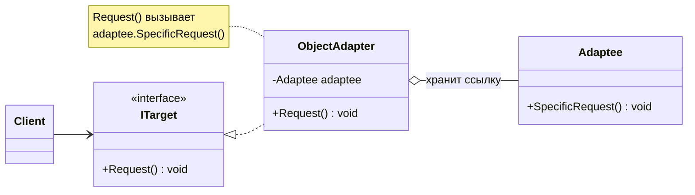
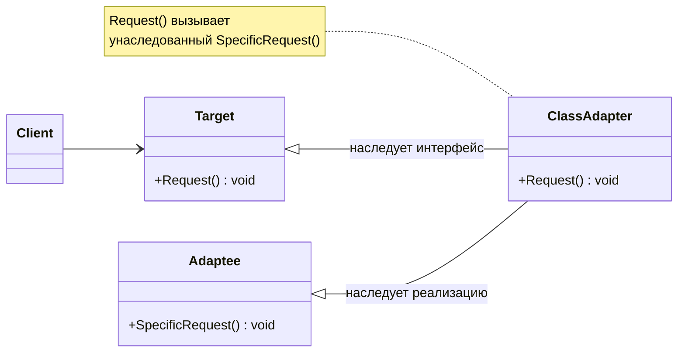
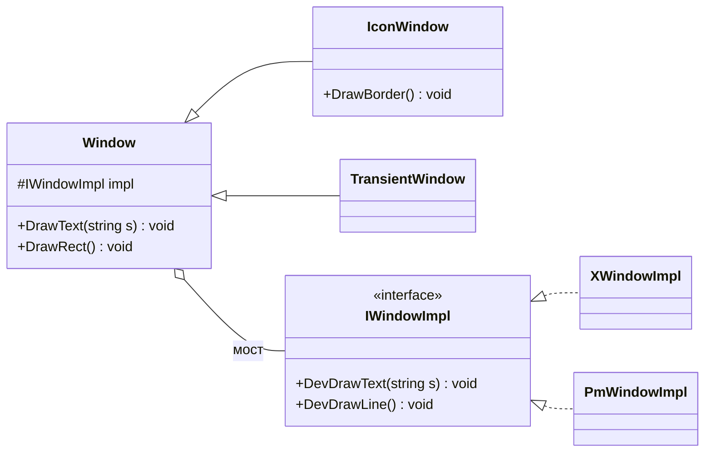
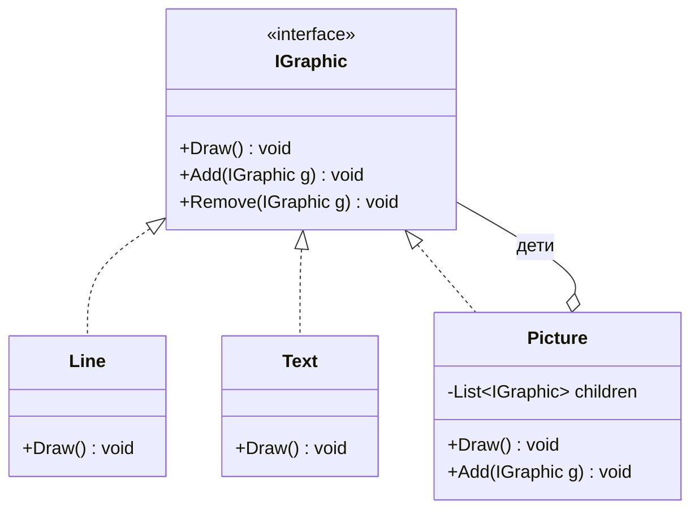
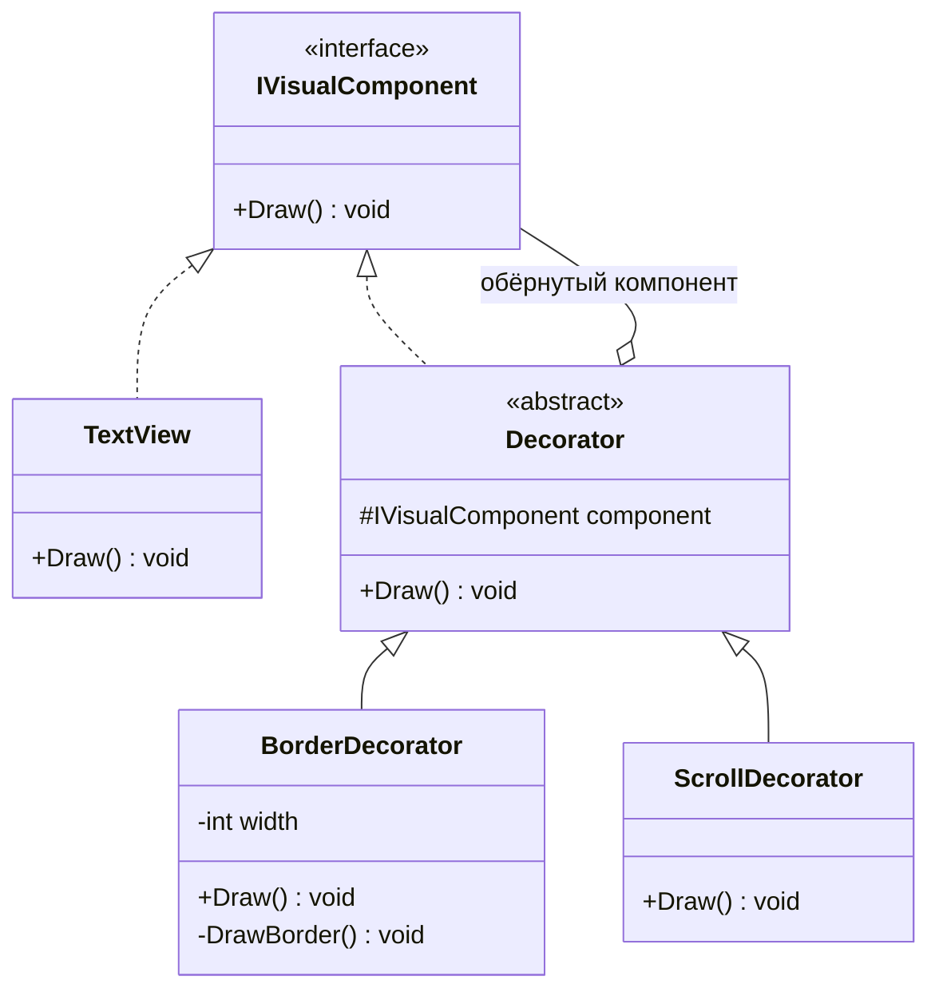
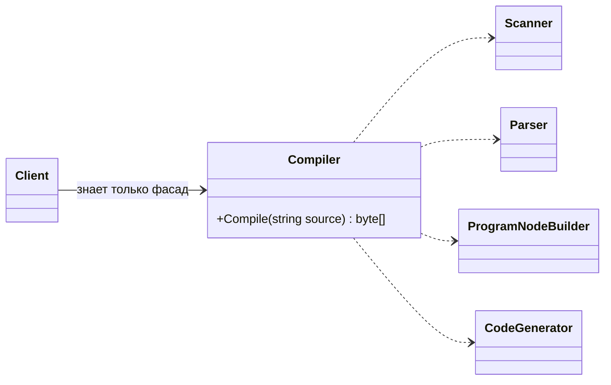
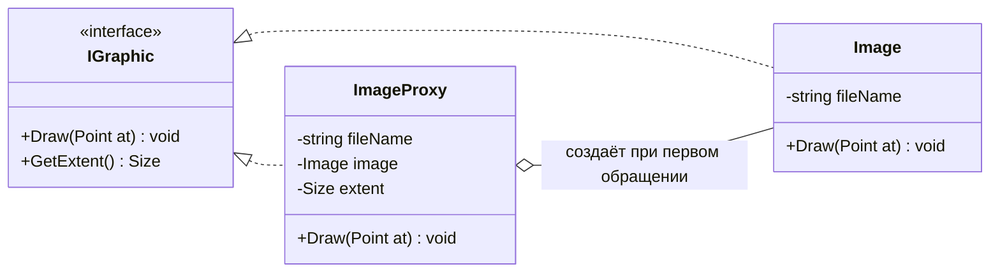
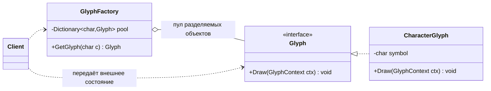

# ООАП. Лекция 6 — Структурные паттерны

> Конспект лектора. Источник — «Приёмы объектно-ориентированного проектирования» (GoF):
> назначение, применимость и участники даются по книге. Код — **C#**, диаграммы — **Mermaid**.

## Хронометраж (60 минут)

| # | Блок | Мин | Накопительно |
|---|------|-----|--------------|
| 1 | Что общего у структурных паттернов | 4 | 0:04 |
| 2 | Adapter (адаптер) | 7 | 0:11 |
| 3 | Bridge (мост) | 8 | 0:19 |
| 4 | Composite (компоновщик) | 8 | 0:27 |
| 5 | Decorator (декоратор) | 8 | 0:35 |
| 6 | Facade (фасад) | 6 | 0:41 |
| 7 | Proxy (заместитель) | 8 | 0:49 |
| 8 | Flyweight (приспособленец) | 6 | 0:55 |
| 9 | Как их различать и выбирать | 5 | 1:00 |

---

## Блок 1. Что общего у структурных паттернов (4 мин)

Структурные паттерны отвечают на вопрос, **как из классов и объектов составлять более
крупные структуры**.

Разделение на два уровня здесь особенно наглядно:

- **паттерны уровня класса** используют наследование, чтобы объединить интерфейсы или
  реализации. Такая структура фиксируется на этапе компиляции. Из каталога это классовый
  вариант адаптера.
- **паттерны уровня объекта** компонуют объекты. Структура складывается **во время
  выполнения**, и потому её можно менять — это даёт гибкость, недостижимую статическим
  наследованием.

Что варьирует каждый (по таблице переменных аспектов из лекции 5):

| Паттерн | Что можно менять, не трогая клиента |
|---|---|
| Адаптер | интерфейс к объекту |
| Мост | реализацию объекта |
| Компоновщик | структуру и состав объекта |
| Декоратор | обязанности объекта без порождения подкласса |
| Фасад | интерфейс к подсистеме |
| Приспособленец | затраты на хранение объектов |
| Заместитель | способ доступа к объекту и его местоположение |

Держите эту таблицу перед глазами всю лекцию: три из семи паттернов имеют почти одинаковые
диаграммы, и различаются они именно **намерением**.

---

## Блок 2. Adapter — адаптер (7 мин)

**Назначение.** Преобразует интерфейс класса в другой интерфейс, ожидаемый клиентами.
Обеспечивает совместную работу классов, которая была бы невозможна без него из-за
несовместимости интерфейсов.

**Задача.** Есть готовый класс с нужным поведением, но не тем интерфейсом: библиотека,
легаси-код, чужой SDK. Менять его нельзя.

GoF описывает **две схемы** адаптера — редкий случай, когда один паттерн существует
и на уровне класса, и на уровне объекта:

- **адаптер объектов** — адаптер реализует `Target` и **хранит ссылку** на `Adaptee`,
  переадресуя ему вызовы (композиция);
- **адаптер классов** — адаптер **наследует сразу и `Target`, и `Adaptee`**
  (множественное наследование).

### Адаптер объектов



```csharp
// Adaptee: чужой класс, менять нельзя
public sealed class LegacyPrinter
{
    public void PrintText(string text, int copies) { }
}

// Target: интерфейс, который ждёт наш код
public interface IDocumentPrinter { void Print(Document doc); }

// Адаптер объектов: композиция + перевод вызовов и данных
public sealed class LegacyPrinterAdapter : IDocumentPrinter
{
    private readonly LegacyPrinter _printer;
    public LegacyPrinterAdapter(LegacyPrinter printer) => _printer = printer;

    public void Print(Document doc) => _printer.PrintText(doc.ToPlainText(), copies: 1);
}
```

**Применимость.** Хотите использовать существующий класс, но его интерфейс не подходит;
нужно создать повторно используемый класс, работающий с заранее неизвестными классами.

**Результаты.** Адаптер объектов работает с самим `Adaptee` и всеми его подклассами,
но переопределить поведение `Adaptee` труднее — оно спрятано за ссылкой. Адаптер классов,
наоборот, позволяет переопределять поведение `Adaptee`, но адаптирует ровно один класс
и с его подклассами не работает.

### Адаптер классов

⚠️ **Из двух схем в C# реализуется только адаптер объектов.** Адаптер классов наследует
одновременно `Target` и `Adaptee`, то есть требует множественного наследования классов,
которого в C# нет. Смотрим вторую схему на Python — там она пишется ровно так, как
нарисована у GoF:



```python
class LegacyPrinter:                       # Adaptee
    def print_text(self, text: str, copies: int) -> None: ...

class DocumentPrinter:                     # Target
    def print(self, doc: Document) -> None: raise NotImplementedError

class LegacyPrinterAdapter(DocumentPrinter, LegacyPrinter):   # наследуем оба
    def print(self, doc: Document) -> None:
        self.print_text(doc.to_plain_text(), copies=1)        # метод достался по наследству
```

Разницу стоит проговорить вслух: в версии на C# адаптер **вызывает** чужой объект,
в версии на Python — **является** им и вызывает унаследованный метод. Отсюда и разные
последствия из абзаца выше.

> **В .NET.** `StreamReader` поверх `Stream`, `DataAdapter`, обёртки над native-API —
> сплошные адаптеры объектов. В Python адаптер часто не нужен вовсе: утиная типизация
> позволяет подсунуть объект с нужными методами. В Go тот же эффект даёт неявная реализация
> интерфейсов.

---

## Блок 3. Bridge — мост (8 мин)

**Назначение.** Отделяет абстракцию от её реализации, чтобы то и другое можно было изменять
независимо.

**Задача.** Пример книги — оконная система: есть иерархия окон (`Window`, `IconWindow`,
`TransientWindow`) и иерархия платформ (X11, PM). Наследование даёт декартово произведение:
`XWindow`, `PMWindow`, `XIconWindow`, `PMIconWindow`… Классов становится вдвое больше
с каждой новой платформой.

Решение — **две иерархии вместо одной**, связанные композицией.



```csharp
public abstract class Window                            // абстракция
{
    private readonly IWindowImpl _impl;                 // ссылка на реализацию
    protected Window(IWindowImpl impl) => _impl = impl;

    public void DrawRect(Point a, Point b)              // операции высокого уровня
    {
        _impl.DevDrawLine(a, new Point(b.X, a.Y));
        _impl.DevDrawLine(new Point(b.X, a.Y), b);
    }
}

public sealed class IconWindow : Window                 // уточнённая абстракция
{
    public IconWindow(IWindowImpl impl) : base(impl) { }
    public void DrawBorder() => DrawRect(Point.Zero, new Point(64, 64));
}

public sealed class XWindowImpl : IWindowImpl           // конкретная реализация
{
    public void DevDrawLine(Point a, Point b) { }
}
```

**Применимость.** Нужно избежать постоянной привязки абстракции к реализации (например,
реализация выбирается во время выполнения); и абстракция, и реализация должны расширяться
подклассами независимо; изменения в реализации не должны влиять на клиентов.

**Результаты.** Отделяет интерфейс от реализации, устраняет комбинаторный взрыв классов,
позволяет переключать реализацию в рантайме, улучшает расширяемость двух иерархий по
отдельности.

**Мост против адаптера.** Один и тот же рисунок, разное намерение и разное время появления:
адаптер применяют **постфактум**, чтобы подружить несовместимое; мост закладывают
**заранее**, чтобы две оси менялись независимо.

> **В .NET.** Классический пример — `ILogger` и провайдеры логирования: категории и уровни
> живут в абстракции, а вывод в консоль, файл или Seq — в реализациях. Драйверы БД через
> `DbConnection` — тоже мост.

---

## Блок 4. Composite — компоновщик (8 мин)

**Назначение.** Группирует объекты в древовидные структуры для представления иерархий
«часть — целое». Позволяет клиентам работать с единичными объектами так же, как с группами.

**Задача.** Графический редактор: линия, текст и группа фигур должны рисоваться одинаково;
группа может содержать другие группы. Клиент не должен различать лист и узел.



```csharp
public interface IGraphic { void Draw(); }

public sealed class Line : IGraphic                      // лист
{
    public void Draw() { }
}

public sealed class Picture : IGraphic                   // составной объект
{
    private readonly List<IGraphic> _children = new();

    public void Add(IGraphic child) => _children.Add(child);
    public void Remove(IGraphic child) => _children.Remove(child);

    public void Draw()
    {
        foreach (var child in _children) child.Draw();   // делегирование детям
    }
}
```

**Применимость.** Нужно представить иерархию «часть — целое»; клиенты должны единообразно
трактовать составные и индивидуальные объекты.

**Главный компромисс паттерна, о котором прямо пишет книга.** Где объявлять `Add`/`Remove`?

- **В общем интерфейсе** — клиент действительно единообразен, но у листа появляются
  операции, которые он не может выполнить (нарушение LSP и ISP из лекции 2). Книга
  предлагает делать их безопасным «ничего не делаю» или бросать исключение.
- **Только в составном классе** — типобезопасно, но клиенту приходится различать лист
  и узел, ради чего паттерн и затевался.

Выбор — компромисс между **прозрачностью и безопасностью**. Это отличный пример того,
что паттерн не отменяет принципы, а заставляет осознанно выбирать сторону.

**Результаты.** Иерархия из простых и составных объектов; упрощение клиента; лёгкое
добавление новых видов компонентов. ⚠️ Проектирование становится слишком общим: трудно
ограничить, какие компоненты можно вкладывать друг в друга.

> **В .NET.** Дерево визуальных элементов WPF/MAUI, `Expression`-деревья, узлы Roslyn,
> файловая система (`DirectoryInfo`/`FileInfo`) — везде компоновщик.

---

## Блок 5. Decorator — декоратор (8 мин)

**Назначение.** Динамически наделяет объект новыми обязанностями. Является гибкой
альтернативой порождению подклассов.

**Задача.** Пример книги — рамка и полоса прокрутки для текстового поля. Через наследование
получаем `ScrollableTextView`, `BorderedTextView`, `BorderedScrollableTextView` — снова
комбинаторный взрыв. Декоратор оборачивает объект и добавляет поведение до или после
делегирования.



```csharp
public abstract class VisualDecorator : IVisualComponent
{
    private readonly IVisualComponent _inner;
    protected VisualDecorator(IVisualComponent inner) => _inner = inner;
    public virtual void Draw() => _inner.Draw();          // делегирование
}

public sealed class BorderDecorator : VisualDecorator
{
    private readonly int _width;
    public BorderDecorator(IVisualComponent inner, int width) : base(inner) => _width = width;

    public override void Draw()
    {
        base.Draw();                                      // сначала сам компонент
        DrawBorder(_width);                               // потом добавленная обязанность
    }
    private void DrawBorder(int width) { }
}

// Сборка обязанностей во время выполнения
IVisualComponent view = new BorderDecorator(new ScrollDecorator(new TextView()), width: 1);
```

```python
# Тот же паттерн «в лоб»: обёртка вокруг объекта с тем же интерфейсом
class VisualDecorator:
    def __init__(self, inner: VisualComponent) -> None:
        self._inner = inner

    def draw(self) -> None:
        self._inner.draw()

class BorderDecorator(VisualDecorator):
    def __init__(self, inner: VisualComponent, width: int = 1) -> None:
        super().__init__(inner)
        self._width = width

    def draw(self) -> None:
        super().draw()
        self._draw_border(self._width)

view = BorderDecorator(ScrollDecorator(TextView()), width=1)
```

### Декоратор в Python: тот же смысл, другая форма

Это место надо разобрать отдельно, потому что в Python слово «декоратор» означает
**синтаксическую конструкцию языка** — `@`-аннотацию над функцией или классом. Идея
та же самая (обёртка, добавляющая обязанности), но объект обёртывания другой:
в GoF оборачивают **объект**, в Python чаще всего — **вызываемое**.

```python
import functools, time

def timed(func):                                   # декоратор — функция над функцией
    @functools.wraps(func)                         # сохраняет имя и docstring обёрнутого
    def wrapper(*args, **kwargs):
        start = time.perf_counter()
        try:
            return func(*args, **kwargs)
        finally:
            print(f"{func.__name__}: {time.perf_counter() - start:.3f}s")
    return wrapper

def retry(times: int):                             # декоратор с параметром — три уровня
    def decorate(func):
        @functools.wraps(func)
        def wrapper(*args, **kwargs):
            for attempt in range(times):
                try:
                    return func(*args, **kwargs)
                except TimeoutError:
                    if attempt == times - 1: raise
        return wrapper
    return decorate

@retry(times=3)                                    # применяются снизу вверх:
@timed                                             # retry(timed(fetch_report))
def fetch_report(report_id: int) -> Report:
    ...
```

Что здесь важно проговорить студентам:

- **Порядок применения** — снизу вверх: ближайший к функции декоратор оборачивает первым.
  Ровно как порядок вложенных обёрток в C#: `new Retry(new Timed(component))`.
- `@`-декоратор — это просто `fetch_report = retry(3)(timed(fetch_report))`. Синтаксис,
  а не магия.
- `functools.wraps` нужен, чтобы обёртка не подменяла имя, документацию и сигнатуру
  оригинала — иначе отладка и рефлексия ломаются.
- Декорировать можно и классы, и методы; `functools.lru_cache` — декоратор из стандартной
  библиотеки, добавляющий кеширование, то есть обязанность.

**Чем это отличается от GoF-декоратора.** GoF требует, чтобы обёртка имела **тот же
интерфейс**, что и компонент, и чтобы её можно было подставить везде вместо него.
Питоновский декоратор функции этого требования не нарушает (обёртка вызывается так же),
но применяется он к вызываемому объекту, а не к экземпляру класса. Для объектов
в Python обычно берут либо явную обёртку, как в примере выше, либо `__getattr__`:

```python
class LoggingProxy:                # прозрачная обёртка над ЛЮБЫМ объектом
    def __init__(self, inner): self._inner = inner

    def __getattr__(self, name):   # вызывается только для отсутствующих атрибутов
        attr = getattr(self._inner, name)
        if not callable(attr): return attr
        def wrapped(*args, **kwargs):
            print(f"-> {name}")
            return attr(*args, **kwargs)
        return wrapped
```

В C# так не сделать без генерации кода: обёртку приходится писать руками по интерфейсу
(или брать `DispatchProxy`, source-генератор, перехватчики DI). Зато компилятор гарантирует,
что вы реализовали весь контракт, — в Python эта гарантия отсутствует.

**Применимость.** Нужно динамически добавлять обязанности отдельным объектам, не затрагивая
другие; обязанности можно снимать; расширение наследованием непрактично из-за числа
комбинаций.

**Результаты.** Больше гибкости, чем у статического наследования; позволяет не «раздувать»
базовый класс редко нужными возможностями. ⚠️ Декоратор и компонент **не тождественны**:
проверка типа обёрнутого объекта даст декоратор, а не исходный класс. И появляется множество
мелких похожих объектов — систему труднее изучать и отлаживать.

**Декоратор против стратегии.** Декоратор меняет **оболочку** объекта снаружи, стратегия —
его **внутренности** (об этом в лекции 7).

> **В .NET.** Потоки: `new GZipStream(new BufferedStream(new FileStream(...)))` — три
> обёртки, каждая добавляет одну обязанность. `DelegatingHandler` в `HttpClient` —
> конвейер декораторов (повторы, логирование, авторизация). В Python декораторы функций
> через `@` — синтаксическая поддержка той же идеи на уровне языка: обёртка вокруг
> вызываемого объекта. В Kotlin делегирование `by` позволяет написать декоратор в одну
> строку, не переписывая все методы интерфейса вручную.

---

## Блок 6. Facade — фасад (6 мин)

**Назначение.** Предоставляет унифицированный интерфейс к набору интерфейсов подсистемы.
Определяет интерфейс более высокого уровня, облегчающий работу с подсистемой.

**Задача.** Пример книги — компилятор: сканер, парсер, генератор кода, оптимизатор.
Большинству клиентов нужен один вызов «скомпилируй файл», а не знание о всех классах.



```csharp
public sealed class Compiler                              // фасад
{
    public byte[] Compile(string source)
    {
        var tokens = new Scanner(source).Scan();
        var tree = new Parser().Parse(tokens);
        return new CodeGenerator().Generate(tree);
    }
}
```

**Применимость.** Нужно предоставить простой интерфейс к сложной подсистеме; есть много
зависимостей между клиентами и классами реализации; требуется разложить подсистему на слои,
общающиеся через фасады.

**Результаты.** Изолирует клиентов от компонентов подсистемы, ослабляет связанность,
но **не запрещает** доступ к внутренним классам напрямую — те, кому нужна тонкая настройка,
по-прежнему могут работать с подсистемой. Это отличает фасад от адаптера: адаптер меняет
интерфейс, фасад упрощает его.

⚠️ Антипаттерн рядом: фасад, который постепенно оброс логикой и превратился в God Object.
Фасад **делегирует**, а не решает.

---

## Блок 7. Proxy — заместитель (8 мин)

**Назначение.** Подменяет другой объект для контроля доступа к нему.

**Задача.** Пример книги — документ с изображениями: открывать документ быстро, а картинки
загружать только когда их действительно надо нарисовать. Клиент об этом знать не должен.



```csharp
public sealed class ImageProxy : IGraphic
{
    private readonly string _fileName;
    private Image? _image;                                // ещё не загружен
    private Size _extent;                                 // дешёвая часть данных

    public ImageProxy(string fileName, Size extent) => (_fileName, _extent) = (fileName, extent);

    public Size GetExtent() => _image?.GetExtent() ?? _extent;   // без загрузки файла

    public void Draw(Point at)
    {
        _image ??= new Image(_fileName);                  // загрузка по требованию
        _image.Draw(at);
    }
}
```

```python
class ImageProxy:
    def __init__(self, file_name: str, extent: Size) -> None:
        self._file_name, self._extent, self._image = file_name, extent, None

    def get_extent(self) -> Size:
        return self._image.get_extent() if self._image else self._extent

    def draw(self, at: Point) -> None:
        if self._image is None:
            self._image = Image(self._file_name)     # загрузка при первом рисовании
        self._image.draw(at)

# для «умных ссылок» в Python часто хватает __getattr__ — заместитель получается
# прозрачным для любого интерфейса, без ручного перечисления методов
```

**Виды заместителей (по книге).**

| Вид | Что делает |
|---|---|
| Удалённый | представляет объект в другом адресном пространстве |
| Виртуальный | создаёт «тяжёлый» объект по требованию |
| Защищающий | контролирует права доступа |
| «Умная» ссылка | подсчёт ссылок, загрузка в память, блокировки |

**Результаты.** Вводит уровень косвенности: можно скрыть, что объект удалённый, отложить
его создание или добавить проверки. ⚠️ Косвенность имеет цену — лишний вызов и усложнение
отладки.

> **В .NET.** `RealProxy`/`DispatchProxy`, прокси EF Core для ленивой загрузки навигационных
> свойств, gRPC- и HTTP-клиенты, сгенерированные по контракту, — удалённые заместители.
> Кеширующие и повторяющие обёртки поверх репозиториев — «умные ссылки».

---

## Блок 8. Flyweight — приспособленец (6 мин)

**Назначение.** Применяет разделение (совместное использование) для эффективной поддержки
множества мелких объектов.

**Задача.** Пример книги — текстовый редактор, где каждый символ является объектом.
Документ на 100 000 символов не может держать 100 000 объектов с полным состоянием.

Ключевая идея — разделить состояние на два вида:

- **внутреннее (intrinsic)** — не зависит от контекста, хранится в приспособленце
  и разделяется всеми: код символа, глиф, шрифт;
- **внешнее (extrinsic)** — зависит от контекста, хранится у клиента и передаётся
  в операции: позиция на странице, стиль абзаца.



```csharp
public sealed class GlyphFactory
{
    private readonly Dictionary<char, CharacterGlyph> _pool = new();

    public CharacterGlyph GetGlyph(char symbol)           // объект создаётся один раз на символ
    {
        if (!_pool.TryGetValue(symbol, out var glyph))
            _pool[symbol] = glyph = new CharacterGlyph(symbol);
        return glyph;
    }
}

public sealed class CharacterGlyph
{
    private readonly char _symbol;                        // внутреннее состояние
    public CharacterGlyph(char symbol) => _symbol = symbol;

    public void Draw(Point position, Font font) { }       // внешнее — приходит параметрами
}
```

```python
from functools import lru_cache

@lru_cache(maxsize=None)          # пул разделяемых объектов — одной строкой
def glyph_for(symbol: str) -> "CharacterGlyph":
    return CharacterGlyph(symbol)

class CharacterGlyph:
    __slots__ = ("symbol",)       # запрещаем словарь атрибутов: объект компактнее
    def __init__(self, symbol: str) -> None: self.symbol = symbol
    def draw(self, position: Point, font: Font) -> None: ...
```

**Применимость.** Объектов очень много; затраты на хранение высоки; большую часть состояния
можно сделать внешним; после вынесения внешнего состояния многие группы объектов заменяются
небольшим числом разделяемых; приложение не зависит от идентичности объектов.

**Результаты.** Экономия памяти тем больше, чем больше объектов и чем больше состояния
удалось вынести наружу. ⚠️ Плата — время на вычисление или передачу внешнего состояния
и потеря идентичности объектов (сравнивать по ссылке больше нельзя).

> **В .NET.** Интернирование строк (`string.Intern`), `ArrayPool<T>`, кеш метаданных
> Roslyn. В Python малые целые и короткие строки закешированы интерпретатором —
> приспособленец встроен в рантайм.

Подробнее — в материале для самостоятельной работы: там приспособленец разбирается вместе
с посетителем и интерпретатором.

---

## Блок 9. Как их различать и выбирать (5 мин)

### Три близнеца: компоновщик, декоратор, заместитель

Диаграммы у них почти одинаковые — объект, реализующий интерфейс и хранящий ссылку
на объект того же интерфейса. Книга посвящает этому сравнению отдельный раздел, и вот суть:

| | Что делает с обёрнутым объектом | Сколько объектов внутри |
|---|---|---|
| **Компоновщик** | группирует, чтобы клиент не различал часть и целое | много |
| **Декоратор** | добавляет обязанности, сохраняя интерфейс | один |
| **Заместитель** | контролирует доступ, ничего не добавляя к обязанностям | один |

Проверочный вопрос: *зачем* здесь косвенность? Ради единообразия дерева — компоновщик.
Ради нового поведения — декоратор. Ради контроля доступа, ленивости или удалённости —
заместитель.

### Ещё три пары, которые путают

- **Адаптер против моста.** Адаптер применяют **после** того, как классы спроектированы,
  чтобы совместить несовместимое. Мост проектируют **до**, чтобы две оси развивались
  независимо.
- **Фасад против адаптера.** Адаптер даёт **другой** интерфейс к тому же объекту; фасад
  даёт **более простой** интерфейс к целой подсистеме.
- **Декоратор против стратегии.** Декоратор меняет объект **снаружи** (оболочка), стратегия
  меняет его **изнутри** (подставленный алгоритм). Декоратор годится, когда компонент
  тяжело изменить; стратегия — когда компонент изначально предусматривает подмену части
  поведения.

### Алгоритм выбора

1. Назовите, что должно меняться: интерфейс, реализация, состав, обязанности, доступ,
   память.
2. Найдите строку в таблице переменных аспектов (блок 1).
3. Проверьте намерение по таблице близнецов выше.
4. Оцените плату: число классов, косвенность, потеря идентичности, сложность отладки.

### Ошибки

1. **Декоратор с расширенным интерфейсом.** Как только обёртка добавляет новые публичные
   методы, клиенту приходится знать её тип — паттерн сломан.
2. **Фасад, ставший God Object.** Фасад делегирует, а не реализует.
3. **Заместитель, меняющий поведение.** Если обёртка меняет результат, это декоратор,
   и называть его надо честно.
4. **Приспособленец без замера.** Экономия памяти — гипотеза, которую нужно проверять
   профилировщиком, а не предполагать.
5. **Мост при одной реализации.** Классическая теоретическая общность.

### Домашнее задание

1. В своём проекте найти место, где интерфейс чужого класса не подходит, и написать
   объектный адаптер. Отдельно объяснить, почему классовый вариант здесь не подошёл бы.
2. Реализовать конвейер из трёх декораторов над одним интерфейсом (например, репозиторий:
   кеширование, логирование, повторы) и показать в тесте, что порядок обёрток меняет
   поведение.
3. Построить компоновщик для древовидной структуры своей предметной области; в отчёте
   явно выбрать сторону в компромиссе «прозрачность против безопасности» и обосновать.
4. Для одного тяжёлого ресурса написать виртуальный заместитель с ленивой загрузкой,
   измерить время старта до и после.
5. Все структуры — диаграммами классов в Mermaid с именами участников по книге
   (Target, Adaptee, Component, Decorator, Subject, RealSubject, Flyweight).
