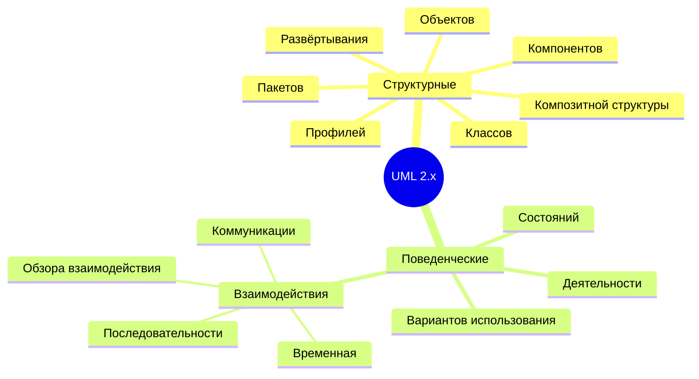
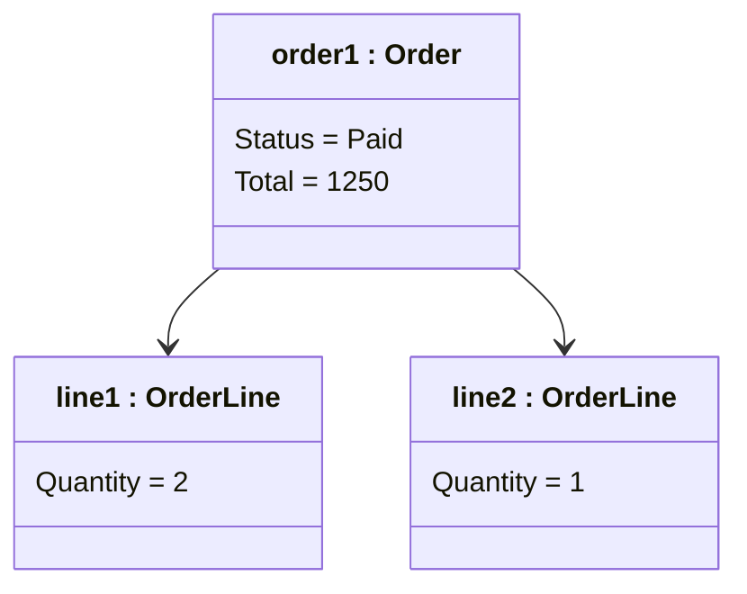
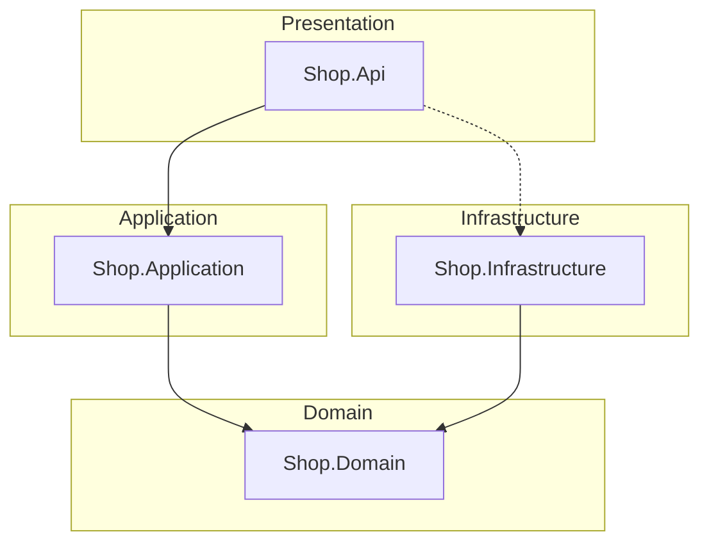
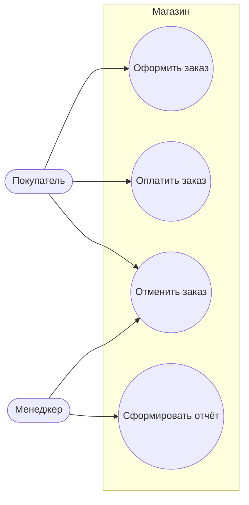
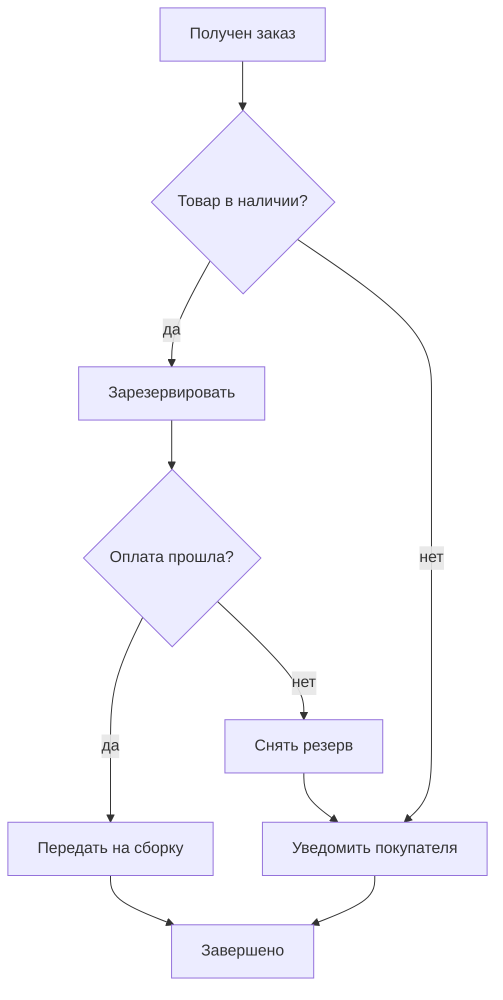
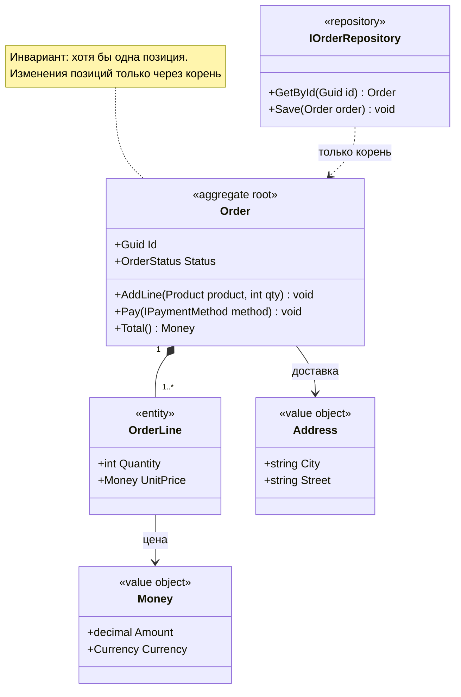

# Раздел 2 — виды UML-диаграмм и моделирование предметной области

!!! info "Об этом материале"

    Объём: три темы, ориентировочно две-три недели — чтение, моделирование и разбор чужих моделей.
    Отчётность: отчёт по каждой теме и модель предметной области в репозитории.
    Формат диаграмм: только Mermaid, блоками в markdown; диаграмма обязана рендериться.

> Материал для самостоятельной работы после лекций 3 и 4. Лекции дали два инструмента —
> диаграммы классов и диаграммы поведения. Здесь вы получаете карту всего языка,
> правила, по которым диаграмма считается пригодной, и главный навык проектировщика:
> превращать текст требований в модель. Все диаграммы — на **Mermaid**, код — на **C#**.
> Ориентировочно две-три недели: чтение, моделирование, разбор чужих моделей.

## Что входит в раздел

1. **Карта UML: виды диаграмм и что из них реально нужно.**
2. **Правила построения диаграмм и уровни моделирования.**
3. **Моделирование предметной области: от требований к классам.**

## Как работать с этим документом

- Каждую диаграмму из примеров **перенаберите руками** на [mermaid.live](https://mermaid.live)
  и сломайте: уберите кратность, поменяйте направление стрелки, добавьте ветку.
  Понимание нотации приходит от правок, а не от разглядывания.
- Ко второй теме заведите себе чек-лист «диаграмма готова» и пользуйтесь им на своих работах.
- Третья тема — самая важная и самая долгая. Там нет правильного ответа, который можно
  подсмотреть: есть модель, которую вы защищаете аргументами.
- Всё, что рисуете, храните в репозитории в `.md`-файлах рядом с кодом.

---

## Тема 1. Карта UML: виды диаграмм и что из них реально нужно

### 1.1. Общая структура языка

UML 2 делит диаграммы на две группы: **структурные** (как система устроена) и
**поведенческие** (что она делает). Фаулер в «UML. Основы» перечисляет **13 официальных
типов** по UML 2.0; в действующей редакции UML 2.5 их четырнадцать — добавилась диаграмма
профилей, нужная тем, кто расширяет сам язык. Знать стоит все — применять регулярно вы
будете четыре-пять.

Оговорка, которую делает и сам Фаулер: часть диаграмм официально появилась только в UML 1
или 2, хотя приёмы использовались раньше, и деление на типы вообще не строгое — важнее,
на какой вопрос диаграмма отвечает, чем к какому типу она формально отнесена.

### 1.2. Структурные диаграммы

**Диаграмма классов** — основная. Разобрана в лекции 3.

**Диаграмма объектов** — снимок конкретных объектов и их связей в один момент времени.
Незаменима, когда диаграмма классов допускает несколько толкований: «покажи мне пример».

**Диаграмма пакетов** — модули и зависимости между ними; ровно тот инструмент, которым
проверяют правила из лекции 2 (циклы, направление зависимостей).

Обратите внимание: `Domain` не имеет исходящих стрелок — это и есть нарисованный DIP.

**Диаграмма компонентов** — крупные части системы и их интерфейсы (порты): сервисы,
библиотеки, внешние API. **Диаграмма развёртывания** — на каком железе и в каких контейнерах
это исполняется. Обе полезны при обсуждении инфраструктуры и почти бесполезны внутри одного
процесса.

**Композитной структуры** и **профилей** — специальные; знать о существовании достаточно.

### 1.3. Поведенческие диаграммы

**Вариантов использования (use case)** — что система делает для внешних действующих лиц.
Не показывает алгоритм: показывает границу системы и набор целей пользователей.

Ценность не в кружках, а в сопровождающем тексте сценария: основной поток, альтернативы,
исключения. Без текста use case — просто картинка. У Лармана («Применение UML и шаблонов»)
подробно разобран формат текстового сценария — прочитайте именно его.

**Деятельности (activity)** — бизнес-процесс или алгоритм с ветвлениями, параллельностью
и зонами ответственности (дорожками). Ближайший родственник BPMN.

**Состояний** и **последовательности** — лекция 4. **Коммуникации** — те же взаимодействия,
но акцент на связях, а не на времени. **Временная (timing)** — про длительности и
ограничения реального времени, нужна во встроенных системах. **Обзора взаимодействия** —
диаграмма деятельности, узлы которой являются диаграммами последовательности.

### 1.4. Что учить всерьёз

| Диаграмма | Как часто нужна | Зачем |
|---|---|---|
| Классов | постоянно | структура модели и кода |
| Последовательности | часто | сценарии, интеграции, отказы |
| Состояний | часто | сущности с жизненным циклом |
| Пакетов / компонентов | регулярно | границы модулей, зависимости |
| Вариантов использования | на старте проекта | границы системы и цели |
| Деятельности | иногда | бизнес-процессы |
| Развёртывания | иногда | инфраструктура |
| Остальные | по необходимости | узкие задачи |

### Проверь себя

1. Чем диаграмма объектов отличается от диаграммы классов и когда без неё не обойтись?
2. Что показывает диаграмма вариантов использования и чего она принципиально не показывает?
3. Диаграмма коммуникации и диаграмма последовательности описывают одно и то же.
   Почему в стандарте оставили обе?
4. На какой диаграмме видно нарушение правила «домен ни от чего не зависит»?
5. Какую диаграмму вы нарисуете, чтобы объяснить новому разработчику, из каких сервисов
   состоит система и как они общаются?

### Практика

Возьмите свой проект и нарисуйте пять диаграмм разных видов, по одной на каждый вопрос:
границы системы, структура домена, сценарий с отказом, жизненный цикл ключевой сущности,
зависимости модулей. Под каждой — одно предложение: какое решение эта диаграмма помогла
принять или какую проблему обнаружила. Диаграммы без такого предложения не засчитываются.

---

## Тема 2. Правила построения диаграмм и уровни моделирования

### 2.1. Точка зрения: концептуальная, спецификации, реализации

Одни и те же прямоугольники означают разное в зависимости от того, что вы моделируете.

| Точка зрения | Что на диаграмме | Кому показываете |
|---|---|---|
| Концептуальная | понятия предметной области, словарь для разговора о ней | аналитику, заказчику, себе на старте |
| Спецификации | интерфейсы, контракты, ответственности (типы, а не классы реализации) | команде при проектировании |
| Реализации | классы как в коде, со всеми деталями | себе и ревьюеру, при разборе кода |

Термин «точка зрения» — из «UML. Основы»; там же отмечено, что на диаграмме с точки зрения
реализации фигурируют классы реализации, а на концептуальной и спецификационной — типы.
Правило: **точка зрения объявляется в подписи к диаграмме**. Диаграмма без объявленной
перспективы читается неправильно примерно всегда — спорят о деталях, которых на этом уровне
быть не должно.

### 2.2. Чек-лист «диаграмма готова»

Заведите его себе и прогоняйте перед сдачей:

1. У диаграммы есть **вопрос**, на который она отвечает, и он записан подписью.
2. Объявлена точка зрения и уровень абстракции.
3. Не больше 7–9 элементов. Больше — разбить.
4. Каждая связь подписана: глагол, кратность, направление.
5. Нет элементов, которые не участвуют в ответе на вопрос.
6. Имена совпадают с кодом и с языком предметной области.
7. Есть ветка отказа (для поведенческих) или инвариант (для структурных).
8. Диаграмма актуальна: лежит в том же коммите, что и код, который описывает.
9. Она рендерится. Сломанный Mermaid — это несданная работа.

### 2.3. Антипаттерны диаграмм

- **Обои** — вся система на одном листе, шрифт 6 пунктов.
- **Скриншот в Word** — не версионируется, не правится, устаревает мгновенно.
- **Диаграмма-декорация** — рисуется после того, как код написан, для отчёта, и никогда
  не читается.
- **Мнимая точность** — на концептуальной диаграмме указаны типы `varchar(50)`; концептуальная модель говорит о понятиях, а не о хранении.
- **Схема базы вместо модели** — прямоугольники называются `tbl_orders`, связи —
  внешними ключами. Это ER-диаграмма, и она отвечает на другой вопрос.
- **Дублирование кода картинкой** — диаграмма классов, полностью повторяющая один файл.
  Если IDE строит её автоматически, руками рисовать незачем.

### 2.4. Docs-as-code

Раз диаграмма — текст, к ней применимы приёмы работы с кодом:

- лежит в репозитории рядом с тем, что описывает (`/docs/architecture/*.md`);
- проходит ревью в pull request вместе с изменением кода;
- проверяется в CI: `mermaid-cli` (`mmdc`) рендерит все блоки и падает при синтаксической
  ошибке — это защита от «диаграмма не открывается»;
- версионируется: видно, когда и почему поменялась модель.

Отдельно посмотрите на **ADR (Architecture Decision Record)** — короткий markdown-документ
на одно архитектурное решение: контекст, решение, последствия. Диаграмма внутри ADR
объясняет решение, а не документирует код, и потому не устаревает: она описывает момент
принятия решения.

### 2.5. Соседние нотации

UML — не единственный язык, и на практике часто уместнее другой:

- **C4 model** (Саймон Браун) — четыре уровня масштаба: контекст, контейнеры, компоненты,
  код. Прямо решает проблему «на одной картинке вся система»: каждый уровень — свой лист.
  Mermaid поддерживает `C4Context`. Для описания архитектуры сервиса сегодня это, пожалуй,
  практичнее диаграммы компонентов UML.
- **ER-диаграммы** — про схему хранения, а не про модель поведения. В Mermaid —
  `erDiagram`.
- **BPMN** — бизнес-процессы, когда собеседник аналитик, а не разработчик.
- **Context map** из DDD — карта ограниченных контекстов и отношений между командами
  (об этом в теме 3).

Умение выбрать нотацию под собеседника — часть навыка. Диаграмма существует для читателя.

### Проверь себя

1. Чем диаграмма классов с концептуальной точки зрения отличается от диаграммы с точки зрения реализации на одном
   и том же домене? Приведите пример элемента, который есть только в одной из них.
2. Почему схема базы данных — не модель предметной области?
3. Что такое ADR и почему диаграмма внутри ADR не устаревает?
4. В каком случае C4 удобнее диаграммы компонентов UML?
5. Как автоматически поймать сломанную диаграмму до того, как её увидит преподаватель?

### Практика

Возьмите одну диаграмму из своей прошлой работы и переделайте её трижды: с концептуальной
точки зрения, с точки зрения спецификации и с точки зрения реализации. Опишите, что пришлось убрать и добавить
на каждом переходе. Затем настройте у себя в репозитории проверку Mermaid при коммите
(любым способом: `mmdc`, GitHub Action, pre-commit hook) и приложите вывод.

---

## Тема 3. Моделирование предметной области: от требований к классам

### 3.1. Что такое модель предметной области

Модель — не диаграмма и не набор классов. Это **общее понимание задачи, зафиксированное
в терминах, которые одинаково понимают заказчик и разработчик**. Эрик Эванс называет это
**единым языком (ubiquitous language)**: одно понятие — одно слово, в разговоре, в модели
и в коде. Если заказчик говорит «отгрузка», а в коде `ShipmentDto`, `DeliveryEntity`
и `OrderTransfer` — модели нет, есть три разных представления, между которыми переводят
вручную.

Практический тест: попросите бизнес-заказчика прочитать имена ваших классов и методов.
Если ему нужен переводчик — единый язык не сложился.

### 3.2. Как извлекать понятия из требований

Классическая техника, с которой стоит начать: разметка текста требований.

- **Существительные** — кандидаты в классы и атрибуты.
- **Глаголы** — кандидаты в операции и связи.
- **Прилагательные и состояния** — кандидаты в перечисления и состояния.
- **Числительные и слова «каждый», «не более»** — кандидаты в кратности и инварианты.

Пример требования: «Покупатель формирует **заказ** из **позиций**; в заказе **хотя бы одна**
позиция. Заказ можно **оплатить** одним из **способов оплаты**. **Оплаченный** заказ
**отгружается**; отменить можно только **неоплаченный**».

Отсюда сразу: классы `Order`, `OrderLine`, `PaymentMethod`; кратность `1..*`; состояния
`Draft/Paid/Shipped/Cancelled`; правило «отменить можно только `Draft`» — сторож на переходе.

Дальше — уточняющие вопросы, которые задаёт проектировщик, а не программист:
что происходит при частичной отгрузке; меняется ли цена позиции после оформления;
может ли заказ существовать без покупателя. Каждый ответ становится кратностью,
инвариантом или новым понятием.

Вторая техника — **CRC-карточки** (Class–Responsibility–Collaboration): на карточке
имя класса, его обязанности и с кем он для этого сотрудничает. Хорошо работает в группе
и мгновенно выявляет God Object: у него не помещаются обязанности на карточку.

### 3.3. Строительные блоки модели

Терминология DDD, которая понадобится и в курсовой, и на работе:

- **Сущность (Entity)** — объект с идентичностью, живущий во времени: `Order`, `Customer`.
  Два заказа с одинаковым содержимым — разные заказы.
- **Объект-значение (Value Object)** — определяется только своими значениями, неизменяем:
  `Money`, `Address`, `DateRange`. Два адреса с одинаковыми полями — один и тот же адрес.
- **Агрегат** и его **корень** — группа объектов, изменяемых как одно целое; снаружи
  доступен только корень, он же отвечает за инварианты. `Order` — корень, `OrderLine`
  внутри агрегата.
- **Репозиторий** — коллекция агрегатов; работает только с корнями.
- **Доменный сервис** — операция, не принадлежащая ни одной сущности (перевод между
  счетами, расчёт маршрута).
- **Доменное событие** — факт, случившийся в модели: `OrderPlaced`, `PaymentFailed`.
- **Ограниченный контекст (Bounded Context)** — граница, внутри которой термин имеет
  ровно одно значение. «Заказ» в продажах и «Заказ» на складе — разные понятия,
  и это нормально: их не надо объединять в один класс.

Ключевое правило агрегата: **снаружи никто не держит ссылку на `OrderLine`**. Хотите
изменить количество — зовёте метод у `Order`. Именно это делает инвариант «сумма заказа
всегда равна сумме позиций» выполнимым.

### 3.4. Типичные ошибки моделирования

- **Мышление таблицами.** Модель проектируют от схемы БД: классы становятся строками,
  связи — внешними ключами, поведение исчезает. Признак: `OrderId` как поле вместо ссылки
  на `Order`, `bool IsDeleted` во всех классах.
- **Анемичная модель.** Классы без поведения плюс сервис, который всё делает.
  Формально ООП, фактически процедурный код в классах.
- **Один класс на все контексты.** `User` с полями для профиля, биллинга, прав доступа
  и склада: 40 полей, из которых в каждом сценарии нужны три.
- **Преждевременные абстракции.** Интерфейс `IEntity`, базовый класс `EntityBase<TId>`
  и generic-репозиторий на всё — до того, как появились две реальные сущности.
- **Технические имена в домене.** `OrderManager`, `DataProcessor`, `InfoHelper` —
  слова, которых нет в языке заказчика.
- **Игнорирование состояний.** Несколько булевых флагов вместо явного жизненного цикла
  (см. лекцию 4).

### 3.5. Путь от модели к коду

Последовательность, которую я жду в курсовой:

1. Текст требований → выписанные понятия и правила (глоссарий).
2. Концептуальная диаграмма классов: понятия и связи с кратностями.
3. Диаграмма состояний для каждой сущности с жизненным циклом.
4. Диаграммы последовательности для двух-трёх ключевых сценариев, включая отказ.
5. Логическая диаграмма: агрегаты, репозитории, интерфейсы.
6. Код, в котором имена совпадают с глоссарием, а инварианты проверяются в конструкторах
   и методах корня.
7. Тесты, проверяющие ровно те инварианты, которые записаны на диаграммах.

Порядок не обязан быть строго линейным — модель уточняется, когда вы пишете код. Но
любое расхождение между диаграммой и кодом на защите означает, что модель мертва.

### Проверь себя

1. Чем сущность отличается от объекта-значения? Приведите пример, когда одно и то же
   понятие в разных контекстах является то одним, то другим.
2. Почему репозиторий работает только с корнем агрегата?
3. Как понять по коду, что модель анемичная? Назовите три признака.
4. Приведите пример понятия, которое в двух ограниченных контекстах значит разное.
5. Что такое единый язык и как проверить, что он у вас есть?
6. Почему `bool IsPaid` и `bool IsShipped` в одном классе — потенциальная ошибка
   моделирования?

### Практика

Дано текстовое описание предметной области (выдам отдельно; можно взять свою, согласовав
со мной). Требуется:

1. Глоссарий: 10–15 терминов с определениями на языке заказчика.
2. Концептуальная диаграмма классов с кратностями и инвариантами в заметках.
3. Выделенные агрегаты с обоснованием границ: почему именно так, что было бы плохого
   при других границах.
4. Диаграмма состояний ключевой сущности и таблица переходов.
5. Скелет кода на C#: сущности, объекты-значения, интерфейс репозитория, проверки
   инвариантов. Без базы данных и UI — только модель и тесты на инварианты.

---

## Литература и источники

**Обязательно:**

- **М. Фаулер. UML. Основы** — весь справочник по нотации; главы о перспективах
  моделирования и о том, зачем вообще рисовать.
- **Э. Гамма, Р. Хелм, Р. Джонсон, Дж. Влиссидес. Приёмы объектно-ориентированного
  проектирования** — читать схемы классов в описаниях паттернов и переносить их в Mermaid:
  лучшая тренировка чтения диаграмм.

**Полезно:**

- **К. Ларман. Применение UML и шаблонов** — текстовые сценарии use case, переход
  от требований к модели, обязанности объектов (GRASP).
- **Э. Эванс. Предметно-ориентированное проектирование** — единый язык, агрегаты,
  контексты. Тяжёлая книга; для начала достаточно частей I и II.
- **В. Вернон. Предметно-ориентированное проектирование: самое основное** — та же
  тема компактнее.
- **С. Браун. C4 model** ([c4model.com](https://c4model.com)) — уровни описания
  архитектуры.
- Документация Mermaid: [mermaid.js.org/syntax](https://mermaid.js.org/syntax) — все
  типы диаграмм, включая C4 и ER.

## Как я буду это проверять

Отчёт по каждой теме плюс модель предметной области в репозитории. Критерии:

- диаграммы рендерятся, лежат в markdown, соответствуют коду;
- у каждой диаграммы объявлена точка зрения и записан вопрос, на который она отвечает;
- границы агрегатов **обоснованы**, а не выбраны по интуиции;
- имена в коде совпадают с глоссарием;
- инварианты с диаграмм покрыты тестами.

Ответ «нарисовал, как принято» не засчитывается: принято кем, для какого читателя
и какое решение вы этим приняли.
