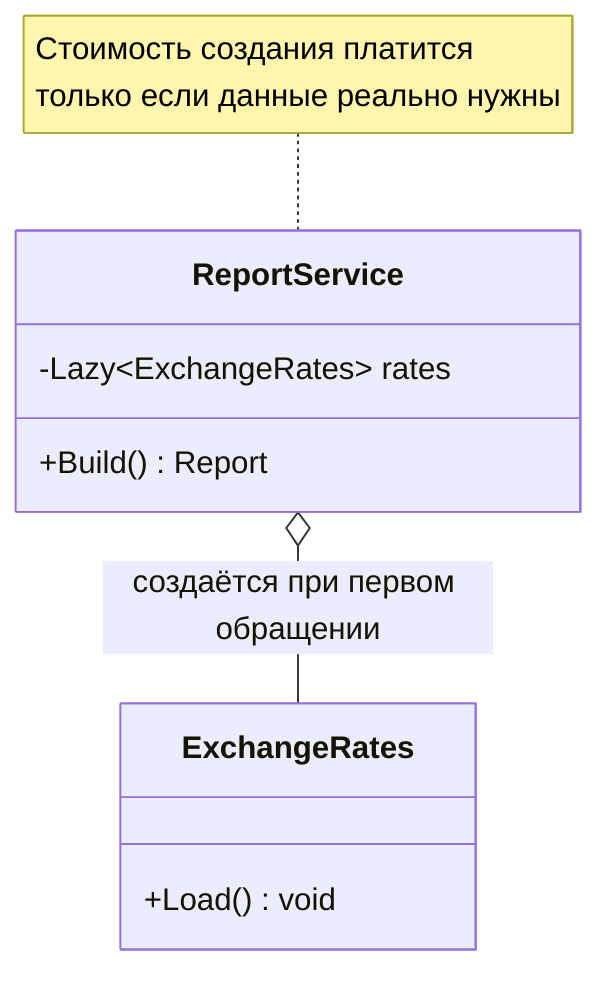
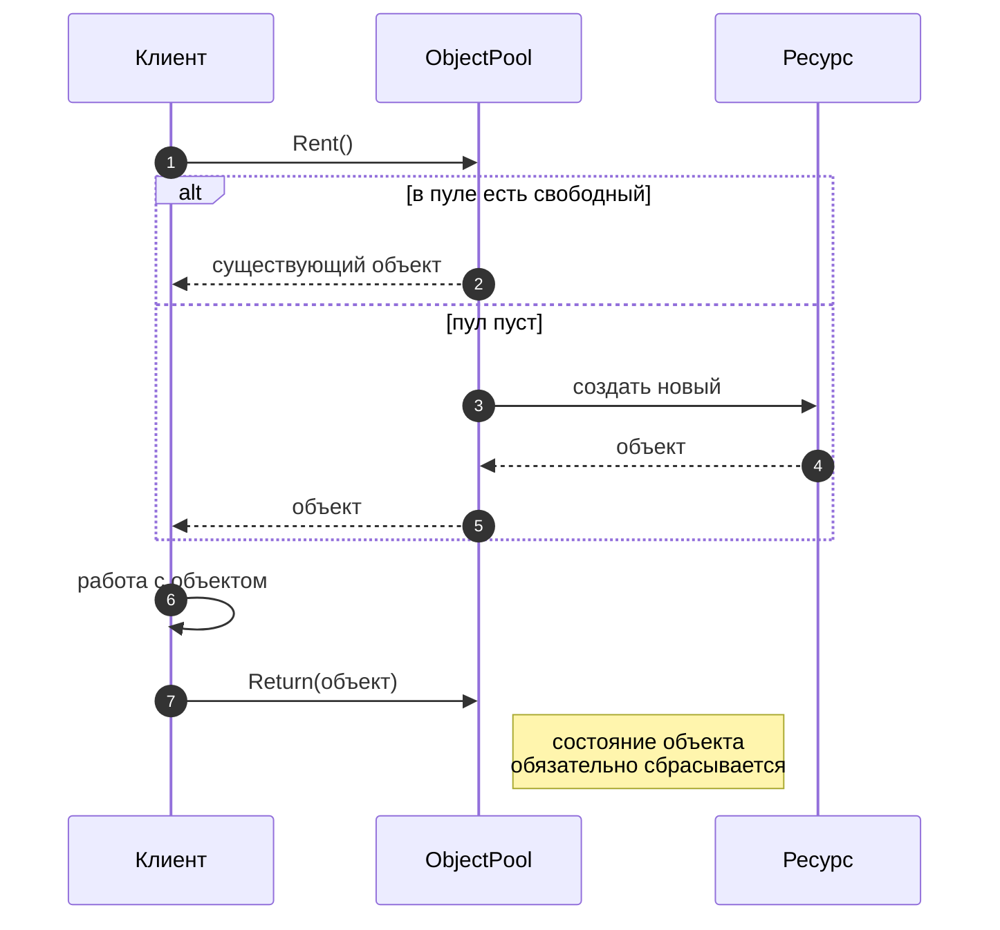
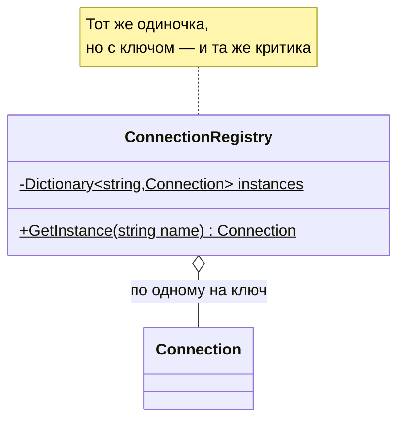

# Дополнительные порождающие паттерны: Lazy Initialization, Object Pool, Multiton

!!! info "Об этом материале"

    Объём: четыре темы, ориентировочно полторы-две недели.
    Отчётность: отчёт по каждой теме, код и бенчмарки в репозитории.
    Требование: любой вывод о выигрыше подтверждается измерением.


> Материал для самостоятельной работы после лекции 5. Этих трёх паттернов **нет
> в каталоге GoF** — они появились позже как обобщение практики, но решают ту же
> задачу: контроль над тем, **когда, сколько и какой ценой** создаются объекты.
> Здесь важно не столько выучить схемы (они простые), сколько разобраться
> в сценариях применимости и в цене каждого решения. Язык примеров — **C#**,
> диаграммы — **Mermaid**. Ориентировочно полторы-две недели.

## Что входит в раздел

1. **Lazy Initialization — отложенная инициализация.**
2. **Object Pool — пул объектов.**
3. **Multiton — реестр именованных экземпляров.**
4. **Сценарии применимости: как выбирать порождающий паттерн.**

## Как работать с этим документом

- Каждый паттерн здесь — про **ресурсы**, а не про структуру кода. Поэтому любое
  утверждение о выигрыше проверяйте измерением: без замера памяти или времени
  вывод не засчитывается.
- Ко всем трём паттернам есть готовые реализации в .NET. Сначала напишите свою,
  потом посмотрите на библиотечную и объясните различия — это и есть обучение.
- Помните вывод лекции 5: порождающие паттерны инкапсулируют знание о конкретных
  классах. Все три сегодняшних добавляют к этому знание о **жизненном цикле**.

---

## Тема 1. Lazy Initialization — отложенная инициализация

### 1.1. Идея и связь с каталогом

Объект создаётся не в конструкторе владельца, а при первом обращении к нему. Экономим
на том, что может не понадобиться: тяжёлый ресурс, соединение, разбор большого файла.

Родство с GoF прямое: **виртуальный заместитель** (лекция 6) — это отложенная инициализация,
завёрнутая в тот же интерфейс, что и настоящий объект. Разница в акценте: заместитель
скрывает ленивость от клиента полностью, отложенная инициализация обычно локальна и видна
владельцу поля.



### 1.2. Реализация и подводные камни

```csharp
public sealed class ReportService
{
    private readonly Lazy<ExchangeRates> _rates =
        new(() => ExchangeRates.LoadFromApi(), LazyThreadSafetyMode.ExecutionAndPublication);

    public Report Build(Order order)
    {
        if (!order.NeedsConversion) return new Report(order);   // курсы так и не загрузятся
        return new Report(order, _rates.Value);                 // здесь произойдёт загрузка
    }
}
```

Что изучить:

- **`Lazy<T>` и режимы потокобезопасности**: `None`, `PublicationOnly`,
  `ExecutionAndPublication`. Понять, чем отличается «фабрику могут вызвать несколько раз,
  но опубликуется одна» от «фабрика выполнится ровно один раз».
- **Кеширование исключения.** Если фабрика бросила исключение в режиме
  `ExecutionAndPublication`, `Lazy<T>` запомнит его и будет бросать при каждом обращении.
  Для загрузки по сети это часто неприемлемо — разберитесь, как это обходят.
- **Двойная проверка блокировки (double-checked locking)** — классическая ручная
  реализация; напишите её сами и объясните, зачем нужен `volatile`.
- **Дедлоки**: ленивая инициализация, которая внутри ждёт другую ленивую инициализацию,
  даёт взаимную блокировку. Реальный сценарий, встречается в DI-контейнерах.
- **Ленивость в ORM.** Ленивая загрузка навигационных свойств EF Core и проблема
  «N + 1 запрос»: паттерн работает как задумано, а приложение при этом тормозит.
  Это лучший учебный пример того, что ленивость — не бесплатная оптимизация.

> **В других языках.** В Kotlin отложенная инициализация встроена: `val rates by lazy { ... }`
> с выбором режима синхронизации. В Swift — `lazy var`. В Python — `functools.cached_property`,
> где кеш живёт в словаре экземпляра (и поэтому не работает со `__slots__` — хороший вопрос
> на понимание темы 1 из первого раздела). В C# ближайший языковой аналог — поле плюс
> `??=`, но без потокобезопасности.

### 1.3. Когда не надо

- Объект дешёвый: ленивость добавит проверку и усложнение ради ничего.
- Объект нужен всегда: вы просто перенесли стоимость со старта на первый запрос,
  причём в момент, когда пользователь уже ждёт.
- Ошибку лучше получить на старте: неверная конфигурация должна ронять приложение
  при запуске, а не через час в бою. Это важный аргумент против ленивости в проверке
  настроек.

---

## Тема 2. Object Pool — пул объектов

### 2.1. Идея

Объекты не создаются и не уничтожаются, а **берутся напрокат** из пула и возвращаются
обратно. Применяется, когда создание дорого (соединение, поток, большой буфер) или когда
число одновременных экземпляров нужно ограничить.



### 2.2. Что изучить

```csharp
// .NET: пул массивов — самый частый в реальном коде
byte[] buffer = ArrayPool<byte>.Shared.Rent(4096);
try
{
    // buffer.Length может быть БОЛЬШЕ запрошенного — типичная ошибка новичка
    var span = buffer.AsSpan(0, 4096);
    Read(span);
}
finally
{
    ArrayPool<byte>.Shared.Return(buffer, clearArray: true);   // очистка чувствительных данных
}
```

- **`ArrayPool<T>`, `MemoryPool<T>`, `Microsoft.Extensions.ObjectPool`** — три разных
  инструмента; разберитесь, для чего каждый.
- **Политика пула** (`IPooledObjectPolicy<T>`): как объект создаётся и что происходит
  при возврате. Ключевой метод — сброс состояния.
- **Пул соединений в ADO.NET**: `SqlConnection` — это уже обёртка над пулом; «открыть
  соединение» на самом деле означает «арендовать». Понять, почему рекомендуется открывать
  соединение как можно позже и закрывать как можно раньше.
- **Три классические ошибки пула:**
  1. **Грязное состояние** — вернули объект с данными предыдущего пользователя;
     следующий их увидел. Это ещё и утечка данных между запросами.
  2. **Утечка аренды** — забыли `Return`, пул исчерпался, приложение встало.
     Обязательно `try/finally` или обёртка с `IDisposable`.
  3. **Использование после возврата** — держите ссылку на возвращённый массив и пишете
     в него, пока им пользуется другой поток.
- **Когда пул вреден:** объекты дешёвые, а сборщик мусора в .NET оптимизирован под
  короткоживущие объекты. Пул для мелких объектов обычно **ухудшает** производительность,
  переводя их в старшие поколения GC. Проверяйте бенчмарком (BenchmarkDotNet), а не
  интуицией.

### 2.3. Практический критерий

Пул оправдан, если выполняются **все** условия: создание объекта заметно дорогое или
ограниченное внешним ресурсом; объекты одинаковые и переиспользуемые; состояние можно
надёжно сбросить; есть измеримая проблема (профиль показывает аллокации или ожидание).

---

## Тема 3. Multiton — реестр именованных экземпляров

### 3.1. Идея

Обобщение одиночки: не один экземпляр, а **по одному на ключ**. Реестр «имя → экземпляр»
с гарантией, что для одного имени объект создаётся однажды.



```csharp
public sealed class ConnectionRegistry
{
    private static readonly ConcurrentDictionary<string, Connection> _instances = new();

    public static Connection For(string name) =>
        _instances.GetOrAdd(name, key => new Connection(key));   // один объект на имя
}
```

### 3.2. Что изучить и о чём подумать

- **Наследуемая критика.** Мультитон — это одиночка, умноженный на число ключей: то же
  глобальное состояние, те же скрытые зависимости, те же проблемы в тестах. Всё, что
  говорилось в лекции 5, действует здесь в N раз сильнее.
- **Утечка по ключам.** Словарь никогда не очищается: динамические ключи (например,
  идентификатор арендатора) означают неограниченный рост памяти. Нужна политика вытеснения,
  а это уже кеш, а не мультитон.
- **Потокобезопасность.** `ConcurrentDictionary.GetOrAdd` **не гарантирует**, что фабрика
  вызовется один раз — разберитесь, почему, и как это чинится через `Lazy<T>` в значении.
- **Современная альтернатива в .NET** — ключевые сервисы DI:
  `services.AddKeyedSingleton<IConnection, SqlConnection>("reports")` и параметр
  `[FromKeyedServices("reports")]`. Тот же контроль жизненного цикла, но зависимость
  видна в конструкторе и подменяется в тестах.
- **Где мультитон оправдан честно:** реестры, которые по природе своей глобальны и
  неизменяемы — кеш скомпилированных регулярных выражений, метаданные типов, локали,
  пул интернированных строк. Общий признак: ключей конечное число, объекты неизменяемы,
  состояние не влияет на бизнес-логику.

---

## Тема 4. Сценарии применимости: как выбирать

### 4.1. Сводная таблица

| Вопрос | Паттерн |
|---|---|
| Какой конкретный класс создать — решает подкласс | Фабричный метод |
| Нужно семейство сочетающихся продуктов | Абстрактная фабрика |
| Сложная пошаговая сборка, разные представления | Строитель |
| Дешевле склонировать образец, чем собрать заново | Прототип |
| Экземпляр должен быть один | Одиночка (а лучше — singleton-время жизни в контейнере) |
| Экземпляр должен быть один **на ключ** | Мультитон (а лучше — keyed-регистрация) |
| Создание дорогое и может не понадобиться | Отложенная инициализация |
| Создание дорогое, а объекты переиспользуемы | Пул объектов |

### 4.2. Порядок принятия решения

1. Есть ли вообще проблема? Для трёх сегодняшних паттернов ответ обязан опираться
   на измерение.
2. Что варьируется: класс, семейство, способ сборки, число экземпляров или момент
   создания?
3. Можно ли обойтись средствами платформы: DI-контейнер, `Lazy<T>`, `ArrayPool<T>`?
   Свой велосипед оправдан только если готовое не подходит, и это надо уметь объяснить.
4. Какова плата: глобальное состояние, сложность отладки, риск грязного состояния,
   удержание памяти?

### Проверь себя

1. Чем отложенная инициализация отличается от виртуального заместителя из лекции 6?
2. Почему `Lazy<T>` кеширует исключение и когда это плохо?
3. Что произойдёт, если вернуть в `ArrayPool` массив, ссылку на который вы сохранили,
   и продолжить в него писать?
4. Почему пул мелких объектов может замедлить приложение в .NET?
5. Чем мультитон принципиально хуже ключевой регистрации в DI-контейнере?
6. Приведите сценарий, где мультитон оправдан, и объясните, чем он отличается от кеша.

### Практика

1. Реализовать свою `Lazy<T>` с двойной проверкой блокировки; тестом показать, что фабрика
   вызывается один раз при конкурентном доступе из десяти потоков. Сравнить поведение
   с `System.Lazy<T>` в трёх режимах потокобезопасности.
2. Реализовать пул объектов с политикой сброса состояния и обёрткой-арендой на `IDisposable`.
   Написать бенчмарк (BenchmarkDotNet) на двух сценариях: дорогой объект и дешёвый объект.
   В отчёте — цифры и вывод, где пул выиграл, а где проиграл.
3. Переписать любой имеющийся у вас мультитон (или написать искусственный) на ключевую
   регистрацию в DI и показать в тестах, что стало возможным подменить реализацию.
4. Для каждого из трёх паттернов описать один сценарий **применимости** и один
   **противопоказание** из своей практики.

## Литература

- **Э. Гамма и др. Приёмы объектно-ориентированного проектирования** — глава 3
  «Порождающие паттерны»: сегодняшние три паттерна выросли из её идей, а заместитель
  (гл. 4) прямо описывает отложенное создание.
- Документация .NET: `Lazy<T>`, `LazyThreadSafetyMode`, `ArrayPool<T>`,
  `Microsoft.Extensions.ObjectPool`, keyed-сервисы DI — первоисточник, а не пересказы.
- Статьи о пуле соединений ADO.NET и о ленивой загрузке EF Core: два примера того,
  как эти паттерны уже встроены в платформу.

## Как я буду это проверять

Отчёт по каждой теме, код в репозитории, бенчмарки с цифрами. Требования те же, что
и всегда: диаграммы в Mermaid, выводы обоснованы измерением, а не ощущением. Отдельно
спрошу за каждый случай, где вы написали своё вместо готового из платформы, — ответ
«хотел разобраться» принимается только в учебном задании, но не в проекте.
