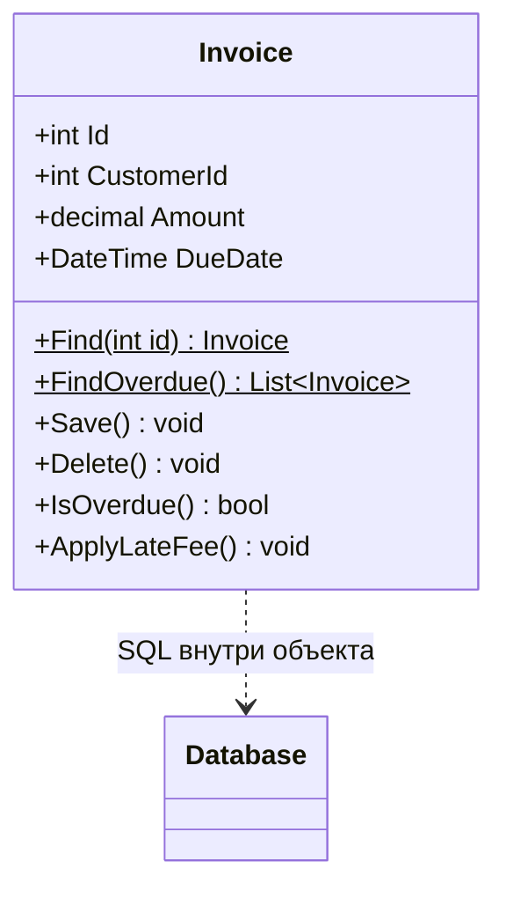
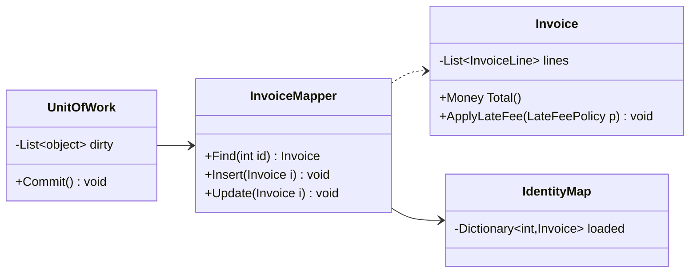

# Active Record и Data Mapper: сравнение подходов к доступу к данным

!!! info "Об этом материале"

    Объём: четыре темы, ориентировочно неделя-полторы.
    Отчётность: две реализации одного сценария, общие тесты, логи SQL с цифрами.
    Требование: выбор подхода обоснован критериями, а не привычкой.


> Материал для самостоятельной работы после лекции 8. Источник — **М. Фаулер, «Шаблоны
> корпоративных приложений»**, разделы о шаблонах источника данных; каталог онлайн:
> [martinfowler.com/eaaCatalog](https://martinfowler.com/eaaCatalog/). Задача материала —
> научиться выбирать подход к доступу к данным осознанно, а не по привычке команды.
> Код — **C#** (EF Core, Dapper), диаграммы — **Mermaid**. Ориентировочно неделя-полторы.

## Что входит в этот материал

1. **Active Record: сильные стороны и границы**
2. **Data Mapper: цена независимости**
3. **Соседние шаблоны: шлюзы, Table Module, микро-ORM, сырой SQL**
4. **Сравнение и выбор под задачу**

## Что уже было в лекции

Active Record — объект, оборачивающий строку таблицы вместе с доменной логикой; Data Mapper —
отдельный слой, переносящий данные между объектами и базой и оставляющий их независимыми.
EF Core является реализацией Data Mapper. Дальше — детали, из-за которых выбор перестаёт быть
вкусовым.

## Как работать с этим документом

- Обе темы завершаются одним и тем же упражнением: **один сценарий, две реализации**.
  Сравнение делается по коду, а не по статьям в интернете.
- Всё, что касается производительности, проверяйте на своих данных: объём выборки,
  число запросов, время. Голословный вывод не засчитывается.
- Держите в голове вопрос из лекции 2: сколько причин для изменения у этого класса?
  Именно он объясняет разницу между двумя подходами лучше всего.

---

## Тема 1. Active Record: сильные стороны и границы

### Устройство

Класс соответствует таблице, экземпляр — строке, у объекта есть и данные, и операции доступа
к базе, и бизнес-логика.



Что изучить:

- **Изоморфность схеме.** Паттерн работает, пока объект почти совпадает с таблицей. Как
  только появляются объекты-значения, наследование, коллекции внутри агрегата — начинается
  борьба.
- **Куда девается логика.** В Active Record бизнес-правила соседствуют с SQL. Посмотрите
  на реальный класс из Rails или Django-проекта: как правило, там же валидация, коллбэки
  жизненного цикла, скоупы запросов и сериализация. Это классический God Object в законной
  форме.
- **Тестируемость.** Логика неотделима от базы: тест бизнес-правила требует базы или
  тщательного мока статики. Сравните с доменной сущностью, которую можно создать
  конструктором и проверить без инфраструктуры.
- **Миграции.** Изменение схемы автоматически становится изменением доменного класса.
  Иногда это удобство, иногда — источник каскадных правок.

### Честные плюсы

Не поддавайтесь соблазну считать Active Record плохим паттерном. Он выигрывает там, где
приложение по сути является редактором таблиц: админки, справочники, отчётные формы,
внутренние инструменты, прототипы. Кода мало, он прозрачен, новый разработчик включается
за час. Фаулер прямо пишет, что паттерн уместен при простой логике.

### Практическое задание к теме

Реализуйте `Invoice` в стиле Active Record: `Find`, `FindOverdue`, `Save`, `ApplyLateFee`.
Затем добавьте требование: пеня зависит от типа клиента и истории платежей. Опишите,
во что превратился класс и сколько причин для изменения у него стало.

---

## Тема 2. Data Mapper: цена независимости

### Устройство

Доменный объект ничего не знает о хранении; отдельный слой отображает его в таблицы и обратно.



Что изучить:

- **Три спутника Data Mapper:** Identity Map (один объект на строку в пределах сеанса),
  Unit of Work (список изменений и транзакция), Lazy Load (загрузка по требованию).
  Все три есть в EF Core; поймите, какую задачу решает каждый.
- **Объектно-реляционное рассогласование (impedance mismatch)** — почему объекты
  и таблицы плохо совпадают: идентичность, наследование, ассоциации и коллекции, типы,
  транзакции. Разберите каждый пункт на своём домене.
- **Отображение наследования:** Table per Hierarchy, Table per Type, Table per Concrete
  Class. В EF Core это `TPH` (по умолчанию), `TPT`, `TPC` — сравните схемы и запросы,
  которые получаются.
- **Конфигурация вместо атрибутов.** Почему `IEntityTypeConfiguration<T>` предпочтительнее
  атрибутов на доменных классах: домен не должен зависеть даже от аннотаций ORM.
- **Стоимость.** Отслеживание изменений, материализация, ленивая загрузка и «N + 1» —
  проверьте на практике, включив логирование SQL.

```csharp
// Домен ничего не знает об EF
public sealed class Invoice
{
    private readonly List<InvoiceLine> _lines = new();
    public Money Total() => _lines.Aggregate(Money.Zero, (s, l) => s + l.Subtotal());
}

// Отображение живёт в слое инфраструктуры
public sealed class InvoiceConfiguration : IEntityTypeConfiguration<Invoice>
{
    public void Configure(EntityTypeBuilder<Invoice> builder)
    {
        builder.HasKey(i => i.Id);
        builder.OwnsMany(i => i.Lines, l => l.WithOwner());     // часть агрегата
        builder.OwnsOne(i => i.Total, m =>                      // объект-значение
        {
            m.Property(x => x.Amount).HasColumnName("total_amount");
            m.Property(x => x.Currency).HasColumnName("total_currency");
        });
        builder.Property<byte[]>("RowVersion").IsRowVersion();  // оптимистическая блокировка
    }
}
```

### Практическое задание к теме

Ту же задачу из темы 1 реализуйте доменной моделью с EF Core: агрегат с позициями,
объект-значение `Money`, политика пени как отдельный объект. Включите логирование SQL
и сравните количество запросов с версией на Active Record.

---

## Тема 3. Соседние шаблоны: шлюзы, Table Module, микро-ORM, сырой SQL

Между двумя крайностями есть ещё несколько подходов, и знать их полезно.

| Подход | Суть | Когда уместен |
|---|---|---|
| **Table Data Gateway** | один объект на таблицу, набор SQL-методов, без доменной логики | отчёты, интеграции, простые CRUD-модули |
| **Row Data Gateway** | объект на строку, только доступ к данным | редко сам по себе; основа для Active Record |
| **Table Module** | один класс на таблицу и **один экземпляр на всю таблицу**, работающий с набором записей | средняя по сложности логика; исторический стиль .NET с `DataSet` |
| **Микро-ORM (Dapper)** | SQL пишете вы, библиотека только материализует объекты | запросы на чтение, производительность, сложный SQL |
| **Сырой ADO.NET** | полный контроль | массовые операции, специфика СУБД |
| **CQRS-разделение** | запись через доменную модель и ORM, чтение — через Dapper и плоские DTO | средние и крупные системы |

```csharp
// Чтение — Dapper: плоский результат, один запрос, никакого отслеживания
const string sql = """
    SELECT i.id AS Id, i.total_amount AS Amount, c.email AS CustomerEmail
    FROM invoices i JOIN customers c ON c.id = i.customer_id
    WHERE i.due_date < @at AND i.status = 'unpaid'
    """;
var overdue = await connection.QueryAsync<OverdueInvoiceDto>(sql, new { at = DateTime.UtcNow });
```

Ключевая мысль темы: **подход выбирается не на проект, а на сценарий**. Совершенно нормально
писать через доменную модель и EF Core, а читать отчёты через Dapper. Ненормально —
принимать это решение неосознанно.

---

## Тема 4. Сравнение и выбор под задачу

### Таблица различий

| Критерий | Active Record | Data Mapper |
|---|---|---|
| Кто знает о базе | сам доменный объект | отдельный слой отображения |
| Связь модели и схемы | жёсткая, изоморфная | независимая |
| Сложная доменная логика | плохо | хорошо |
| Тесты без базы | почти невозможны | естественны |
| Скорость старта проекта | высокая | ниже |
| Объектно-значения, агрегаты, наследование | трудно | штатно |
| Причин для изменения у класса | две и больше | одна |
| Типичные представители | Rails, Django ORM, Eloquent | EF Core, NHibernate, Hibernate, SQLAlchemy |

### Критерий выбора

Задайте три вопроса:

1. **Насколько сложны правила?** Пара проверок — Active Record; сеть инвариантов —
   доменная модель.
2. **Как долго живёт система и как часто меняется схема?** Долгая жизнь и независимая
   эволюция схемы — Data Mapper.
3. **Нужны ли быстрые тесты бизнес-логики?** Если да, доменная модель без зависимости
   от базы — единственный практичный вариант.

И помните ограничение обоих: они про **доступ к данным**, а не про архитектуру целиком.
Никакой из них не спасёт анемичный домен и не заменит слой сервисов.

---

## Вопросы для самопроверки

1. Почему Active Record нарушает принцип единственной ответственности и когда это допустимо?
2. Что такое объектно-реляционное рассогласование? Назовите три конкретных проявления.
3. Зачем Data Mapper нужны Identity Map и Unit of Work?
4. Почему конфигурацию отображения лучше держать вне доменных классов?
5. В каком случае связка «EF Core на запись + Dapper на чтение» оправдана, а в каком
   является преждевременным усложнением?
6. Приведите пример домена, где Active Record — правильный выбор, и объясните почему.

## Практика

1. Реализовать сценарий выставления счёта и начисления пени **двумя** способами: Active
   Record и доменная модель с EF Core. Одинаковые тесты бизнес-правил применить к обоим
   вариантам и описать, чего стоило их написать в каждом случае.
2. Включить логирование SQL и сравнить: число запросов, наличие «N + 1», время выполнения
   на 10 000 записей.
3. Реализовать один отчётный запрос через Dapper и через LINQ-проекцию EF Core; сравнить
   получившийся SQL и время.
4. Написать конфигурацию отображения для агрегата с объектом-значением и коллекцией-частью,
   включив оптимистическую блокировку. Показать тестом конфликт одновременных изменений.
5. Оформить вывод: какой подход вы выбираете для своего курсового проекта и по каким
   критериям.

## Литература

- **М. Фаулер. Шаблоны корпоративных приложений** — главы о шаблонах источника данных
  и объектно-реляционном отображении.
- Документация EF Core: отслеживание изменений, стратегии наследования (TPH/TPT/TPC),
  владеемые типы, конкурентность.
- Документация Dapper — как микро-ORM решает ту же задачу иначе.
- **В. Хорикова. Unit Testing** — влияние выбора на тестируемость.

## Как я буду это проверять

Две реализации одного сценария в репозитории, общий набор тестов бизнес-правил, логи SQL
с цифрами и письменный вывод. Ответ «выбрал EF, потому что все так делают» не засчитывается:
нужны критерии и последствия.
