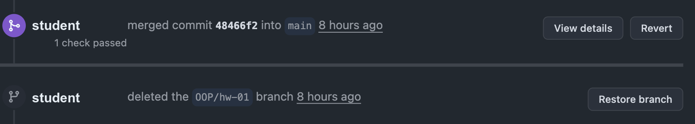

# Слил работу без проверки — как вернуть

Бывает: открыли Pull Request, увидели зелёную кнопку **Merge pull request**,
нажали — и работа уехала в `main` до того, как её кто-то прочитал.

Ничего страшного не произошло, и переделывать работу не нужно. Ниже — как
вернуть всё на место за три клика.

> **Сразу о том, чего делать нельзя.** Не удаляйте репозиторий, не создавайте
> новый, не делайте `git push --force` и `git reset --hard` в `main`. Всё это
> ломает историю и ссылки в задании, а проблема решается штатными кнопками
> GitHub.

## Почему это вообще важно

Сдача работы — это не «файлы оказались в `main`», а **разговор по строкам кода**.
Замечания ставятся к конкретным местам в Pull Request, вы отвечаете там же,
правите в той же ветке. Если работа уже влита, писать замечания некуда:
обсуждать нечего, всё уже принято.

Поэтому `main` возвращают в прежнее состояние, а работу открывают заново —
теперь уже на проверку.

## Способ 1. Три кнопки на GitHub

Работает, если вы ничего не успели сделать после ошибочного слияния. Откройте
страницу своего Pull Request — того самого, который слили, и прокрутите вниз.
Обе нужные кнопки уже там:



### Шаг 1. Вернуть ветку

Внизу страницы, под сообщением о слиянии, есть кнопка **Restore branch** —
нажмите её. Ветка с вашей работой удалилась при слиянии, эта кнопка её
возвращает вместе со всеми коммитами.

### Шаг 2. Откатить `main`

Рядом — кнопка **Revert**. Она создаёт новый Pull Request, который отменяет
ваше слияние: возвращает `main` к тому состоянию, в котором он был до сдачи.

Этот Pull Request можно слить сразу, самому. Он технический: в нём нет вашей
работы, ревьюить там нечего.

После слияния `main` чистый, а ваша работа цела — она лежит в ветке,
восстановленной на первом шаге.

### Шаг 3. Открыть Pull Request заново

Перейдите на вкладку **Pull requests** → **New pull request**, выберите свою
ветку — и дальше как обычно:

- свяжите с заданием через блок **Development**;
- проверьте, что преподаватель назначен ревьюером;
- **не нажимайте Merge.** Работу вливает преподаватель после проверки.

Подробно эти шаги расписаны в [основной инструкции](index.md#6-pull-request).

## Способ 2. Если ветка не восстанавливается

Кнопки **Restore branch** может не быть — например, если ветку удалили руками
давно. Тогда то же самое делается двумя откатами подряд.

Идея простая: первый откат убирает работу из `main`, второй — отменяет первый,
то есть возвращает работу обратно, но уже в отдельной ветке и под ревью.

```bash
git switch main
git pull

# 1. Откатываем ошибочное слияние. Хеш видно на странице PR
#    или через git log --oneline
git revert <хеш вашего слияния>
git push
```

Теперь `main` в прежнем состоянии. Возвращаем работу в новую ветку:

```bash
git switch -c OOP/hw-01-review

# 2. Отменяем свой же откат — работа возвращается
git revert <хеш коммита Revert из предыдущего шага>
git push -u origin OOP/hw-01-review
```

Дальше — открыть Pull Request из этой ветки, связать с заданием, назначить
ревьюера. Не мёржить.

В истории останутся три записи: слияние, откат и возврат. Это нормально
и честно: так было.

## Проверьте задание

Если Pull Request был связан с заданием, при слиянии задание могло закрыться
автоматически. Откройте его и посмотрите: если закрылось — нажмите
**Reopen issue**. Работа ещё не сдана, и задание должно висеть открытым
до настоящего слияния.

Новый Pull Request свяжите с тем же заданием заново.

## Как не повторить

Кнопка **Merge pull request** у вас не заблокирована — репозиторий ваш,
технически вы можете слить что угодно. Здесь работает договорённость,
а не запрет.

Простое правило: **после того как открыли Pull Request, вы на него больше
не нажимаете ничего зелёного.** Ваша часть закончилась в момент, когда
преподаватель назначен ревьюером. Дальше — только отвечать на замечания
и править в той же ветке.

Слияние — это подпись преподавателя под работой. Поставить её за него
не получится, а вот вернуть всё назад — легко, как раз по этой странице.
