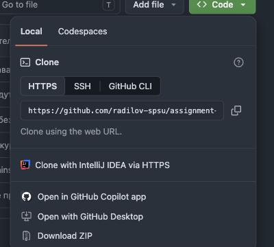
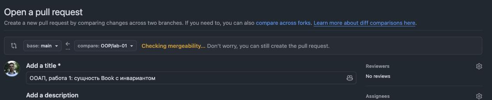
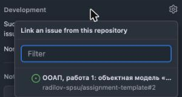
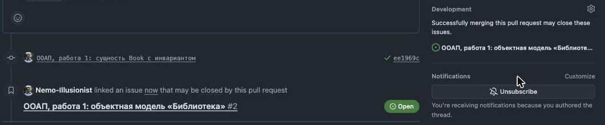
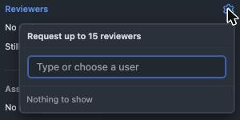

# Как сдавать работы

Работа сдаётся не файлом в чат, а **Pull Request** — запросом на слияние
в вашем личном репозитории. Это нужно, чтобы замечания вставали прямо
у строк кода, а история сдач оставалась видимой.

Схема такая: вы пишете код в отдельной **ветке**, открываете Pull Request,
преподаватель читает и оставляет замечания. Когда всё в порядке — работа
вливается в основную ветку `main`, и это означает «сдано».

Если вы раньше не работали с GitHub — делайте ровно по шагам, придумывать
ничего не нужно.

!!! note "Что откуда брать"

    `ИМЯ-РЕПОЗИТОРИЯ` ниже — имя вашего личного репозитория, оно есть
    в комментарии робота к вашей заявке. `OOP/lab-01` — курс и номер работы;
    для других курсов и работ меняются соответственно.

## Шаг 1. Скачать репозиторий к себе

Один раз на компьютере. Адрес — зелёная кнопка **Code**, вкладка **HTTPS**:



```bash
git clone https://github.com/radilov-spsu/ИМЯ-РЕПОЗИТОРИЯ.git
cd ИМЯ-РЕПОЗИТОРИЯ
```

Если git попросит логин и пароль — пароль от GitHub не подойдёт. Проще всего
поставить [GitHub CLI](https://cli.github.com/) и один раз выполнить
`gh auth login`, дальше git перестанет спрашивать.

## Шаг 2. Создать ветку для работы

**Ветка** — отдельная линия правок, чтобы не трогать основную. Название
фиксированное: курс, косая черта, номер работы.

```bash
git checkout main
git pull
git checkout -b OOP/lab-01
```

Проверить, где вы сейчас: `git branch --show-current` — должно вывести
`OOP/lab-01`.

## Шаг 3. Написать работу

Файлы кладите **только внутрь папки своего курса**:

```
OOP/lab-01/src/      ← сюда код
OOP/lab-01/README.md ← сюда описание и схема (файл уже есть, заполните его)
```

Папки других курсов не трогайте.

## Шаг 4. Сохранить изменения в git

```bash
git add OOP/lab-01
git commit -m "ООАП, работа 1: модель Библиотеки"
```

Коммитов может быть сколько угодно — делайте их по ходу работы, а не один
в конце. Сообщение отвечает на вопрос «что изменилось и зачем»:
`добавил инварианты Loan` — хорошо; `fix`, `готово`, `2` — плохо.
История коммитов входит в оценку.

## Шаг 5. Отправить ветку на GitHub

```bash
git push -u origin OOP/lab-01
```

В ответ git напечатает ссылку вида
`https://github.com/radilov-spsu/…/pull/new/OOP/lab-01` — по ней сразу
открывается создание Pull Request. Дальше пушить проще: `git push`.

## Шаг 6. Открыть Pull Request

Откройте ссылку из шага 5 — или вкладка **Pull requests** → зелёная кнопка
**New pull request**.



Проверьте, что вверху выбрано:

- **base:** `main` — куда вливаем;
- **compare:** `OOP/lab-01` — что вливаем.

Заголовок — понятный, например `ООАП, работа 1: модель Библиотеки`.
В теле уже подставлен шаблон: заполните его целиком и отметьте галочки
самопроверки. Нажмите **Create pull request**.

## Шаг 7. Связать Pull Request с заданием

Теперь, когда Pull Request создан, справа появился блок **Development**.
Нажмите шестерёнку рядом с ним и выберите в списке своё задание:



Готово — под обсуждением появится запись «linked an issue», а задание
закроется само, когда работу примут:



!!! tip "Шестерёнки нет?"

    На экране *создания* Pull Request её и не бывает — она появляется
    только после того, как вы нажали **Create pull request**. Если связать
    забыли, это можно сделать в любой момент позже.

## Шаг 8. Проверить, что преподаватель назначен ревьюером

Справа есть блок **Reviewers**. Преподаватель добавляется туда автоматически
через несколько секунд после открытия Pull Request — обновите страницу.



Если через минуту его там нет — нажмите шестерёнку рядом с **Reviewers**,
начните набирать `Nemo-Illusionist` и выберите его.

## Шаг 9. Дождаться проверки и поправить замечания

Замечания придут комментариями к конкретным строкам кода — отвечать можно
прямо там же.

**Новый Pull Request создавать не нужно.** Правьте в той же ветке:

```bash
git add OOP/lab-01
git commit -m "поправил инварианты по замечаниям"
git push
```

Pull Request обновится сам. Когда всё в порядке, преподаватель вливает его
в `main` — работа сдана, задание закрывается.

## Частые ошибки

| Ошибка | Что не так |
|---|---|
| Коммит прямо в `main` | Работа обязана приехать через Pull Request — иначе замечания некуда писать |
| Файлы вне своей папки | Всё, что добавляете, лежит в папке работы, например `OOP/lab-01/` |
| Один коммит «сделал всё» | История коммитов — часть оценки |
| В репозитории `bin/`, `obj/`, `.vs/` | Это результат сборки, в git он не нужен; для того и лежит `.gitignore` |
| Pull Request не связан с заданием | Задание не закроется само — свяжите через блок **Development** |

Застряли на любом шаге — напишите комментарием прямо в своё задание.
